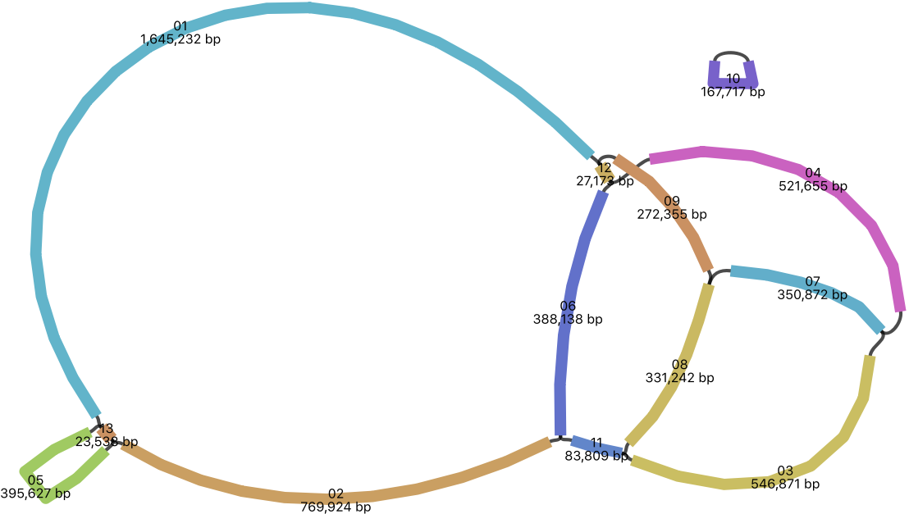
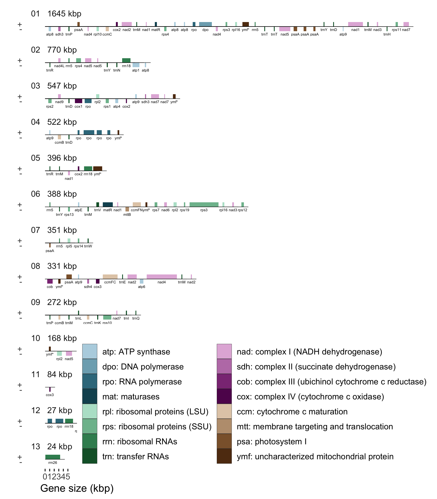

Plant mitochondrial genomes vary widely in size. Although many plant mitochondrial genomes have been sequenced and assembled, the vast majority are of angiosperms, and few are of gymnosperms. Most plant mitochondrial genomes are smaller than a megabase, with a few notable exceptions. We have sequenced and assembled the 5.5 Mbp mitochondrial genome of Sitka spruce (*Picea sitchensis*), the largest complete mitochondrial genome of a gymnosperm. We sequenced the whole genome using Oxford Nanopore MinION, and then identified contigs of mitochondrial origin assembled from these long reads. The assembly graph shows a multipartite genome structure, composed of one smaller 168 kbp circular segment of DNA, and a larger 5.4 Mbp component with a branching structure. The branching points of the assembly graph may represent active sites of recombination, and give insight into an underlying complex linear branching physical genome structure.

# Introduction

Plant mitochondrial genomes are amazingly diverse and complex [@Mower_2012]. Land plant mitochondrial genomes range in size from 100 kilobases (kbp) for mosses such as *Mielichhoferia elongata* [@Goruynov_2018] to more than 11 megabases (Mbp) in the case of the flowering plant *Silene conica* [@Sloan_2012]. Although their genome structure is often portrayed as a circle, the true physical structure of their genome appears to be a variety of circles, linear molecules, and complex branching structures [@Backert_1997]. While many species have a single master circle representation of their mitochondrial genome, others are composed of more than a hundred circular chromosomes [@Sloan_2012]. The precise mechanism of how plant mitochondria replicate and maintain their DNA is not yet fully understood [@Cupp_2014]. It is hypothesized that recombination-dependent replication plays a role, giving a functional role to the repeat sequences often observed in mitochondria [@Gualberto_2014]. This model does not fully explain how genomic copy number is regulated and maintained [@Oldenburg_2015], particularly in multipartite genomes [@Vlcek_2010]. Although angiosperm mitochondrial genomes are well studied with numerous complete genomes available, few gymnosperm mitochondrial genomes are available, one from each of the cycads [@Chaw_2008], ginkgos, gnetales [@Guo_2016], and conifers [@Jackman_2015]. Whereas other gymnosperm mitochondrial genomes are smaller than a megabase, conifer mitochondrial genomes can exceed five megabases [@Jackman_2015], larger than many bacteria. The origin and mechanism of this expansion is not known. As plant mitochondrial genomes typically have fewer than 100 genes, what role this expanse of DNA serves, if any, is mysterious.

Assembling plant mitochondrial genomes is difficult due to the presence of large (up to 30 kbp) perfect repeats, which may be involved in active recombination, and possibly recombination-dependent replication [@Gualberto_2014]. A hybrid assembly of both long reads, which are able to span these repeats, and accurate short sequencing reads, which correct indel errors, is well suited to tackle these challenging genome features. When analyzing whole genome sequencing reads to reconstruct mitochondrial genomes, long reads provide additional confidence that the assembled sequences represent the true mitochondrial sequence in regions that share sequence homology between the mitochondrion, plastid, and nuclear genomes, due to transfer of DNA between cellular compartments [@Adams_2003; @Smith_2011]. Although hybrid assembly has been applied to assemble the plastid genome of *Eucalyptus pauciflora* [@Wang_2018], it has not yet been applied to the assembly of a plant mitochondrial genome.

Annotating plant mitochondrial genomes is also challenging, due to numerous features of plant mitochondria that are not typical of most organisms. For one, RNA editing of C-to-U is pervasive, and the process creates AUG start codons by editing ACG to AUG [@Hiesel_1989] or by editing GCG to GUG, an alternative start codon used by some plant mitochondrial genes [@Sakamoto_1997]. RNA editing can also create stop codons in a similar fashion. Further complicating annotation using available bioinformatics pipelines, the typical GU-AG splice site expected by most splice-aware alignments tools is instead GNGCG-AY (Y denotes C or T) for group II introns [@Lambowitz_2010 and see results]. Also, trans-spliced genes are common in mitochondrial genomes [@Kamikawa_2016], and no purpose-built software tool exists for identifying and annotating trans-spliced genes. To add further difficulty, trans-spliced exons may be as small as 22 bp, as is *nad5* exon 3 of gymnosperms [@Guo_2016]. For these reasons, annotating a plant mitochondrial genome remains a laborious and manual task.

# Methods

## Genome Sequencing and Assembly

Genomic DNA was extracted from young Sitka spruce (genotype Q903) needles, as described in @Coombe_2016. We constructed 18 Oxford Nanopore 1D sequencing libraries, 16 by ligation of 1 to 7 &micro;g of lightly needle-sheared genomic DNA and 2 by rapid transposition of 0.6 &micro;g of unsheared genomic DNA, and sequenced these on 18 MinION R9.4 flow cells. This whole genome sequencing produced 98 Gbp in 9.6 million reads (SRA accession SRX5081713), yielding 5-fold depth of coverage of the roughly 20 Gbp nuclear genome, and 26-fold depth of coverage of the mitochondrial genome. Because separating putative mitochondrial reads by homology to known mitochondrial sequences could discard mitochondrial sequences that are unique to Sitka spruce, we chose to first assemble the whole genome reads and then compare contigs to known mitochondrial sequences. Assembling such a large number of Nanopore reads is not yet straight forward, and so we adopted an iterative approach to assembly. We first obtained a rough but computationally efficient assembly using Miniasm [@Li_2016], after trimming adapter sequences with Porechop [@Wick_2017_Porechop]. Miniasm produces an assembly whose sequencing error rate is comparable to that of the original reads, but no better. We polished this assembly using Racon [@Vaser_2017]. We selected contigs with homology to the white spruce (*Picea glauca*, interior white spruce genotype PG29) mitochondrial genome [@Jackman_2015] using Bandage [@Wick_2015], retaining contigs with at least one 5 kbp alignment to the white spruce mitochondrion by BLASTN [@Altschul_1990]. We note that this selection process would also discard any mitochondrial plasmids smaller than 5 kbp, if present.

We selected putative mitochondrial reads by aligning the Nanopore reads to this assembly using Minimap2 [@Li_2018], and retained reads with an alignment score of 5000 or more. We assembled these reads using Unicycler [@Wick_2017_Unicycler]. This assembly yielded one circular contig and many linear contigs with no adjacent contigs, indicating that the assembly may not yet be complete, unless the genome were composed of linear chromosomes. We repeated the alignment of the Nanopore reads to the assembly, and again retained reads with an alignment score of 5000 or more. We assembled these reads using Flye [@Kolmogorov_2018], taking the output assembly graph `2-repeat/graph_final.gfa` that identifies repeats that are longer than the read length and determines their precise boundaries. This Flye assembly was polished using Racon. Contigs with homology to the white spruce mitochondrion were selected using Bandage, which uses BLASTN, requiring an alignment length of at least 5 kbp and percent identity at least 90. Contigs with unambiguous adjacent contigs were merged using the Bandage operation "Merge all possible nodes".

In addition to a generally high sequencing error rate, Nanopore reads are particularly poor in accurately representing the length of homopolymer repeats. To compensate, we polished the assembly using one flow cell of Illumina HiSeq sequencing reads of the same DNA extraction, yielding 59-fold depth of coverage of the mitochondrial genome, to correct for sequencing and homopolymer length errors. We used Unicycler Polish to iteratively align the reads to the assembly using Bowtie2 [@Langmead_2012], and correct the consensus sequence using Pilon [@Walker_2014]. This iterative polishing process yielded no further corrections on the tenth round. Unicycler Polish applies Assembly Likelihood Estimate (ALE) [@Clark_2013] to each round to verify that the assembly of the final round of polishing resembles the reads the most.

## Annotation

We annotated coding genes and non-coding rRNA and tRNA genes using automated methods where possible, and performed manual inspection to refine these automated annotations. We used Prokka [@Seemann_2014], which uses Prodigal [@Hyatt_2010] to identify single-exon coding genes and open reading frames (ORFs). We used MAKER [@Holt_2011], which uses BLASTP and Exonerate [@Slater_2005] to identify cis-spliced coding genes. We used tRNAscan-SE [@Lowe_1997] and Aragorn [@Laslett_2004] to identify tRNA. We used RNAmmer [@Lagesen_2007] and Barrnap [@Seemann_2014] to identify rRNA. We used RNAweasel [@Lang_2007] and Infernal [@Nawrocki_2009] to identify group II introns. RFAM motif Domain-V (RM00007) represents domain V of group II introns, and RFAM family Intron_gpII (RF00029) represents both domains V and VI [@Kalvari_2017].

Following automated annotation, we reviewed coding genes for completeness, compared to their best BLASTP match, and corrected the annotation, most often for aspects that are particular to plant mitochondria. We manually corrected the annotation of genes to address start codons created by RNA editing of ACG to the start codon AUG, and editing of GCG to the alternative start codon GUG (see results for details). Three genes use atypical start codons: *rpl16* uses a GUG start codon [@Sakamoto_1997]; *rps19* uses a GUG start codon created by RNA editing GCG, seen also in *Pinus strobus* AJP33554.1; *matR* appears to use an unusual GGG start codon, seen also in *Cycas taitungensis* YP_001661429.1 [@Chaw_2008] and *Pinus strobus* AJP33535.1. The gene *sdh4* was missed by automatic annotation, as its coding sequence was found to overlap with *cox3* by 73 bp on the same strand.

We reviewed splice sites, and adjusted their position to agree with the expected splicing motifs of group II introns when possible, ensuring not to introduce insertions or deletions into the peptide sequence compared to homologous proteins. We confirmed the presence of domain V of the group II intron upstream of the 3' splice site, identified by RNAweasel or Infernal. We manually annotated trans-spliced introns by comparing alignments of homologous proteins to the genome. We determined the 5' and 3' splice sites similarly to cis-spliced introns, looking for expected group II splicing motifs, and domain V upstream of the 3' splice site. When Infernal did find a match to RFAM Intron_gpII (RF00029), it frequently identified the precise 3' splice site, in agreement with protein sequence homology.

# Results

## Complete Genome Assembly

The complete mitochondrial genome of Sitka spruce is 5.52 Mbp assembled in 13 segments, and has a GC content of 44.7%. The genome assembly is composed of two components: a 168 kbp circular segment, and a larger 5.36 Mbp component composed of 12 segments, visualized by Bandage [@Wick_2015] in @fig:genome. The two smallest segments (27 kbp and 24 kbp, labeled 12 and 13 respectively) have an estimated copy number of two based on their depth of sequencing coverage, and all other segments have similar depth of coverage, assumed to represent single copy. The single-copy segments range in size from 84 kbp to 1.65 Mbp. No sequence variation is evident in these repeats. An absence of variation in the repeat implies that they may be involved in active recombination [@Mar_chal_2010]. Though 10% of reads are larger than 24 kbp, no reads fully span these repeats.

{#fig:genome}

The complete genome is composed of 1.7% (93 kbp) of genes with known function, 9.5% (524 kbp) of 2,499 ORFs (at least 90 bp), 3.7% (205 kbp) of repeats, and 85.1% unclassified sequence. Of the ORFs, 468 are at least 300 bp (100 amino acids) in size and compose 3.6% (202 kbp) of the genome. Aligning the ORFs with BLASTP, 23 ORFs (12 ORFs at least 300 bp) have a significant (E < 0.001) hit to the nr database. Plastid-derived sequence composes 0.25% (14 kbp) of the genome in 24 segments.

The nuclear repeat LTR/Gypsy compose 51% of the repeat sequence, LTR/Copia compose 7%, simple repeat sequence compose 34%, low complexity compose 3%, and 5% are other repeat sequences. The 36-bp Bpu repeat sequence is present in roughly 500 copies in *Cycas taitungensis* and roughly 100 copies in *Ginkgo biloba* [@Guo_2016]. We find only a single full-length copy with four mismatches in Sitka spruce, similar to *Welwitschia mirabilis*.

## Genes

The mitochondrial genome of Sitka spruce has 41 distinct protein coding genes with known function, 3 distinct rRNA genes (@tbl:rrna), 27 distinct tRNA genes representing 18 distinct anticodons (@tbl:trna). The relative order and orientation of these genes are shown in @fig:genes. The 41 known protein coding genes found in the gymnosperm mitochondria *Cycas taitungensis* [@Chaw_2008] and *Ginkgo biloba* [@Guo_2016] are also found in Sitka. The 29 introns, 16 cis-spliced and 13 trans-spliced, are found in 10 protein coding genes, two pseudogenes, and one plastid-derived tRNA (@tbl:introns).

{#fig:genes}

Four open reading frames (937, 508, 368, and 214 amino acids) contain an organellar DNA polymerase type B (DNA_pol_B_2) Pfam family [@El_Gebali_2018]. The largest also contains a segment homologous to the structural maintenance of chromosome (SMC_N) Pfam family, which includes the *RecF* and *RecN* proteins involved in DNA recombination. We hypothesize that this ORF may be involved in recombination-dependent replication of mitochondrial DNA [@Gualberto_2014]. These ORFs have homology to DNA polymerase genes found in the mitochondria of *Picea glauca* and the angiosperms *Cocos nucifera*, *Daucus carota*, *Helianthus annuus*, and *Silene vulgaris*. Two open reading frames (781 and 560 amino acids) contain an RNA polymerase (RNA_pol) domain. These ORFs have homology to DNA-dependent RNA polymerase genes found in the mitochondria of *Picea glauca* and the angiosperms *Beta vulgaris*, *Cocos nucifera*, *Daucus carota*, and *Phoenix dactylifera*. The two largest genes of the Sitka spruce mitochondrial genome are these putative DNA and RNA polymerase genes.

The *matR* gene and three additional open reading frames (476, 197, and 163 amino acids) contain a reverse transcriptase, or RNA-dependent DNA polymerase, (RT_like) NCBI conserved protein domain with similarity to the group II intron reverse transcriptase/maturase (group_II_RT_mat) NCBI conserved protein domain [@Marchler_Bauer_2016]. We hypothesize that these ORFs may be additional maturases involved in splicing [@Matsuura_2001]. These ORFs have homology to mitochondrial genes of *Picea glauca* and the angiosperm *Utricularia reniformis*.

The full complement of rRNA genes are present in Sitka spruce, shown in @tbl:rrna. Unlike rRNA genes of other gymnosperms, the Sitka spruce rRNA genes are present in multiple copies. The 5S rRNA gene *rrn5* is present in four copies. The small subunit rRNA gene *rrn18* is present in three copies, though one copy is found on the 27 kbp repeat segment with an estimated copy number of two. One copy of the large subunit rRNA gene *rrn26* is present, though it is found on the 24 kbp repeat segment, which also has an estimated copy number of two.

Table: rRNA content of four gymnosperms. This table is adapted from Table S1 of @Guo_2016 with the addition of Sitka spruce. \*One copy is present on a repeat segment with an estimated copy number of two. {#tbl:rrna}

| Gene           | Cycas | Ginkgo | Sitka | Welwitschia |
|----------------|-------|--------|-------|-------------|
| rrn5           |  1    |  1     |  4    | 1           |
| rrn18          |  1    |  1     |  3\*  | 1           |
| rrn26          |  1    |  1     |  1\*  | 1           |
| **Total rRNA** |  3    |  3     |  8    | 3           |

Sitka spruce has 27 tRNA genes, representing 18 distinct anticodons, coding for 15 distinct amino acids, DEHIKLMNPQRTVWY (@tbl:trna). tRNA genes coding for the amino acids ACFGS are absent in Sitka spruce, and also absent in *Welwitschia*. *trnM-CAU* has six copies, *trnD-GUC* three copies, and *trnY-GUA* two copies. All other tRNA genes are single copy. *trnN-GUU*, *trnV-UAC*, and one copy of *trnfM-CAU* are derived from plastid origins. One cis-spliced intron is observed in the plastid-derived *trnV-UAC* gene, also seen in *Cycas taitungensis*. Six tRNA genes (*trnL-CAA*, *trnR-CCG*, *trnR-GCG*, *trnT-AGU*, *trnT-UGU*, and *trnY-AUA*) found in Sitka spruce are absent in *Cycas*, *Ginkgo*, and *Welwitschia*.

Table: tRNA content of four gymnosperms. Sitka spruce has 27 tRNA genes, one of which is cis-spliced, with 18 distinct anticodons, coding for 15 distinct amino acids. This table is adapted from Table S1 of @Guo_2016 with the addition of Sitka spruce. (i) Contains a cis-spliced group II intron. \*Anticodon is inferred to be edited [@Weber_1990]. {#tbl:trna}

| Gene           | Cycas | Ginkgo | Sitka | Welwitschia |
|----------------|-------|--------|-------|-------------|
| trnC-GCA       |  1    |  1     |  -    | -           |
| trnD-GUC       |  1    |  1     |  3    | 1           |
| trnE-UUC       |  1    |  1     |  1    | 1           |
| trnF-GAA       |  1    |  2     |  -    | -           |
| trnG-GCC       |  1    |  -     |  -    | -           |
| trnG-UCC       |  -    |  1\*   |  -    | -           |
| trnH-GUG       |  1    |  1     |  1    | -           |
| trnI-CAU       |  1\*  |  1\*   |  1\*  | 1\*         |
| trnK-UUU       |  1    |  1\*   |  1    | -           |
| trnL-CAA       |  -    |  -     |  1    | -           |
| trnL-UAA       |  1\*  |  2     |  -    | -           |
| trnL-UAG       |  1    |  1     |  -    | -           |
| trnM-CAU       |  6    |  2     |  6    | 1           |
| trnN-GUU       |  1    |  -     |  1    | -           |
| trnP-AGG       |  1    |  1     |  1    | -           |
| trnP-UGG       |  1    |  1     |  1    | -           |
| trnQ-UUG       |  1\*  |  1     |  1    | 1           |
| trnR-ACG       |  -    |  -     |  -    | 1           |
| trnR-CCG       |  -    |  -     |  1    | -           |
| trnR-GCG       |  -    |  -     |  1    | -           |
| trnR-UCU       |  1\*  |  1     |  -    | -           |
| trnS-GCU       |  1    |  1     |  -    | -           |
| trnS-GGA       |  1    |  -     |  -    | -           |
| trnS-UGA       |  1    |  1     |  -    | -           |
| trnT-AGU       |  -    |  -     |  1    | -           |
| trnT-UGU       |  -    |  -     |  1    | -           |
| trnV-UAC (i)   |  1    |  -     |  1    | -           |
| trnW-CCA       |  1    |  2     |  1    | 1           |
| trnY-AUA       |  -    |  -     |  1    | -           |
| trnY-GUA       |  1    |  1     |  2    | 1           |
| **Total tRNA** | 27    | 23     | 27    | 8           |

In addition to three plastid-derived tRNA genes, eight partial plastid genes are found in the 14 kbp of plastid-derived sequence: *atpE*, *chlN*, *petA*, *psaA*, *rps3*, *rrn18*, a partial copy of *rpl2*, and a partial *trnS-GGA* gene with homology to *Cycas taitungensis*. The *rpl2* partial gene is more similar to eudicot plastids (77% identical to *Helwingia himalaica*, *Robinia pseudoacacia*, and many other eudicots) than it is to the Sitka spruce plastid (66% identical).

## Introns

Although the same 27 introns are found in the same 11 genes as *Cycas taitungensis* [@Chaw_2008; @Guo_2016], eight introns that are cis-spliced in *Cycas* are trans-spliced in Sitka spruce, more than doubling the number of trans-spliced introns found in *Cycas*. Nearly half of the introns in Sitka spruce are trans-spliced. All introns are group II introns, whose domain V was identified by both RNAweasel and Infernal, with one exception.

The first intron of *nad1* is trans-spliced in Sitka spruce and other gymnosperms [@Guo_2016]. No domain V is detectable by Infernal either downstream of exon 1 or upstream of exon 2 in Sitka spruce nor any of *Cycas*, *Ginkgo*, and *Welwitschia*. The genomic disruption of this intron may occur in domain V itself, as is seen in *cox2* of *Diphylleia rotans* [@Kamikawa_2016].

The fourth intron of *nad1* is cis-spliced, and it contains *matR* in *Cycas*, trans-spliced with a single disruption in Sitka spruce, and trans-spliced with two distinct genomic disruptions in *Welwitschia mirabilis* [Figure S2 of @Guo_2016]. Whereas *matR* is found in a cis-spliced intron in *Cycas* and free-standing in *Welwitschia*, it is found upstream of *nad1* exon 5 in Sitka spruce. In this regard, Sitka spruce appears to be an evolutionary midpoint between *Cycas* and *Welwitschia*. Sitka spruce however has not experienced the extensive gene loss observed in *Welwitschia*.

A second partial copy of *nad5* is found in Sitka spruce with one cis-spliced group II intron, representing exons 4 and 5. The translated protein sequence of this partial gene is more similar however to eudicot mitochondria (99% identical to both *Chrysobalanus icaco* and *Hirtella racemosa*, >95% identical to many other eudicots, and 94% identical to one monocot *Triantha glutinosa*) than to the complete *nad5* of Sitka spruce (76% identical). It may have been acquired by horizontal gene transfer, as is frequently reported in plant mitochondria [@Richardson_2006] of both gymnosperms [@Won_2003] and angiosperms [@Bergthorsson_2003]. This interpretation of horizontal gene transfer in plant mitochondria is not universally accepted [@Goremykin_2008]. This partial copy of *nad5* is also found in white spruce [@Jackman_2015] with 100% nucleotide identity. This level of conservation between Sitka spruce, white spruce, and angiosperms suggests that this partial gene may be functional. We find no upstream domain V, whose presence would indicate that it may be part of a larger trans-spliced gene. A putatitve alternative GUG start codon created by RNA editing of GCG could initiate translation of this partial gene.

RNAweasel identifies 34 group II domain V regions in Sitka spruce, 26 of which are associated with the intron of a gene. Two domain V regions are found in the cis-spliced introns of the pseudogenes *&Psi;nad5* and plastid-derived *&Psi;rpl2*. The remaining six domain V regions are not associated with a gene, and further investigation would be needed to determine whether they may also be partial fragments of pseudogene introns.

Table: Intron content of four gymnosperms. Sitka spruce has 29 introns, 16 cis-spliced (&bull;) and 13 trans-spliced (T), in ten protein coding genes, two pseudogenes (&Psi;), and one tRNA. "T&sup2;" indicates a tripartite (double trans-spliced) intron. "-" indicates intron absence. "x" indicates gene absence. "cp" indicates plastid-derived. This table is adapted from @Guo_2016 with the addition of Sitka spruce. {#tbl:introns}

| Gene               | Intron | Cycas  | Ginkgo | Sitka  | Welwitschia |
|--------------------|--------|--------|--------|--------|-------------|
| ccmFc              | 1      | &bull; | &bull; | &bull; | -           |
| cox2               | 1      | &bull; | &bull; | T      | -           |
|                    | 2      | &bull; | &bull; | T      | T           |
| nad1               | 1      | T      | T      | T      | T           |
|                    | 2      | &bull; | &bull; | &bull; | -           |
|                    | 3      | T      | T      | T      | T           |
|                    | 4      | &bull; | &bull; | T      | T&sup2;     |
| nad2               | 1      | &bull; | &bull; | &bull; | -           |
|                    | 2      | T      | T      | T      | T           |
|                    | 3      | &bull; | &bull; | &bull; | -           |
|                    | 4      | &bull; | &bull; | T      | -           |
| nad4               | 1      | &bull; | &bull; | T      | &bull;      |
|                    | 2      | &bull; | &bull; | &bull; | -           |
|                    | 3      | &bull; | &bull; | &bull; | -           |
| nad5               | 1      | &bull; | &bull; | &bull; | -           |
|                    | 2      | T      | T      | T      | T           |
|                    | 3      | T      | T      | T      | T           |
|                    | 4      | &bull; | &bull; | &bull; | -           |
| nad7               | 1      | &bull; | &bull; | &bull; | -           |
|                    | 2      | &bull; | &bull; | T      | &bull;      |
|                    | 3      | &bull; | &bull; | &bull; | -           |
|                    | 4      | &bull; | &bull; | T      | &bull;      |
| rpl2               | 1      | &bull; | &bull; | T      | x           |
| rps3               | 1      | &bull; | &bull; | &bull; | -           |
|                    | 2      | &bull; | &bull; | &bull; | -           |
| rps10              | 1      | &bull; | -      | &bull; | x           |
| trnV-UAC (cp)      | 1      | &bull; | x      | &bull; | x           |
| &Psi;nad5          | 4      | x      | x      | &bull; | x           |
| &Psi;rpl2 (cp)     | 1      | x      | x      | &bull; | x           |
| Total cis (&bull;) |        | 22     | 20     | 16     | 3           |
| Total trans (T)    |        |  5     |  5     | 13     | 7           |
| Total introns      |        | 27     | 25     | 29     |10           |

The splice site motifs of the 14 cis-spliced genes of the Sitka spruce mitochondrial genome are shown in @fig:splice, visualized by WebLogo [@Crooks_2004]. Because its position is variable, the bulged adenosine of the 3' splice site, typically found at position -7 or -8, is not readily apparent.

{#fig:splice}

# Conclusions

The 5.5 Mbp mitochondrial genome of Sitka spruce is the largest complete mitochondrial genome of a gymnosperm. Its genomic structure is not the typical circularly-mapping single chromosome, but a rosette-like structure, mirroring the rosette-like structures observed in electron micrographs of mitochondrial DNA [@Backert_2000]. Although sequence identity of the set of common mitochondrial proteins is well conserved, their structure is not. Trans-splicing is a frequently-employed mechanism of coping with this genomic structural instability, and Sitka spruce has a record number of trans-spliced introns. As the first long read assembly of a complete plant mitochondrial genome, demonstrating a complex branching genome structure, this resource will prove invaluable to future interrogations into the genome structure and mechanism of replication of conifer mitochondrial genomes.

# References
