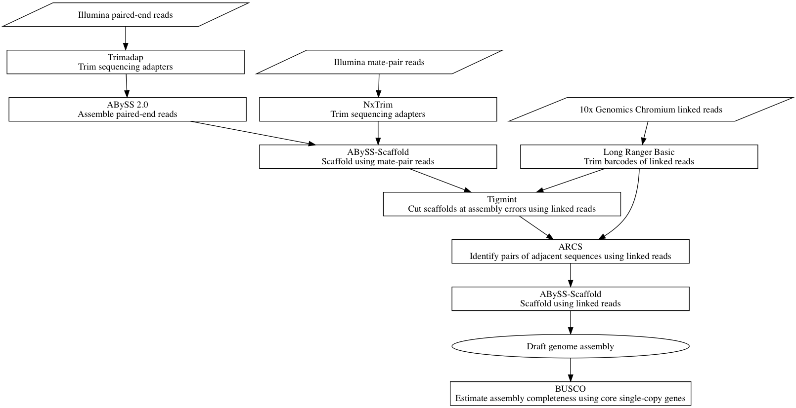
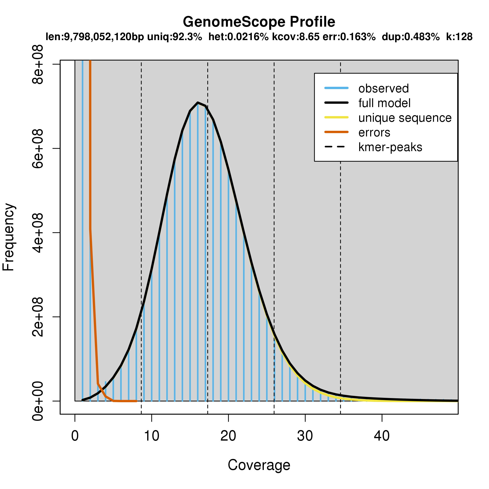

# Abstract

We assemble an 8 Gbp draft genome of western redcedar (*Thuja plicata*) from paired-end, mate-pair, and linked reads. ABySS is used to assemble contigs from paired-end reads, and mate-pairs reads are used to scaffold the genome. Linked reads from 10x Genomics Chromium are used to correct misassemblies and scaffold the genome. Half of the assembled sequence is in 1,035 scaffolds larger than 2.31 Mbp (N50). Sixty percent of core single-copy genes (BUSCOs) are present, either fully or partially, in the draft assembly. We demonstrate an assembly with megabase scaffold contiguity of a conifer genome using short read and linked read sequencing. This chapter describes the technical aspects of a preliminary draft assembly. It does not attempt to analyze or interpret the western redcedar genome.

# Introduction

Advances in genomics have yielded improvements in agronomy, particularly in the discovery of genetic variants for selective breeding to improve desirable crop traits [@Morrell_2011]. Plants have a number of genomic features that may make their assembly difficult. Polyploidy, repeat and intron expansion, and large genome size name a few challenges. Bread wheat is hexaploid [@IWGSC_2014]. Nearly 85% of the maize genome is composed of transposable elements [@Schnable_2009]. The onion genome is 16 Gbp [@Jo_2017], and conifer genomes can exceed 20 Gbp [@Birol_2013]. Although conifers are socially and economically important, the large size of their genomes make them expensive to sequence and difficult to assemble. This challenge has until recently largely excluded conifers from the rapidly advancing genomics revolution in agronomy.

The first conifer genomes were sequenced in 2013, with three genomes being assembled within a year: interior white spruce [*Picea glauca* genotype PG29, @Birol_2013], Norway spruce [*Picea abies*, @Nystedt_2013], and loblolly pine [*Pinus taeda*, @Zimin_2014]. Interior white spruce was sequenced using Illumina paired-end and mate-pair sequencing and assembled using ABySS 1.3.5 [@Simpson_2009]. Norway spruce used a hybrid whole genome shotgun (WGS) and hierarchical sequencing strategy, making using of both shotgun Illumina paired-end and mate-pair sequencing, as well as paired-end sequencing of fosmid pools. The fosmid pools and WGS were assembled using CLC Assembly Cell from CLC bio, scaffolded using BESST [@Sahlin_2014], and the fosmid and WGS assemblies merged using GAM-NGS [@Vicedomini_2013]. Loblolly pine was sequenced using Illumina paired-end and mate-pair sequencing and assembled using MaSuRCA [@Zimin_2013] and a modified version of the CABOG assembler [@Miller_2008], which is derived from the Celera Assembler. Two additional species were sequenced a few years later: sugar pine [*Pinus lambertiana*, @Stevens_2016] and Douglas fir [*Pseudotsuga menziesii*, @Neale_2017]. Both sugar pine and Douglas fir were sequenced using Illumina paired-end and mate-pair sequencing and assembled using MaSuRCA and SOAPdenovo2 [@Luo_2012].

An improved assembly of interior white spruce genotype PG29 was scaffolded using the assembly of another white spruce genotype WS77111, sequenced using Illumina paired-end and mate-pair sequencing and assembled using ABySS 1.5.2 [@Warren_2015_Improved]. An improved assembly of loblolly pine used a hybrid strategy of both Illumina sequencing and single molecule sequencing from PacBio [@Zimin_2017], and was assembled using an updated version of MaSuRCA [@Zimin_2017_MaSuRCA] intended for hybrid assembly of Illumina and PacBio sequencing. An improved assembly of sugar pine [@Crepeau_2017] used linked reads from 10x Genomics GemCode, a previous version of their Chromium technology, to scaffold the previous assembly using fragScaff [@Adey_2014]. The assembly size and scaffold N50 of these nine genome assemblies are shown in @tbl:conifer-assemblies.

Table: Nine genome assemblies of six conifer species spanning five years.  ^1^initial assembly ^2^improved assembly {#tbl:conifer-assemblies}

| Year | Species                 | Assembly size | Scaffold N50 |
|-----:|-------------------------|--------------:|-------------:|
| 2013 | Norway spruce           |        12 Gbp |        5 kbp |
| 2013 | Interior white spruce^1^|        21 Gbp |       20 kbp |
| 2014 | Loblolly pine^1^        |        20 Gbp |       67 kbp |
| 2015 | White spruce            |        22 Gbp |       20 kbp |
| 2015 | Interior white spruce^2^|        21 Gbp |       83 kbp |
| 2016 | Sugar pine^1^           |        25 Gbp |      247 kbp |
| 2017 | Loblolly pine^2^        |        21 Gbp |      108 kbp |
| 2017 | Douglas fir             |        15 Gbp |      341 kbp |
| 2017 | Sugar pine^2^           |        25 Gbp |    2,510 kbp |  

# Methods

The sequencing of western redcedar employed three library types of DNA sequencing: short fragment paired end, large fragment mate pair, and linked reads from large molecules using 10x Genomics Chromium, shown in @tbl:sequencing.

Table: The sequencing data of western redcedar is composed of three library types, thirteen libraries, and 28 lanes of Illumina sequencing. The sequencing read length is 2 x 151 bp. Depth of coverage is calculated using raw sequencing data before trimming adapters and an estimated genome size of 12.5 Gbp. The molecule size of linked reads is estimated by ChromeQC from alignments to the assembled draft genome, and so underestimates the true molecule size. {#tbl:sequencing}

| Library type | Fragment | Lanes | Sequence  | Depth |
|--------------|---------:|------:|----------:|------:|
| Paired end   |   431 bp |     3 |   437 Gbp |  35.0 |
|              |   433 bp |     3 |   412 Gbp |  33.0 | 
|              |   430 bp |     2 |   257 Gbp |  20.6 |
|              |   419 bp |     2 |   252 Gbp |  20.2 |
| **Total**    |          |    10 | 1,358 Gbp | 108.6 |
| Mate pair    |  2.7 kbp |     2 |   239 Gbp |  19.1 |
|              |  5.4 kbp |     2 |   283 Gbp |  22.6 |
|              |  9.0 kbp |     2 |   283 Gbp |  22.6 |
|              | 10.9 kbp |     2 |   282 Gbp |  22.6 |
|              | 15.5 kbp |     2 |   259 Gbp |  20.7 |
| **Total**    |          |    10 | 1,346 Gbp | 107.7 |
| Linked reads |   35 kbp |     2 |   236 Gbp |  18.9 |
|              |   35 kbp |     2 |   241 Gbp |  19.3 |       
|              |   20 kbp |     2 |   241 Gbp |  19.3 |
|              |   22 kbp |     2 |   241 Gbp |  19.3 |
| **Total**    |          |     8 |   959 Gbp |  76.7 |

Illumina paired-end sequencing adapters were trimmed using Trimadap 0.1r11 (<https://github.com/lh3/trimadap>). Illumina mate-pair sequencing adapters were trimmed using NxTrim 0.4.3 [@O_Connell_2015]. 10x Genomics Chromium adapters were trimmed using Long Ranger Basic 2.1.6 (<https://github.com/10XGenomics/longranger>). Depth of *k*-mer coverage profiles were computed for multiple values of *k* using ntCard 1.0.1 [@Mohamadi_2017]. We analysed and visualized these *k*-mer coverage profiles using GenomeScope 1.0.0 [@Vurture_2017].

We assembled the paired-end reads using ABySS 2.1.4, and scaffolded using the mate-pair reads with ABySS-Scaffold [@Jackman_2017]. We aligned the linked reads to this draft assembly using BWA-MEM 0.7.17 [@Li_2013]. We identified and corrected misassemblies using the linked reads with Tigmint 1.1.2 [@Jackman_2018]. We scaffolded the assembly using the linked reads with ARCS 1.0.5 [@Yeo_2017] and ABySS-Scaffold. We estimated the molecule size of the linked read libraries using ChromeQC 1.0.4 (<https://bcgsc.github.io/chromeqc/>). We assessed the genome completeness using BUSCO (Benchmarking Universal Single-Copy Orthologs) 3.0.2 [@Waterhouse_2017], which determines what proportion of core single-copy genes are present in the assembly. A flow chart of this assembly pipeline is shown in @fig:redcedar_flowchart.

{#fig:redcedar_flowchart}

# Results

Assembly using a *de Bruijn* graph assembler such as ABySS requires selecting the critical parameter *k*, the size of a *k*-mer. We selected the largest value of *k* that provided a mode *k*-mer coverage of at least 15, which is *k* = 128, shown in @fig:ntcard. The Lander-Waterman equation [@Lander_1988] for a depth of coverage of 15 yields an estimated coverage of 99.99997%, or an expected one missing k-mer per 3.3 Mbp in homozygous regions. This calculation is an optimistic approximation, since the depth-of-coverage of nearby *k*-mers is naturally correlated, and this equation assumes uncorrelated uniform random sampling. It shows however that contigs are more likely to come to an end due to other issues, such as repetitive sequence, than due to a lack of coverage due to random sampling.

{#fig:ntcard}

The genome of western redcedar is estimated to be 12.5 Gbp [@Hizume_2001; @Ohri_1986]. GenomeScope estimates the genome size to be 9.8 Gbp, shown in figure @fig:genomescope. This discrepancy is not entirely explained. GenomeScope disregards *k*-mers with very high depth of coverage, by default more than 1,000 fold, to filter out reads derived from the organelles. Other heterochromatic nuclear sequences, such as the centromeres and telomeres, may also have high depth. Disregarding these sequences may account for some of this discrepancy. The heterozygosity of the genome is estimated to be 0.0216%, or one single nucleotide variant (SNV) every 4.6 kbp. A low rate of heterozygosity tends to make genome assembly easier.

{#fig:genomescope}

Half of the 7.95 Gbp draft genome is assembled using ABySS, Tigmint, and ARCS in 1,035 scaffolds larger than 2.31 Mbp (N50). The largest scaffold is 16.3 Mbp. Assembly metrics for five stages of assembly are shown in @tbl:contiguity. Unitigs are assembled from *k*-mers. Contigs use paired-end reads to resolve and expand repeats. Scaffolds order and orient the contigs into scaffolds using mate pairs. Tigmint and ARCS respectively correct misassemblies and scaffold the assembly, both using linked reads. We scaffolded the assembly using ARCS both with and without first correcting misassemblies using Tigmint to demonstrate the effect that correcting misassemblies has on improving the contiguity of the assembly. The NG50 is improved by 14% by first correcting misassemblies using Tigmint before scaffolding using ARCS.

Table: The assembly contiguity metrics are shown for five stages of assembly. The NG50 is calculated using a genome size of 10 Gbp, rounded up from the 9.8 Gbp estimated by GenomeScope. The number of scaffolds and draft genome size includes sequences that are 1 kbp or larger. The row "Scaffolds (MP)" shows the assembly contiguity after scaffolding with Illumina mate-pair sequencing. The row "Tigmint + ARCS" shows the assembly contiguity after correcting misassemblies using Tigmint and then scaffolding with ARCS. The row "ARCS" scaffolds the assembly without first correcting misassemblies using Tigmint. Comparing these two rows shows the effects of Tigmint on improving contiguity. {#tbl:contiguity}

| Stage          | N50      | NG50      | Largest  | Size     | L50     | LG50    | Scaffolds   |
|:---------------|---------:|----------:|---------:|---------:|--------:|--------:|------------:|
| Unitigs        | 6.98 kbp |  4.20 kbp |  119 kbp | 7.52 Gbp | 294,835 | 524,000 |   1,811,335 |
| Contigs (PE)   | 17.8 kbp |  12.9 kbp |  166 kbp | 7.97 Gbp | 128,893 | 196,169 |     882,457 |
| Scaffolds (MP) |  377 kbp |   280 kbp | 2.77 Mbp | 7.95 Gbp |   6,320 |   9,479 |      95,754 |
| Tigmint        |  375 kbp |   278 kbp | 2.77 Mbp | 7.95 Gbp |   6,355 |   9,531 |      96,557 |
| ARCS           | 2.04 Mbp |  1.50 Mbp | 16.3 Mbp | 7.95 Gbp |   1,176 |   1,761 |      68,083 |
| Tigmint + ARCS | 2.31 Mbp |  1.71 Mbp | 16.3 Mbp | 7.95 Gbp |   1,035 |   1,551 |      67,895 |

BUSCO determines that 60% of core single-copy genes are present in the assembled genome, either in full or partially, shown in @tbl:busco. The 30 species represented in the BUSCO embryophyta database include 29 angiosperm and one moss. Since gymnosperm are not represented in the database, some of these core genes may have been lost in gymnosperm, and these results may be an underestimate.

Table: 870 (60%) of core single-copy genes are present, either fully or partially. {#tbl:busco}

| Category                     | Percent | Count | 
|------------------------------|--------:|------:|
| Complete                     | 53.9%   |   776 |
| Complete and single-copy     | 50.1%   |   722 |
| Complete and duplicated      |  3.8%   |    54 |
| Fragmented                   |  6.5%   |    94 |
| Missing                      | 39.6%   |   570 |
| **Total**                    |  100%   | 1,440 |

# Conclusions

This preliminary draft assembly of the western redcedar genome is one of one only two conifer genome assemblies to report a scaffold N50 measured in megabases: 2.51 Mbp for the improved sugar pine assembly [@Neale_2017] and 2.31 Mbp for this western redcedar assembly. Both of these assemblies employed a hybrid assembly of short reads and linked reads to assemble a highly contiguous draft assembly of a multi-gigabase conifer genome. They demonstrate an impressive level of contiguity achieved using only high-throughput sequencing, and exemplify an economical strategy for future sequencing projects of large plant genomes.

# References
