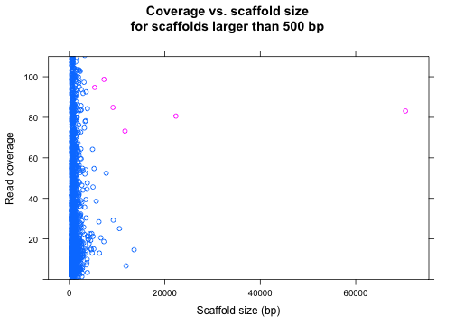
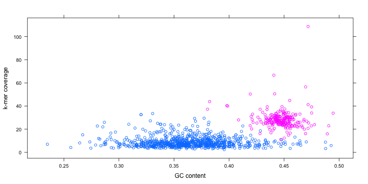
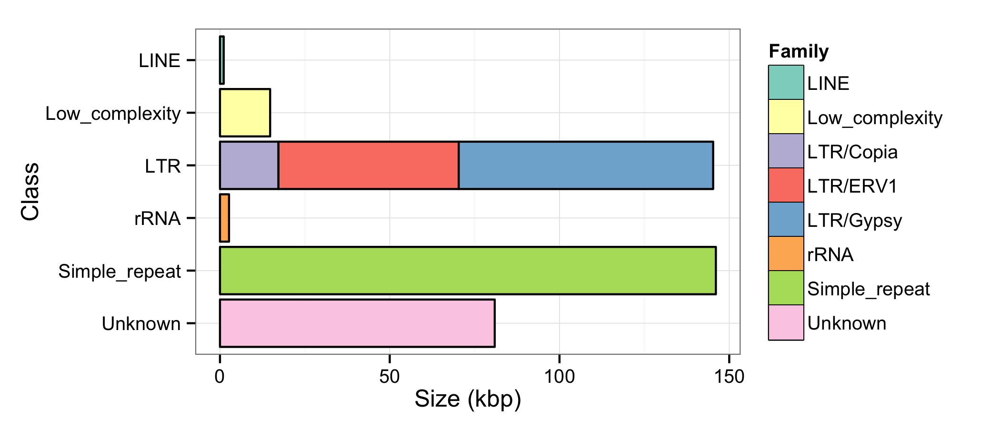
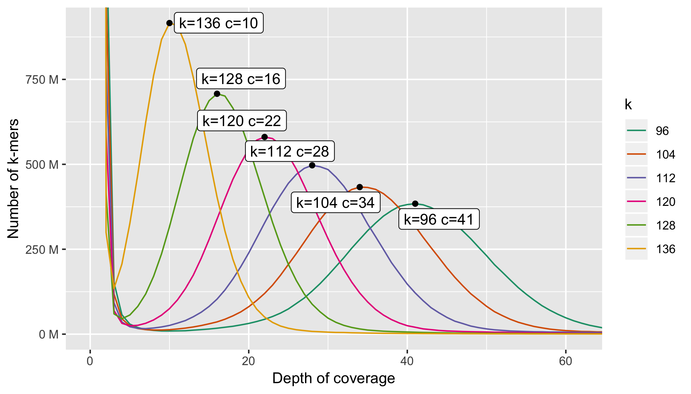

\setlength{\cftfignumwidth}{30pt}
\setlength{\cfttabnumwidth}{30pt}
\renewcommand\cftchapdotsep{\cftdotsep}
\renewcommand{\cftmarktoc}{\markboth{}{\hfill \contentsname \hfill}}
\renewcommand{\cftmarklof}{\markboth{}{\hfill \listfigurename \hfill}}
\renewcommand{\cftmarklot}{\markboth{}{\hfill \listtablename \hfill}}
\renewcommand{\chaptermark}[1]{\markboth{}{\hfill \chaptername\ \thechapter.\ #1 \hfill}}

\frontmatter

\thispagestyle{empty}

\begin{center}
\Large

Efficient Assembly of Large Genomes
\vspace{1cm}

by
\\ Shaun Dunn Jackman
\\ B.A.Sc., Simon Fraser University, 2004
\vspace{1cm}

A dissertation submitted in partial fulfillment of
\\ the requirements for the degree of
\vspace{5mm}

Doctor of Philosophy
\vspace{5mm}

in
\vspace{5mm}

The Faculty of Graduate and Postdoctoral Studies
\\ (Bioinformatics)
\vspace{5mm}

The University of British Columbia
\\ (Vancouver)
\vspace{5mm}

April 2019

\vfill
\normalsize
\copyright\ Shaun Dunn Jackman, 2019
\end{center}

\newpage

The following individuals certify that they have read, and recommend to the Faculty of Graduate and Postdoctoral Studies for acceptance, the dissertation entitled:
\vspace{5mm}

Efficient Assembly of Large Genomes
\vspace{5mm}

submitted by Shaun Jackman in partial fulfillment of the requirements for

the degree of Doctor of Philosophy

in Bioinformatics
\vspace{5mm}

**Examining Committee:**

| Inanc Birol, Medical Genetics
| Co-supervisor

| J&ouml;rg Bohlmann, Michael Smith Laboratories
| Co-supervisor

| Steven Hallam, Microbiology & Immunology
| Supervisory Committee Member

| Keith Adams, Botany
| University Examiner

| Patricia Schulte, Zoology
| University Examiner

| C. Titus Brown, Population Health and Reproduction
| University of California, Davis, Genome Center
| External Examiner
\vspace{5mm}

**Additional Supervisory Committee Members:**

| Steven Jones, Medical Genetics
| Supervisory Committee Member

\newpage

## Abstract

Genome sequence assembly presents a fascinating and frequently-changing challenge. As DNA sequencing technologies evolve, the bioinformatics methods used to assemble sequencing data must evolve along with it. Sequencing technology has evolved from slab gel sequencing, to capillary sequencing, to short read sequencing by synthesis, to long-read and linked-read single-molecule sequencing. Each evolutionary jump in sequencing technology required developing new bioinformatic tools to address the unique characteristics of its sequencing data. This work reports the development of efficient methods to assemble short-read and linked-read sequencing data, named ABySS 2.0 and Tigmint. ABySS 2.0 reduces the memory requirements of short-read genome sequencing assembly by ten fold compared to ABySS 1.0. It does so by using a Bloom filter probabilistic data structure to represent a de Bruijn graph. Tigmint uses linked reads to identify large-scale errors in a genome sequence assembly. Correcting assembly errors using Tigmint before scaffolding improves both the contiguity and correctness of a human genome assembly compared to scaffolding without correction. I have also applied these methods to assemble the 12 gigabase genome of western redcedar (*Thuja plicata*), which is four times the size of the human genome.

Although numerous mitochondrial genomes of angiosperm are available, few mitochondria of gymnosperms have been sequenced. I assembled the plastid and mitochondrial genomes of white spruce (*Picea glauca*) using whole genome short read sequencing. I assembled the mitochondrial genome of Sitka spruce (*Picea sitchensis*) using whole genome long read sequencing, the largest complete genome assembly of a gymnosperm mitochondrion. The mitochondrial genomes of both species include a remarkable number of trans-spliced genes.

I have developed two additional tools, UniqTag and ORCA. UniqTag assigns unique and stable gene identifiers to genes based on their sequence content. This gene labeling system addresses the inconvenience of gene identifiers changing between versions of a genome assembly. ORCA is a comprehensive bioinformatics computing environment, which includes hundreds of bioinformatics tools in a single easily-installed Docker image, and is useful for education and research.

The assembly of linked read and long read sequencing of large molecules of DNA have yielded substantial improvements in the quality of genome assembly projects.

\newpage

## Lay Summary

A DNA sequencing machine reads the ACGT nucleotides that compose the chromosomes of a genome, much as a digital camera converts a landscape to a sequence of ones and zeros. An ideal DNA sequencing machine would read an entire chromosome of DNA from beginning to end, with perfect fidelity. Practical DNA sequencing machines are able to read only snippets of DNA, and they make errors while reading the microscopic DNA, yielding imperfect sequence. I have developed software tools to reconstruct the true genome sequence from this imperfect DNA sequencing data. The program ABySS 2.0 reduces the memory (RAM) needed for genome assembly by ten fold compared to ABySS 1.0. The program Tigmint corrects genome sequence assembly errors using a sequencing strategy called linked reads. I apply these tools to assembling the genome sequence of human and western redcedar, whose genome is many times larger than human.

\newpage

## Preface

**Chapter 2**: ABySS 2.0.
A version of this material has been published as Shaun D Jackman, Benjamin P Vandervalk, Hamid Mohamadi, Justin Chu, Sarah Yeo, S Austin Hammond, Golnaz Jahesh, Hamza Khan, Lauren Coombe, Rene L Warren, Inanc Birol (2017) ABySS 2.0: Resource-efficient assembly of large genomes using a Bloom filter. *Genome Research*, 27, 768–777 (<https://doi.org/10.1101/gr.214346.116>).
SDJ and BPV are joint first authors. SDJ, BPV, and RLW drafted the manuscript. SDJ, BPV, RLW, SAH, and IB revised the manuscript. SDJ and BPV implemented ABySS 2.0. HM implemented ntHash. SDJ, LC, JC, RLW, and SY implemented ARCS. JC implemented JupiterPlot and created the JupiterPlot figures. IB supervised the project. SDJ and BPV designed and executed the data analysis.

**Chapter 3**: Tigmint.
A version of this material has been published as Shaun D Jackman, Lauren Coombe, Justin Chu, Rene L Warren, Benjamin P Vandervalk, Sarah Yeo, Zhuyi Xue, Hamid Mohamadi, Joerg Bohlmann, Steven JM Jones, Inanc Birol (2018) Tigmint: Correcting assembly errors using linked reads from large molecules. *BMC Bioinformatics*, 19 (<https://doi.org/10.1186/s12859-018-2425-6>).
SDJ drafted the manuscript. SDJ and IB revised the manuscript. SDJ designed and executed the data analysis. SDJ, LC, and ZX performed exploratory data analysis. SDJ, LC, and JC implemented Tigmint. SDJ, LC, JC, RLW, and SY implemented ARCS. SDJ and BPV implemented ABySS 2.0. HM implemented ntHash. JC implemented JupiterPlot and created the JupiterPlot figure. JeB, SJMJ, and IB supervised the project.

**Chapter 4**: UniqTag.
A version of this material has been published as Shaun D Jackman, Joerg Bohlmann, Inanc Birol (2014). UniqTag: Content-derived unique and stable identifiers for gene annotation. *PLOS ONE*, 10(5) (<https://doi.org/10.1371/journal.pone.0128026>).
SDJ drafted the manuscript, developed the software, and designed and executed the data anlaysis. SDJ, JeB, and IB revised the manuscript. JeB and IB supervised the project.

**Chapter 5**: ORCA.
A version of this material has been submitted for publication as Shaun D Jackman, Tatyana Mozgacheva, Susie Chen, Brendan O'Huiginn, Lance Bailey, Inanc Birol, Steven JM Jones. ORCA: A Comprehensive Bioinformatics Container Environment for Education and Research.
SDJ and TM are joint first authors of the manuscript. SDJ lead the development of ORCA, Linuxbrew, and Brewsci/bio. SDJ, TM, SC, and BOH implemented ORCA. SDJ, TM, IB, and SJMJ revised the manuscript. LB, IB, and SJMJ supervised the project.

**Chapter 6**: White spruce organelles.
A version of this material has been published as Shaun D Jackman, Rene Warren, Ewan Gibb, Benjamin P Vandervalk, Hamid Mohamadi, Justin Chu, Anthony Raymond, Stephen Pleasance, Robin Coope, Mark R Wildung, Carol E Ritland, Jean Bousquet, Steven JM Jones, Joerg Bohlmann, Inanc Birol (2015). Organellar Genomes of White Spruce (Picea glauca): Assembly and Annotation. Genome Biology and Evolution, 8(1), 29–41 (<https://doi.org/10.1093/gbe/evv244>).
SDJ and RW drafted the manuscript. SDJ, RW, and IB revised the manuscript. SDJ and RW assembled the plastid genome. SDJ annotated the plastid genome, assembled and annotated the mitochondrial genome, and designed and executed the data analysis. SDJ and Martin Krzywinski developed the data visualization of the genes of the white spruce mitochondrion. SP and RC supervised the library preparation and sequencing. SJMJ, JoB, and IB supervised the project.

**Chapter 7**: Sitka spruce mitochondrion.
A version of this material is intended for publication as Shaun D Jackman, Lauren Coombe, René L Warren, Heather Kirk, Eva Trinh, Tina McLeod, Stephen Pleasance, Pawan Pandoh, Yongjun Zhao, Robin J Coope, Jean Bousquet, Joerg Bohlmann, Steven JM Jones, Inanc Birol. Largest Complete Mitochondrial Genome of a Gymnosperm, Sitka Spruce (*Picea sitchensis*), Assembled Using Long Reads.
SDJ drafted the manuscript. SDJ, LC, RLW, SP, JoB, and IB revised the manuscript. HK, ET, and TM constructed the libraries and sequenced the DNA. SP, PP, and YZ supervised the sequencing. SDJ assembled and annotated the mitochondrial genome. SDJ designed and executed the data analysis. JeB, JoB, SJMJ, and IB supervised the project.

**Chapter 8**: Western redcedar.
This material is unpublished work.
SDJ drafted this chapter, assembled the genome, and designed and executed the data analysis.

\newpage

\tableofcontents

\newpage

\listoftables

\newpage

\listoffigures

\newpage

\markboth{}{}

\newpage

## Abbreviations

| **BAM**: binary alignment map
| **BED**: browser extensible data
| **bp**: base pair
| **Gbp**: gigbase pair
| **GFA**: graphical fragment assembly
| **GIAB**: Genome in a Bottle
| **kbp**: kilobase pair
| **Mbp**: megabase pair
| **NCBI**: National Center for Biotechnology Information
| **ORF**: open reading frame
| **RAM**: random access memory
| **RSS**: resident set size
| **SAM**: sequence alignment map
| **SMS**: single-molecule sequencing
| **SRA**: Sequence Read Archive
| **WGS**: whole genome shotgun

\newpage

## Glossary

| **N50**: Half of the genome assembly is in sequences at least as large as the N50. The N50 is the weighted median of the sequence lengths, where the weight is the length of each sequence.
| **NG50**: Half of the estimated genome size *G* is assembled in sequences at least as large as the NG50. The NG50 is equivalent to the N50 if *G* is the size of the assembled sequence. The NG50 penalizes assemblies that are smaller than the estimated genome size.
| **NGA50**: After aligning the assembly to a reference, half of the estimated genome size *G* is in alignments blocks at least as large as the NGA50. The NGA50 penalizes assemblies that are structurally different than the reference.

\newpage

## Acknowledgements

I thank my supervisor Inanc Birol for his guidance and support throughout my PhD, which I have thoroughly enjoyed thanks to his kind and encouraging nature. I thank my co-supervisor Joerg Bohlmann for providing a biological context for my computational work. I thank my supervisory committee members, Steven Hallam and Steven Jones, for their feedback on this thesis. I acknowledge the contributions of my colleagues with whom I have collaborated to write the papers found in this thesis. I am thankful to have spent time with my fellow students and friends in the Birol lab. I am grateful to my collaborators and colleagues in the wet lab, without whom I would have no sequencing data to analyze. Finally, I am grateful for the financial support of the Natural Sciences and Engineering Research Council of Canada (NSERC), who funded my studies, and the agencies that funded the individual research projects, described below.

**Chapter 2**: ABySS 2.0. This work was funded by the United States National Human Genome Research Institute of the National Institutes of Health (under award number R01HG007182), with additional support provided by Intel, Genome Canada, Genome British Columbia, and the British Columbia Cancer Foundation.

**Chapter 3**: Tigmint. This work was funded by Genome Canada, Genome British Columbia, Natural Sciences and Engineering Research Council of Canada (NSERC), National Institutes of Health (NIH).

**Chapter 4**: UniqTag. The authors thank Nathaniel Street for his enthusiastic feedback, the SMarTForests project and the organizers of the 2014 Conifer Genome Summit that made our conversation possible. This work was funded by Genome Canada and Genome British Columbia.

**Chapter 5**: ORCA. We thank Danielle Lalonde (<http://danilalo.com>) for the Linuxbrew and Brewsci logos, the developers of the software packages included with ORCA, the developers of the Homebrew and Linuxbrew package managers, and those who contributed the scripts to package these tools. This work was funded by Genome Canada and Genome British Columbia.

**Chapter 6**: White spruce organelles. This work was funded by Genome Canada, Genome British Columbia and Genome Quebec as part of the SMarTForests Project (<https://www.smartforests.ca>). We thank Carson Holt for his help with using the MAKER genome annotation software tool.

**Chapter 7**: Sitka spruce mitochondrion. Funding was provided by Genome Canada, Genome Quebec, Genome British Columbia, and Genome Alberta for the Spruce-Up (243FOR) Project (<http://www.spruce-up.ca>).

**Chapter 8**: Western redcedar. This work was funded by the United States Department of Energy (DOE) Joint Genome Institute (JGI).

\newpage

## Dedication

I dedicate this work to my joyful and passionate wife and partner in life, Liz, my inquisitive wee scientists, Daphne and Jake, my supportive and inspiring parents, Mike and Agnes, and my bright and cheerful siblings, Katie, Thomas, Meghan, and Ashley. I am grateful to everyone who was helped watch and raise my children, Nana, Papa, and Uncle Landon in particular. My life is full of fun and laughter thanks to you all!

\mainmatter
# Introduction

Genome sequence assembly is an important open problem of bioinformatics. More contiguous genome assemblies expand the biological questions that may be answered from the assembly. To annotate a gene requires that the gene be assembled into a single scaffold. Comparison of gene synteny between species requires that adjacent genes be assembled into a single scaffold. These biological questions and many others are hampered by a fragmented assembly. Whole genome short read sequencing is a cost effective means of providing the bulk of the data for a genome sequencing project. An assembly of only short read sequencing however is confounded by repeats. Advances in sequencing technology provide long distance information that may be used to resolve repeats, but the data produced by these revolutionary technologies are often significantly different in nature than the technologies that came before. Existing algorithms and software must be adapted to benefit from these new sources of genomic information.

Two recent advances in sequencing technology are able to provide long-range genomic information: single-molecule sequencing [@Rusk_2009] and linked reads [@Eisenstein_2015]. Each technology has its own characteristic merits and challenges.

Single-molecule sequencing technologies yield long reads, which is their primary advantage. A secondary advantage of these technologies is that they do not rely on amplification, such as PCR, to construct the sequencing library, and so provide more uniform coverage of the genome. The biggest challenge to the analysis of these reads is the poor sequencing quality inherent in sequencing one single molecule of DNA. Whereas short-read sequencing produces reads that are over 99% accurate, or fewer than one error in a hundred bases, single-molecule sequencing produces reads that are less than 90% accurate, or more than one error in every ten bases. Designing algorithms that can analyse reads with such high error rates is the primary challenge posed by single-molecule sequencing.

Whereas paired-end sequencing produces two reads from each fragment of DNA, one from each end, the linked reads of 10X Genomics Chromium extends this concept to sequence multiple reads from each molecule of DNA. The primary benefit of linked reads is the large molecule size, with DNA molecules larger than 100 kbp [@Weisenfeld_2017]. A significant challenge is that each barcode contains multiple molecules of DNA, resulting in reads from disparate regions of the genome being present in a single barcode. When aligning to a reference genome, reads that align near each other can be grouped to infer which reads originate from the same molecule of DNA. When aligning to the contigs of a fragmented assembly, reads from the same barcode may be split across multiple contigs, but it is not evident whether those reads derived from the same molecule.

Assembling a genome using only single-molecule sequencing have provided genome assemblies that are more contiguous than assemblies using only short-read sequencing, as the long reads are better able to span repetitive sequences. Using only single-molecule sequencing has two limitations: the high error rate of the sequences imposes algorithmic and computational challenges, and single-molecule sequencing is currently more expensive than short-read sequencing.

A number of algorithms capable of assembling genomes using only single-molecule sequencing have been developed in recent years. The assemblers HGAP [@Chin_2013], Falcon [@Pendleton_2015; @Chin_2016], Canu [@Koren_2017], Miniasm [@Li_2016], Flye [@Kolmogorov_2018], and MARVEL [@Nowoshilow_2018] are capable of assembling genomes using only single-molecule sequencing. An axolotl salamander (*Ambystoma mexicanum*) genome at 32 Gbp is the largest assembled using only PacBio sequencing [@Nowoshilow_2018], and a human genome at 3 Gbp is the largest assembled using only Oxford Nanopore sequencing [@Jain_2018].

Short-read sequencing is currently more cost effective than long read sequencing. Large genome assembly projects constrained by cost continue to rely on short-read sequencing for the bulk of the sequencing depth. To achieve the contiguity desired of an assembly, additional genomic analysis methods must be used to provide the long-range genomic information. These methods include optical mapping [@Udall_2017], chromosome conformation capture [@Putnam_2016], and genetic maps [@Fierst_2015].

Genome sequence assembly is usually formulated as finding the correct paths through a sequence overlap graph. These paths represent the chromosomal sequences of the organism being sequenced. In long read assembly, a sequence overlap graph is constructed by an all-to-all comparison of the reads to themselves [@Myers_2000]. In short read assembly, the sequence overlap graph is a de Brujin graph, and the overlaps are of fixed-sized strings called *k*-mers [@Compeau_2011]. Exploring the graph to find these paths requires storing the entire graph in memory. That requirement is not onerous for bacterial and small eukaryote genome projects. For larger genomes, it can pose a significant challenge. ABySS was the first genome assembly tool to assemble a human genome from short read sequencing [@Simpson_2009]. At that time, no readily available computer had enough memory to fit the entire graph in memory. The problem was surmounted by using multiple computers connected by a high-speed network to aggregate sufficient memory to store the graph. The speed of communication over the network now became the limiting factor. Chapter 2 presents ABySS 2.0 [@Jackman_2017], which reduces the memory requirements of assembly by ten fold over ABySS 1.0. It does so by using a probabilistic data structure called a Bloom filter [@Bloom_1970] to represent the de Bruijn graph. This technique was first introduced by Minia [@Chikhi_2013]. Minia does not however make use of paired-end reads, limiting the contiguity of its assemblies. Incorporating this strategy into ABySS resulted in a more contiguous genome assembly than Minia, while reducing the memory requirements of ABySS substantially.

Genome scaffolding is the problem of ordering and orienting assembled contigs. ABySS includes the ability to scaffold genomes using paired-end and mate-pair reads. Two other tools for this purpose are SSPACE [@Boetzer_2010] and BESST [@Sahlin_2014]. HiRise [@Putnam_2016] uses chromosome conformation capture to scaffold a genome, hybridScaffold uses optical mapping [@Udall_2017], and ARCS [@Yeo_2017] uses linked reads. Most scaffolding tools assume that the contigs given as input are correct. When assembled contigs contain errors, those errors both limit the contiguity of the assembly, and confound downstream analyses, such as annotating genes and comparative genomics. Chapter 3 presents Tigmint [@Jackman_2018], which uses linked reads to identify and correct assembly errors. Correcting misassemblies before scaffolding yield a final assembly that is both more contiguous and more correct than scaffolding without correction.

Genome assembly is only a stopping point on the way to downstream analyses, one of which is annotating the genes of the genome. Scientific discovery is however rarely a linear path. A genome sequencing project may iterate a few times between genome assembly and genome annotation, as new sequencing data is generated. Genes with unknown function are commonly assigned a simple serial number identifier. When a newly assembled version of the genome is annotated, the order of the genes on the scaffolds will change as the scaffolds are rearranged. The gene identifiers, when assigned serially, will have no resemblance to those of previous versions of the assembly. This complete upheaval is rather inconvenient for the scientists relying on these annotations. The order of genes may change between assembly versions, but the coding sequence of most genes will remain unchanged. Chapter 4 presents UniqTag [@Jackman_2015_UniqTag], a system that assigns unique identifiers to genes based on their coding sequence, so that genes with unchanged coding sequence will have consistent and stable identifiers between assembly versions.

Using a bioinformatics tool naturally requires first installing that tool. Installing commercial software is usually straight forward. Installing bioinformatics software is often not. Installing dependencies of the tool, as well as the dependencies of dependencies, can consume days of effort, or may fail altogether. Package managers like Bioconda [@Gr_ning_2018] and Linuxbrew [@Jackman_2016] make installing software and their dependencies much easier.Conflicting requirements between dependencies of different tools can still cause trouble. Container environments like Docker (<https://docker.com>) and Singularity [@Kurtzer_2017] provide the tool and all of its dependencies in a single image. BioContainers [@Leprevost_2017] provides a docker image for each tool found in Bioconda. Most bioinformatics analyses require more than one tool, and Docker images are not easily combined. A seasoned bioinformatician may use a workflow management tool such as Nextflow [@Di_Tommaso_2017] or Common Workflow Language [@Amstutz_2016] to orchestrate an analysis using multiple containers. A simpler solution is needed in an educational environment where workflow management has not yet been taught. Chapter 5 presents ORCA, a comprehensive bioinformatics environment that provides all the bioinformatics tools available to the Homebrew/Linuxbrew package manager in a single Docker image.

The organellar genomes of plants have a few noteworthy features. Mitochondria and chloroplasts are responsible for two key cellular functions: synthesizing ATP and photosynthesis. Cytoplasmic male sterility is exploited in the commercial production of hybrid seed, and it is associated with abnormalities in the mitochondrial genome [@Schnable_1998]. Organellar genomes are useful for phylogenetic studies due to their uniparental inheritance [@Birky_1995]. Sequencing organellar genomes is possible on a modest budget, due to their small genome size, compared to the nuclear genome.
Over 3,000 plastid genomes are available from NCBI RefSeq. Mitochondrial genomes are less well represented, but nonetheless, over two hundred plant mitochondrial genomes are available. Gymnosperm mitochondrial genomes are however quite poorly represented, with a mere four mitochondrial genomes in RefSeq [@Chaw_2008; @Guo_2016]. Chapter 6 presents the draft mitochondrial genome of white spruce (*Picea glauca*), assembled from short reads, as well as the complete plastid genome [@Jackman_2015]. Chapter 7 presents the complete mitochondrial genome of Sitka spruce (*Picea sitchensis*), assembled from long reads. It is the largest complete mitochondrial genome of a gymnosperm.

The assembly of conifer genomes is difficult due to their large size. Six conifer genomes have been assembled, all 20 Gbp and larger: Norway spruce (*Picea abies*) [@Nystedt_2013], interior white spruce (*Picea glauca*) [@Birol_2013], white spruce [@Warren_2015_Improved], loblolly pine (*Pinus taeda*) [@Zimin_2014; @Zimin_2017], sugar pine (*Pinus lambertiana*) [@Stevens_2016] and Douglas fir (*Pseudotsuga menziesii*) [@Neale_2017]. Few assemblers are capable of assembling genomes of this size. The Norway spruce genome used a hierarchical sequencing strategy, combining fosmid pools and whole genome short-read sequencing [@Nystedt_2013]. It was assembled using commercial software from CLC bio (<http://clcbio.com>). The loblolly pine genome was assembled from a combination of short and long reads using MaSuRCA [@Zimin_2013; @Zimin_2017_MaSuRCA]. The white spruce genome was assembled from paired-end and mate-pair reads using ABySS 1.0 [@Simpson_2009]. The sugar pine and Douglas fir genomes were assembled from paired-end and mate-pair reads using MaSuRCA and SOAPdenovo2 [@Luo_2012]. Chapter 8 presents the assembly of the 12 Gbp western redcedar (*Thuja plicata*) genome, assembled from paired-end, mate-pair, and linked reads using ABySS 2.0 [@Jackman_2017], Tigmint [@Jackman_2018], and ARCS [@Yeo_2017], and it demonstrates the effectiveness of these tools in assembling large genomes from short and linked reads.

# ABySS 2.0: Resource-Efficient Assembly of Large Genomes using a Bloom Filter
\chaptermark{ABySS 2.0}


The assembly of DNA sequences *de novo* is fundamental to genomics research. It is the first of many steps towards elucidating and characterizing whole genomes. Downstream applications, including analysis of genomic variation between species, between or within individuals critically depend on robustly assembled sequences. In the span of a single decade, the sequence throughput of leading DNA sequencing instruments has increased drastically, and coupled with established and planned large-scale, personalized medicine initiatives to sequence genomes in the thousands and even millions, the development of efficient, scalable and accurate bioinformatics tools for producing high-quality draft genomes is timely.

With ABySS 1.0, we originally showed that assembling the human genome using short 50 bp sequencing reads was possible by aggregating the half terabyte of compute memory needed over several computers using a standardized message-passing system (MPI). In ABySS 2.0, we present its re-design, which departs from MPI and instead implements algorithms that employ a Bloom filter, a probabilistic data structure, to represent a de Bruijn graph and reduce memory requirements.

We benchmarked ABySS 2.0 human genome assembly using a Genome in a Bottle dataset of 250 bp Illumina paired-end and 6 kbp mate-pair libraries from a single individual. Our assembly yielded a NG50 (NGA50) scaffold contiguity of 3.5 (3.0) Mbp using less than 35 GB of RAM. This is a modest memory requirement by today’s standards, and is often available on a single computer. We also investigate the use of BioNano Genomics and 10x Genomics’ Chromium data to further improve the scaffold NG50 (NGA50) of this assembly to 42 (15) Mbp.

ABySS 2.0 is available online at <https://github.com/bcgsc/abyss>.

## Introduction

*De novo* genome assembly remains a challenging problem, especially for large and complex genomes. The problem refers to reconstructing the chromosome sequence(s) for a genome from sequencing reads, which are orders of magnitude shorter than the target genome [@Nagarajan_2013]. In practice, current state-of-the-art assemblers do not fully reconstruct the chromosome sequences but rather reduce the input sequencing reads to a smaller number of non-redundant, more contiguous sequences (contigs). If further linkage information is available, such as in the form of paired end reads or physical maps, these contigs may be ordered and oriented with respect to each other and reported as scaffolds, where there may be undetermined sequences (represented as ‘N’s) between contigs. The quality of returned contigs and scaffolds are conventionally measured by the contiguity of the assembled sequences. Often assembly algorithms are also validated using data from resequencing experiments, where assembled sequences are compared against a reference genome for their correctness in addition to their contiguity [@Gurevich_2013].

Performance of sequence assembly algorithms is closely coupled with the sequencing technology used and the quality of the data they generate, with highly accurate long reads always being desirable. However, the genomics research landscape, especially cancer genomics studies, has been heavily dominated by the high throughput sequencing platforms from Illumina (San Diego, CA). Although longer (albeit noisier) sequences from Pacific Biosciences (Menlo Park, CA) instruments are proven to yield high quality *de novo* human genome assemblies [@Chaisson_2014; @Pendleton_2015], they come at a higher price relative to Illumina reads. The newer long read instruments from Oxford Nanopore Technologies (Oxford, UK) do not yet have the necessary throughput or data quality to be of utility in human genomics studies. As a result, most large cohort projects, as well as price-sensitive personalized medicine applications still use the Illumina platforms.

Recently, new sequencing technologies have been introduced that combine long range linkage information with the strengths of existing Illumina short read technologies. The Chromium platform from 10x Genomics (Pleasanton, CA) generates sequencing libraries that localize sequence information on DNA fragments that are over 100 kb long. The technology employs microfluidics to isolate large DNA fragments in partitions containing sequencing primers and a unique barcode, preparing a library that is compatible with Illumina paired end sequencing [@Weisenfeld_2017]. Another recent technology for long range linkage information is the optical mapping platform from BioNano Genomics (San Diego, CA). It has previously been demonstrated in the Human Genome Project [@IHGSC_2001] and other pioneering *de novo* sequencing projects that linkage information from a physical map is very valuable in building highly contiguous assemblies. We show that 10x Genomics data and BioNano Genomics data can be used in combination to substantially improve the contiguity of a *de novo* assembly.

Of particular interest in this study is resequencing data from human genome studies. The approach of *de novo* assembly of data from these experiments prior to comparison to a reference sequence is a valuable approach in detecting structural variants between individuals or between tumor and normal genomes [@Li_2015_FermiKit; @Mose_2014]. Even though it is substantially more computationally intensive to analyze sequencing data by assembling the reads first, the specificity gains and resulting savings in event verification efforts may justify the choice. However, when working with mammalian-size genome data, *de novo* assembly is often plagued with long assembly run times and prohibitively large memory requirements – resource usages that warrant improvements.

In this domain ABySS 1.0 was the first scalable *de novo* assembly tool that could assemble a human genome, using short reads from a high-throughput sequencing platform [@Simpson_2009]. However, the feat required aggregating a large amount of memory distributed across a number of compute nodes communicating through the Message Passing Interface (MPI) protocol. Although this enabling technology found applications in many large cancer cohort studies [@Yip_2011; @Roberts_2012; @Pugh_2013; @TCGA_2013; @Morin_2013], its large memory consumption constituted a substantial bottleneck. This issue was not unique to ABySS 1.0, with popular algorithms such as SOAPdenovo2 [@Luo_2012] and DISCOVAR *de novo* requiring over 600 GB to assemble a typical human data set. Some noteworthy assembly algorithms that have been developed to reduce memory requirements include: (i) SGA [@Simpson_2011], which uses the Burrows-Wheeler transform to compress and index sequencing data, (ii) Minia [@Chikhi_2013], which uses a Bloom filter [@Bloom_1970] to represent the de Bruijn graph, (iii) BCALM 2 [@Chikhi_2016], which employs minimizer hashing [@Chikhi_2014] to partition the de Bruijn graph, and (iv) MEGAHIT [@Li_2016], which employs the Succinct de Bruijn Graph data structure of @Bowe_2012.

In this paper we describe the implementation of ABySS 2.0, which reduces memory requirements for *de novo* assembly by an order of magnitude, while achieving results competitive with existing assemblers. ABySS 2.0 follows the model of Minia, wherein a probabilistic Bloom filter representation is used to encode the de Bruijn graph. We compare the performance of ABySS 2.0 against the latest version of ABySS 1.0, as well as two other scalable assembly pipelines that include a scaffolding stage, SOAPdenovo2 and SGA. We note that there are other algorithms that can build contigs without scaffolding, and we include comparison to DISCOVAR *de novo*, MEGAHIT, Minia, and BCALM 2, scaffolding the contigs of DISCOVAR *de novo* using the scaffolding tools BESST [@Sahlin_2016], LINKS [@Warren_2015_LINKS], and the ABySS scaffolding algorithm. We also demonstrate how long range linkage information from Chromium reads and BioNano maps may improve scaffold contiguity of draft genome assemblies.

## Results

### Overview of ABySS 2.0 Assembly Algorithm

ABySS 1.0 is a multi-stage *de novo* assembly pipeline consisting of unitig, contig, and scaffold stages. In the unitig stage, we perform the initial assembly of sequences according to the de Bruijn graph assembly paradigm [@Pevzner_2001]. In the contig stage, we align the paired-end reads to the unitigs, and use the pairing information to orient and merge overlapping unitigs.  In the scaffold stage, we align the mate-pair reads to the contigs to orient and join them into scaffolds, inserting runs of 'N' characters at gaps in coverage and for unresolved repeats. The most resource-intensive stage of ABySS 1.0 is the unitig (de Bruijn graph) assembly stage and is also its peak memory requirement.  This stage of the pipeline loads the full set of *k*-mers from the input sequencing reads into a hash table, and stores auxiliary data for each *k*-mer such as the number of *k*-mer occurrences in the reads and the presence/absence of possible neighbor *k*-mers in the de Bruijn graph. ABySS 1.0 addresses the large memory requirement by implementing a distributed version of the de Bruijn graph assembly approach, wherein the hash table of *k*-mers is split across cluster nodes, and communication between nodes occurs via the MPI standard.  By these means, ABySS 1.0 enables the assembly of large genomes on clusters of commodity hardware. For example, ABySS 1.0 was used to assemble the 20 Gbp white spruce genome with 115 cluster nodes and approximately 4.3 TB of aggregate memory [@Birol_2013].

The main innovation of ABySS 2.0 is a Bloom filter-based implementation of the unitig assembly stage, and it reduces the overall memory requirements by an order of magnitude, enabling assembly of large genomes on a single machine. A Bloom filter [@Bloom_1970] is a compact data structure for representing a set of elements supporting two operations: (i) inserting an element into the set, and (ii) querying for the presence of an element in the set.  In the context of Bloom filter-based de Bruijn graph assembly algorithms, the elements of the set are the *k*-mers of the input sequencing reads. The Bloom filter data structure consists of a bit vector and one or more hash functions, where the hash functions map each *k*-mer to a corresponding set of positions within the bit vector ([@fig:bloom]A); we refer to this set of bit positions as the _bit signature_ for the *k*-mer. A *k*-mer is inserted into the Bloom filter by setting the positions of its bit signature to 1 and is queried by testing if all positions of its bit signature are 1.  While a Bloom filter provides a very memory-efficient means of representing a set, it has the caveat that it can generate _false positives_ when the bit signatures of different *k*-mers overlap by chance. In the context of our application, this means that a certain fraction of *k*-mer queries will return true even though the *k*-mers do not exist in the input sequencing data. The false positive rate for a Bloom filter [@Bloom_1970] can be estimated using

$$ FPR = \left(1 - \left(1 - \frac{1}{m}\right)^{hn}\right)^h \approx \left(1 - e^{-hn/m}\right)^h $$ {#eq:fpr}

where *m* is the Bloom filter in bits, *h* is the number of hash functions, and *n* is the number of distinct *k*-mers in the data. Handling false positives was the main design challenge of ABySS 2.0, and we discuss the issue in further detail in Methods.

During unitig assembly, two passes are made through the input sequencing reads. In the first pass, we extract the *k*-mers from the reads, and load them into a Bloom filter ([@fig:bloom]A). To filter out the majority of *k*-mers caused by sequencing errors, we discard all *k*-mers with an occurrence count below a user-specified threshold, typically in the range of 2-4. We refer to the retained *k*-mers as _solid k-mers_. In the second pass through the reads, we identify reads that consist entirely of solid *k*-mers, which we term _solid reads_, and extend them left and right within the de Bruijn graph to create unitigs ([@fig:bloom]C).  During read extension, we adopt the same approach to graph traversal as originally described for Minia [@Chikhi_2013]. Since only the nodes (*k*-mers) of the de Bruijn graph are stored in the Bloom filter and not the edges, we query all 4 possible *k*-mers neighboring the current *k*-mer during each step of graph traversal. This step enables us to discover outgoing edges ([@fig:bloom]B).  We note that during the read extension phase of assembly, it is possible for multiple solid reads to result in the same unitig.  To avoid such duplicate sequences we use an additional tracking Bloom filter to record *k*-mers included in previous unitigs, and a solid read is only extended if it has at least one *k*-mer that is not already in the tracking Bloom filter.

![Overview of the ABySS 2.0 assembly algorithm. (A) *k*-mers from each input sequencing read are loaded into the Bloom filter by computing the hash values of each *k*-mer sequence and setting the corresponding bit in the Bloom filter. For clarity, we show a Bloom filter that uses a single hash function; in practice, multiple bit positions are set for each *k*-mer using multiple independent hash functions. (B) A path in the de Bruijn graph is traversed by repeatedly querying for possible successor *k*-mers and advancing to the successor(s) that are found in the Bloom filter. Each possible successor corresponds to single base extension of the current *k*-mer by "A", "C", "G", or "T". (C) ABySS 2.0 builds unitig sequences by extending *solid reads* left and right within the de Bruijn graph. A solid read is a read that consists entirely of *k*-mers with an occurrence count greater or equal to a user-specified threshold (*solid k-mers*); the optimum minimum occurrence threshold is typically in the range of 2-4. Extension of a solid read is halted when either a branching point or a dead end in the de Bruijn graph is encountered.  A look-ahead algorithm is employed to detect and ignore short branches caused by Bloom filter false positives and/or recurrent read errors.](abyss2/assembly-algorithm.png){#fig:bloom}

### Effect of Bloom Filter False Positive Rate

In the context of de Bruijn graph assembly, Bloom filter false positives have the effect of adding to the graph *k*-mers that are not present in the input sequencing reads. To address this issue, we have implemented a look-ahead mechanism to remove such *k*-mers from the graph, as described in Methods. However, in order to confirm that Bloom filter false positives do not cause assembly artifacts, and to better understand the relationship between Bloom filter false positive rate, assembly quality, RAM usage, and running time, we conducted the following experiment.

Using the *C. elegans* dataset DRR008444, we conducted assemblies with a range of Bloom filter false positive rates, and measured the resulting NG50 length metric, number of misassemblies, and wallclock time ([@fig:fpr]). We note that the Bloom filter false positive rate is not a directly tunable parameter of ABySS 2.0. Instead, we controlled the false positive rate indirectly by changing the Bloom filter size from 250 MB to 3000 MB, with a step size of 250 MB. Further details of the experimental setup are provided in "Effect of Bloom Filter Positive Rate" in Appendix A. In [@fig:fpr]A, we observe that the NG50 remains stable in the neighborhood of 9600 bp as the Bloom filter allocation decreases from 3000 MB to 500 MB, corresponding to FPR values of 1.91% and 10.9% respectively, but drops sharply when Bloom filter allocation is decreased further from 500 MB to 250 MB (FPR 10.9% and 20.7%, respectively). Similarly, the number of major misassemblies (9) and local misassemblies (30-31) reported by QUAST 3.2 remains stable as the Bloom filter allocation is decreased from 3000 MB and 250 MB ([@fig:fpr]B). Additional QUAST metrics indicate that genome assemblies are of similar quality with a Bloom filter allocation as low as 500 MB (detailed in Fig. A.1--3 and Tables A.1--3).  Finally, in [@fig:fpr]C we observe that the run time of ABySS 2.0 is inversely related to Bloom filter size.  This behavior is due to the use of a look-ahead algorithm to trim false branches from the de Bruijn graph, as described in Methods and depicted in [@fig:bloom]C. Run time increases gradually as the Bloom filter allocation decreases from 3000 MB to 500 MB but rises sharply from 57 min to 152 min when the allocation is further decreased from 500 MB to 250 MB.  These plots demonstrate a trade off between memory usage and run time, with an FPR in the range of 5% - 10% giving both good memory usage and time performance. It also indicates that any FPR below 11% has no adverse effects on assembly quality, considering both contiguity and correctness.

Most false positive *k*-mers result in a tip that is pruned by the look-ahead algorithm. In a standard de Bruijn graph, two *k*-mers that occur at distant locations in the genome, but coincidentally share an overlap of *k*-1 nucleotides, cause a branch in the de Bruijn graph, stopping the assembly of a contig at that branching point. The false positive *k*-mers of a Bloom filter de Bruijn graph can make a connection between two *k*-mers that overlap by fewer than *k*-1 nucleotides. Such a chance connection similarly creates a branching point causing the contig to come to a premature end. The probability of such a chance connection decreases exponentially with decreasing overlap, $\textrm{FPR}^{k-1-o}$, where FPR is the false positive rate, and *o* is the amount of overlap between the two *k*-mers. If these chance connections occurred frequently, we would expect that varying the size of the Bloom filter and thus the FPR to significantly affect the contiguity of the assembly. However, we show empirically in [@fig:fpr]A that the contiguity of the assembly is largely insensitive to the FPR, and we surmise that these chance connections occur infrequently.

![Effect of Bloom filter memory allocation on ABySS 2.0 assemblies of the *C. elegans* DRR008444 dataset. (A) The assembly contiguity (NG50) remains stable in the neighborhood of 9600 bp as the Bloom filter allocation decreases from 3000 MB of 500 MB, but drops sharply as the allocation is further decreased from 500 MB to 250 MB. (B) The number of major misassemblies (9) and local misassemblies (30-31) reported by QUAST remains stable as the Bloom filter allocation is decreased from 3000 MB to 250 MB. (C) The assembly wallclock time increases gradually as the Bloom filter allocation is decreased from 3000 MB to 500 MB, but rises sharply from 57 min to 152 min when the allocation is further decreased from 500 MB to 250 MB  (D) The relationship between Bloom filter false positive rate and the Bloom filter memory allocation.  From these results we conclude that a Bloom filter FPR in the range of 5% - 10% provides a good balance between assembly time and memory usage, without any detrimental effect on assembly quality.](abyss2/FPR-experiment.png){#fig:fpr}

### Assembler Comparison

To assess the performance of ABySS 2.0, we compared it with other leading assemblers for large genomes: ABySS 1.0 [@Simpson_2009], BCALM 2 [@Chikhi_2016], DISCOVAR *de novo* (unpublished), MEGAHIT [@Li_2016], Minia [@Chikhi_2013], SGA [@Simpson_2011] and SOAPdenovo2 [@Luo_2012]. We note that DISCOVAR *de novo* is the whole genome de novo assembly successor to DISCOVAR [@Weisenfeld_2014].  We conducted our comparison using a recent, publicly available human short read data set provided by the Genome in a Bottle [@Zook_2016] project. The NIST HG004 (Coriell cell line NA24143) data was chosen for its deep 70X coverage of Illumina short read (paired-end 250 bp) data and the availability of sequences from other platforms, including a 175X physical coverage mate pair dataset (after trimming), 10x Genomics Chromium data, and BioNano optical mapping data. We note that paired-end 250 bp sequencing data from an Illumina HiSeq 2500 in rapid-run mode is currently roughly double the cost per base of paired-end 125 bp sequencing data on the same machine in high-throughput mode (<http://bit.ly/hiseq2500>, <http://bit.ly/cornell-price-list>).

Each of the assemblers in the comparison was chosen due to its significant contributions towards the goal of scalable *de novo* assembly. The previous version of ABySS facilitates large genome assemblies by distributing the de Bruijn graph across cluster nodes, and was the first software to assemble a human genome from short reads. The BCALM 2 assembler introduces a novel method for partitioning the de Bruijn graph using minimizer hashing, which enables subsets of the graph to be assembled iteratively or in parallel. DISCOVAR *de novo* is a recent de Bruijn graph assembler for large genomes. MEGAHIT utilizes a data structure called a succinct de Bruijn graph [@Bowe_2012] to reduce the memory requirements for de Bruijn graph assembly. Minia is the first assembler to employ a Bloom filter representation of the de Bruijn graph, and uses a novel algorithm for eliminating Bloom filter false positives. SGA demonstrates the use of an FM-index [@Simpson_2011] as the core data structure for assembly, enabling detection of variable-length overlaps between reads with a low memory footprint. In addition to the aforementioned assemblers, we also attempted to include ALLPATHS-LG 52488 [@Gnerre_2010] and MaSuRCA 3.1.3 [@Zimin_2013]; however, were unable to run these assemblers to completion on the HG004 dataset. (See "Assembler Scripts and Configuration Files" in Appendix A for details.) For the majority of assemblers, we conducted assemblies across a range of *k*-mer sizes, and selected a single assembly for inclusion in the comparison that represented the best tradeoff between maximizing contiguity (NG50 and NGA50) and minimizing alignment breakpoints with respect to reference genome GRCh38 (Fig. A.5, Tables A.5--9). Further details regarding *k*-mer size optimization are described in "*K*-mer Size Sweeps" in Appendix A.

In [@fig:metrics]A and [@tbl:mem], we compare the peak RAM usage and wallclock time of the assemblers.  All assemblies from [@fig:metrics] were benchmarked on a server with 2.5 TB of RAM and four Xeon E7-8867 v3 CPUs running at 2.50GHz, providing a total of 64 cores. Memory usage and run time of the assemblers varied from 5 GB (BCALM 2) to 659 GB (SOAPdenovo2) and 9 hours (BCALM 2) to 65 hours (SGA). The tools that represent the de Bruijn Graph succinctly, ABySS 2.0, MEGAHIT, Minia and SGA, had memory footprints many times smaller than ABySS 1.0, DISCOVAR *de novo* and SOAPdenovo2. BCALM 2 achieved both the smallest memory footprint, by virtue of its novel partitioning strategy to constructing the de Bruijn graph, and completed the assembly in 9 hours, 8 hours of which was spent counting *k*-mers with DSK [@Rizk_2013]. DISCOVAR *de novo*, which achieved the best sequence contiguity, required 618 GB of memory and 26 hours to complete, and SOAPdenovo2 required a similar 659 GB and 35 hours. SGA achieves its compact memory usage of 82 GB at the expense of run time, requiring 65 hours to complete the assembly. In addition to the results of [@fig:metrics]A, we performed further benchmarking of ABySS 1.0 and ABySS 2.0 on other platforms (Table A.10). Most notably, we ran the ABySS 2.0 assembly on a low-memory machine with 48 GB RAM and 12 CPU cores, with a peak memory usage of 34 GB and a wallclock time of 80 hours.

![*De novo* assembly results for Genome in a Bottle HG004 human genome short read data with ABySS 1.0, ABySS 2.0, BCALM 2, DISCOVAR *de novo*, MEGAHIT, Minia, SOAPdenovo2, and SGA. To enable comparison with ABySS, the DISCOVAR *de novo* assembly was scaffolded with third-party scaffolders ABySS-Scaffold, LINKS [@Warren_2015_LINKS] and BESST [@Sahlin_2016]. For panels B--D, on the Y axes we show the range of NGA50 to NG50 to indicate uncertainty caused by real genomic variants between individual HG004 and the reference genome (GRCh38). On the X axes, we show the number of breakpoints that occurred when aligning the sequences to the reference genome. (A) Peak memory usage and wallclock time for the assemblers. (B) Contiguity and correctness metrics for contig sequences. (C) Contiguity and correctness metrics after scaffolding with mate pair (MPET) reads. The SOAPdenovo2 result for this plot was excluded as an outlier with an NGA50 (NG50) value of 103 kbp (172 kbp) and 10,610 breakpoints (D) Contiguity and correctness metrics after further scaffolding with BioNano optical mapping data, using BioNano's hybrid scaffolding pipeline. ](abyss2/assembler-comparison.png){#fig:metrics}

In [@fig:metrics]B and [@tbl:contigs], we compare the contiguity and correctness of the contig sequences generated by the assemblers. To extract contigs from the assemblies, we split the sequences at occurrences of one or more 'N' characters. In addition to comparing the contigs produced by each assembler, we included two additional data points ('ABySS 1.0 + Sealer', 'ABySS 2.0 + Sealer') in [@fig:metrics]B to show the contiguity improvement produced by closing scaffold gaps with Sealer [@Paulino_2015], prior to splitting the scaffold sequences at 'N's. Further details regarding the Sealer results are provided in "Gap Filling With Sealer" in Appendix A. To assess the contiguity of the contigs we calculated both NG50 and NGA50 using a genome size of 3,088,269,832 bp. To assess assembly correctness, we counted the number of breakpoints when aligning the contigs to the primary chromosome sequences of the human reference GRCh38. Comparing the NG50 and NGA50 of the contigs, we observe that DISCOVAR *de novo* achieves the highest sequence contiguity by a factor of approximately two (DISCOVAR *de novo* NG50 of 82 kbp vs. ABySS 1.0 + Sealer NG50 of 38 kbp), although its memory use is the second largest, exceeded only by SOAPdenovo2. We note that the NG50 of the ABySS 1.0 (30 kbp) and ABySS 2.0 (21 kbp) contigs noticeably exceeds those of BCALM 2 (1 kbp), MEGAHIT (8 kbp), and Minia (5 kbp), primarily due to the additional use of paired-end information in ABySS. We also note that ABySS 2.0 achieves a lower contiguity than ABySS 1.0 (21 kbp vs. 30 kbp). Upon investigation, we conclude that the main cause of this difference is the handling of low coverage regions. Whereas ABySS 1.0 retains all *k*-mers in the de Bruijn graph along with their counts, ABySS 2.0 discards *k*-mers with counts below a user-specified threshold, as discussed in Methods. To further assess the assemblies, we calculated the percent sequence identity and percent genome coverage of the contigs aligned to the reference genome. The percent identity ranged from 99.5% to 99.8%, the percent genome coverage from 93% to 98%, and ABySS 2.0 scored near the upper ends of both measures with 99.7% identity and 96% genome coverage (Fig. A.4 and Table A.4).

In [@fig:metrics]C and [@tbl:scaffolds], we compare the contiguity and correctness of the assemblies after scaffolding with Illumina mate pair data. We generally excluded assemblers from this stage of the comparison that did not implement their own scaffolding algorithms. However, in light of the strong contiguity results of DISCOVAR *de novo* at the contig stage, we chose to scaffold the DISCOVAR *de novo* contigs with several third party scaffolders: ABySS-Scaffold (unpublished), LINKS [@Warren_2015_LINKS] and BESST [@Sahlin_2016]. In comparison to [@fig:metrics]B, we note that the NG50 and NGA50 values of the DISCOVAR *de novo* and ABySS assemblies begin to converge, as do the values for the two versions of ABySS compared. We also note that there are significant differences between the scaffold NG50 and NGA50 length metrics, particularly in the case of the DISCOVAR *de novo* + ABySS-Scaffold assembly with an NG50 of 10.4 Mbp and NGA50 of 6.3 Mbp. We understand this divergence to be caused by the differing assumptions of the two contiguity metrics. While the NG50 is calculated under the assumption that all sequences are correctly assembled, the NGA50 metric penalizes breakpoints when aligning the sequences to the reference genome. While the NG50 is an overly optimistic metric, the NGA50 is an overly pessimistic metric because certain breakpoints may be attributed to real structural variation between the sequenced individual and the reference genome.  For this reason, we show contiguity of the assemblies as a range between NGA50 and NG50, with the true unknown value lying somewhere in between.

In [@fig:metrics]D and [@tbl:bionano], we show the results after an additional round of scaffolding of the DISCOVAR *de novo* and ABySS assemblies using the BioNano optical map for individual HG004, as provided by the Genome in a Bottle project. The BioNano protocol generates an optical map of the genome by fluorescently tagging occurrences of a particular endonuclease motif within long DNA molecules, resulting in a barcode-like pattern for each molecule. To perform the scaffolding, the BioNano software generates an analogous set of barcode patterns *in silico* for the sequences of the input assembly, and then aligns the two sets of bar codes. Applying BioNano scaffolding to the mate-pair-scaffolded sequences improved the NG50 by a factor of five or more across all assemblies, with NG50 reaching 52 Mbp with DISCOVAR *de novo* + ABySS-Scaffold + BioNano. We observe that the distance between the NG50 and NGA50 values grows even larger at this stage of scaffolding, which we surmise is caused by a greater likelihood of encountering real sequence variation between the sequenced individual and the reference genome.

Given the aforementioned limitations of our breakpoint metric for assessing assembly correctness, we additionally performed manual checks for assembly correctness. To this end, we investigated large-scale misassemblies (>10MB) and found only 2 major events within our ABySS 2.0 + BioNano scaffolds ([@fig:ideogram;@fig:jupiter]). One of these large scale events between Chromosomes 1 and 16 was identified in every assembly (Fig. A.7--12), which indicates that the event may be a real structural variant with respect to the reference human genome GRCh38. The other large scale event between Chromosomes 6 and 8 is interestingly also found in the DISCOVAR *de novo* + BESST + BioNano assembly (Fig. A.11), despite having fewer breakpoints and using an independent methodology. This suggests that the relative correctness of the ABySS 2.0 + BioNano assembly is on par with that of other assemblies.

Table: The peak memory usage and wall clock run time with 64 threads of the assemblies of GIAB HG004. {#tbl:mem}

| Assembly           | Memory (GB) | Time (h) |
|-------------------:|------------:|---------:|
| ABySS 1.0          | 418         | 14       |
| ABySS 2.0          | 34          | 20       |
| DISCOVAR *de novo* | 618         | 26       |
| BCALM 2            | 5           | 9        |
| MEGAHIT            | 197         | 26       |
| Minia              | 137         | 19       |
| SGA                | 82          | 65       |
| SOAPdenovo2        | 659         | 35       |

Table: The sequence contiguity and number of breakpoints when aligned to GRCh38 using BWA-MEM of the assemblies of GIAB HG004. {#tbl:contigs}

| Assembly           | NG50 (kbp) | NGA50 (kbp) | Breakpoints |
|--------------------|-----------:|------------:|------------:|
| ABySS 1.0          | 30.0       | 29.1        | 1,898       |
| ABySS 1.0 + Sealer | 38.0       | 36.3        | 2,268       |
| ABySS 2.0          | 20.6       | 20.1        | 1,813       |
| ABySS 2.0 + Sealer | 24.5       | 23.7        | 2,089       |
| DISCOVAR *de novo* | 82.1       | 76.6        | 1,947       |
| BCALM 2            |  1.2       |  1.2        |   236       |
| MEGAHIT            |  8.2       |  8.1        | 1,709       |
| Minia              |  4.8       |  4.7        |   949       |
| SGA                |  7.9       |  7.9        |   820       |
| SOAPdenovo2        |  3.8       |  3.7        |   609       |

Table: The scaffold contiguity and number of breakpoints when aligned to GRCh38 using BWA-MEM of the assemblies of GIAB HG004. {#tbl:scaffolds}

| Assembly                  | NG50 (Mbp) | NGA50 (Mbp) | Breakpoints |
|---------------------------|-----------:|------------:|------------:|
| ABySS 1.0                 |  4.82      | 4.36        | 2,975       |
| ABySS 2.0                 |  3.49      | 2.97        | 2,717       |
| DISCOVAR + ABySS-Scaffold | 10.42      | 6.32        | 3,085       |
| DISCOVAR + LINKS          |  3.08      | 2.44        | 2,655       |
| DISCOVAR + BESST          |  6.92      | 3.94        | 2,657       |
| SOAPdenovo2               |  0.17      | 0.10        | 11,219      |

Table: The scaffold contiguity and number of breakpoints when aligned to GRCh38 using BWA-MEM of the assemblies of GIAB HG004 with BioNano scaffolding. {#tbl:bionano}

| Assembly                            | NG50 (Mbp) | NGA50 (Mbp) | Breakpoints |
|-------------------------------------|-----------:|------------:|------------:|
| ABySS 1.0 + BioNano                 | 32.5       | 15.3        |  3,051      |
| ABySS 2.0 + BioNano                 | 26.9       | 12.8        |  2,750      |
| DISCOVAR + ABySS-Scaffold + BioNano | 52.2       | 15.0        |  3,121      |
| DISCOVAR + LINKS + BioNano          | 25.7       | 13.6        |  2,735      |
| DISCOVAR + BESST + BioNano          | 37.8       |  9.3        |  2,672      |

### Scaffolding with Chromium Data

As the final step of our ABySS 2.0 assembly, we used the 10x Genomics Chromium data available for individual HG004 to further scaffold the BioNano assembly. The Chromium sequencing platform augments existing short read technologies by labeling reads that originate from the same long DNA molecule with a shared barcode sequence. This labeling is achieved during library preparation by isolating long DNA molecules into droplets alongside gel beads containing the barcoding oligos. The barcodes added by the Chromium protocol provide additional long-range grouping information for the short reads, which can be leveraged for scaffolding and other bioinformatics applications, such as phasing sequence variants.

To scaffold our assembly with the Chromium data, we developed ARCS [@Yeo_2017]. Briefly, we aligned the Chromium linked reads to the input BioNano scaffolds with BWA-MEM and recorded the barcodes of the reads that aligned to each scaffold. As we were only interested in the barcodes that joined scaffolds, we reduced noise by masking the interior portions of the input BioNano scaffolds with 'N' characters, preserving only the first/last 30 kbp of sequence in each scaffold, prior to aligning the Chromium reads. Using the information obtained from the read alignments, we constructed a graph representation of the relationships between scaffolds, using nodes to represent scaffolds and edge weights to represent the number of shared barcodes between scaffolds. Finally, we supplied this graph as input to the LINKS [@Warren_2015_LINKS] scaffolding algorithm to identify high-confidence paths within the graph and to output the corresponding scaffolds. Additional information regarding the Chromium scaffolding with ARCS and LINKS is provided in "Assembler Scripts and Configuration Files" in Appendix A.

The Chromium scaffolding increased the scaffold NG50 of our ABySS 2.0 assembly from 26.9 Mbp to 41.9 Mbp. At this scale of contiguity, the largest scaffolds represent significant fractions of chromosome arms. In [@fig:ideogram], we show the positions on the chromosomes of the 89 scaffolds larger than 3.2 Mbp that compose 90% of the genome. We note that many chromosome arms are reconstructed by one to four large scaffolds, exemplified in [@fig:jupiter]. We observe two regions indicative of a structural rearrangement and/or misassembly. Interestingly, the t(1;16) translocation is seen in every assembly (Fig. A.7--12), and the t(6;8) translocation is also seen in the DISCOVAR *de novo* + BESST + BioNano assembly (Fig. A.11).

![Contigs from the 89 scaffolds larger than 3.2 Mbp that compose 90% of the genome are aligned to GRCh38 using BWA-MEM. Contigs from the same scaffold are shown in the same shade of grey, and alternating shades of light and dark grey are used to distinguish between contigs from different scaffolds. Two translocations, t(1;16) and t(6;8), are shown in green and blue. The segments of the genome that are not covered by alignments of the largest 89 scaffolds are shown offset in black. Gaps in the reference genome, including centromeres and other heterochromatin, are shown in red.](abyss2/ideogram.png){#fig:ideogram}

![A Circos [@Krzywinski_2009] assembly consistency plot. Scaftigs from the largest 89 scaffolds that compose 90% of the genome are aligned to GRCh38 using BWA-MEM. GRCh38 chromosomes are displayed on the left and the scaffolds on the right. Connections show the aligned regions between the genome and scaffolds. Contigs are included as a part of the same region if they are within 1 Mbp on either side of the connection, and regions shorter than 100 kbp are not shown. The black regions on the chromosomes indicate gaps in the reference and the circles indicate the centromere location on each chromosome.](abyss2/abyss2_bionano_arcs.png){#fig:jupiter}

## Discussion

The ideogram of [@fig:ideogram] demonstrates that correct and highly-contiguous *de novo* assembly of human genomes is possible using current short read sequencing technologies combined with long range scaffolding techniques.  While each of the scaffolding data types used here (mate-pair, BioNano, Chromium) are capable of increasing assembly contiguity by orders of magnitude on their own, our results demonstrate that these data are even more powerful when used in combination, also demonstrated by @Mostovoy_2016. In the human assembly we have described here, each scaffolding step feeds on the success of the previous assembly stages.  Longer contig sequences improve the results of mate-pair scaffolding by allowing more mate-pairs to map to the contigs.  Longer mate-pair scaffolds improve the BioNano scaffolding by allowing the optical map to align unambiguously to the mate-pair scaffolds; for this reason, BioNano recommends that the input assembly contains sequences of at least 100 kbp. Finally, longer BioNano scaffolds improve the Chromium scaffolding by resolving ambiguities in ordering and orientation of the scaffolds that are difficult to resolve using Chromium data alone.

Another observation that can be made from our assembler comparison is that, in spite of more than a decade of research and development related to de Bruijn graph assemblers, the memory and runtime efficiency of short read assemblers can still be greatly improved. This issue is particularly important for downstream studies that involve large numbers of *de novo* assemblies, such as human population studies, cancer genome studies, and clinical applications. The opportunity for improving the throughput of *de novo* assemblies is evident when comparing novel de Bruijn graph implementations such as Minia and BCALM 2 against more mature assembly pipelines such as ABySS 1.0 and DISCOVAR *de novo* ([@fig:metrics]A). For example, the BCALM 2 assembly used only 5 GB RAM and 9 hours to run, whereas the DISCOVAR *de novo* assembly used over 600 GB of RAM and over a day to run. While Minia and BCALM 2 did not match the results of ABySS and DISCOVAR *de novo* in terms of assembly contiguity ([@fig:metrics]B), we posit that this is due to the limited error removal of the implementations, and not a fundamental limitation of the algorithms themselves. In the case of Minia, this hypothesis is borne out by the results of ABySS 2.0 ([@fig:metrics]A), which employs a Bloom filter-based assembly approach similar to Minia, but achieves contiguity results that are on par with DISCOVAR *de novo* and ABySS 1.0.

The assembly of long reads has yielded highly contiguous genome assemblies of human [@Pendleton_2015; @Chin_2016] and other organisms with sequence contiguity in the megabase range. Long read sequencing comes however at a cost premium. For applications that are cost sensitive, such as sequencing for diagnostic medicine, algorithms that exploit high-throughput short-read sequencing are valuable. We show that megabase scaffolds are achievable using short-read sequencing with one paired-end and one mate-pair library, and scaffolds approaching the size of entire chromosome arms are possible when scaffolding with additional BioNano and/or 10x Genomics data. A remaining challenge for short read assemblies is to improve their sequence contiguity, which remains in the range of tens of kilobases, significantly shorter than the megabases achieved with the assembly of long read sequencing.

## Methods

### Bloom Filter de Bruijn Graph Assembly

The first stage of the ABySS 2.0 assembly pipeline is a de Bruijn graph assembler that uses a compact, Bloom filter-based representation of the graph. The use of Bloom filters for *de novo* assembly was first demonstrated in Minia [@Chikhi_2013], and ABySS 2.0 builds on many aspects of that approach.  The parts of our assembly algorithm that are novel with respect to Minia are: (i) the use of *solid reads* to seed contig traversals (explained below), (ii) the use of look-ahead for error correction and elimination of Bloom filter false positives rather than a separate data structure, and (iii) the use of a new hashing algorithm, ntHash [@Mohamadi_2016], designed for processing DNA/RNA sequences efficiently.

We will begin by describing the basic aspects of our assembly algorithm that closely follow Minia, including the Bloom filter representation of the de Bruijn graph and the use of a *cascading Bloom filter* to remove low-occurrence *k*-mers. As in Minia, the first step of the assembly algorithm is to load all *k*-mers from the sequencing reads into a Bloom filter ([@fig:bloom]A). These *k*-mers represent the set of nodes in the de Bruijn graph, but we do not explicitly store the edges representing the *k*-1 bp overlaps between *k*-mers. Instead, as in Minia, we discover edges at runtime by querying the Bloom filter for the four possible predecessors/successors of the current *k*-mer during the course of a graph traversal ([@fig:bloom]B). Each possible successor (predecessor) corresponds to a single-base extension of the current *k*-mer to the right (left) by "A", "C", "G", or "T". Another technique shared with Minia is the use of a cascading Bloom filter to eliminate low-occurrence *k*-mers, the majority of which are caused by sequencing errors [@Vandervalk_2014]. Briefly, a cascading Bloom filter is a chained array of Bloom filters where each Bloom filter stores *k*-mers with a count that is one higher than the preceding Bloom filter. The procedure for inserting a *k*-mer into a cascading Bloom filter is to query each Bloom filter in succession and to add the *k*-mer to the first Bloom filter where it is not already present. After all *k*-mers from the reads have been inserted, the last Bloom filter in the chain is then kept as the set of *solid k-mers* and the preceding Bloom filters are discarded.  We note that ABySS 2.0 assigns equal sizes to each Bloom filter in the cascading chain, and so using *c* cascading Bloom filter levels effectively multiplies the peak memory requirement of the assembler by a factor of *c*. We used ntCard [@Mohamadi_2017] to estimate the approximate number of singleton *k*-mers in the dataset. As we describe below, an additional tracking Bloom filter is used to record *k*-mers that have been included in previously assembled contigs, and so the total memory multiplier is *c* + 1.

We now proceed to describe the unique aspects of the ABySS 2.0 algorithm in comparison to Minia. The first difference is the method used to seed graph traversals in order to generate contigs.  While Minia identifies and stores branching points of the de Bruijn graph to use as starting points for contig traversal, ABySS 2.0 instead extends *solid reads* left and right until either a dead end or a branching point is encountered in the graph. A read is considered to be a solid read if it consists entirely of solid *k*-mers, and is thus likely to represent a correct path in the de Bruijn graph. The percentage of solid reads in the data set depends on the user-specified minimum *k*-mer occurrence threshold. In the case of the Genome-in-a-Bottle HG004 assembly, the *k*-mer occurrence threshold was set to 3 and the number of solid reads was 782,886,725 of 868,593,056 (90.1%), after correction with BFC. The read extension approach to contig generation has the advantage of being simple to implement, but requires some precautions to ensure that redundant contigs are not generated by solid reads located in the same neighborhood of the de Bruijn graph. We address this issue by using an additional tracking Bloom filter to record the set of *k*-mers that have previously been included in contigs; if all the *k*-mers of a solid read are already contained in the tracking Bloom filter, it is not extended into a contig but is instead skipped. We note that in order for this scheme to work correctly, solid reads that span branching points of the de Bruijn graph must be split at the branching points, and treated as separate candidates for extension. We note that the tracking Bloom filter is assigned the same size in memory as the chained Bloom filters that make up the cascading Bloom filter, described in the previous paragraph.

A second important difference between Minia and ABySS 2.0 is the strategy used for handling of Bloom filter false positives. While the Minia approach uses an additional non-probabilistic data structure to store *critical false positives* [@Chikhi_2013], ABySS 2.0 instead uses a look-ahead mechanism during graph traversal to eliminate short branches that are caused by false positives and recurrent sequencing errors ([@fig:bloom]C). The majority of branches created by sequencing errors are removed by the cascading Bloom filter. In detail, we invoke a look-ahead step at each branching point we encounter during contig extension, up to a distance of *k* nodes. If the look-ahead step reveals that a branch is less than or equal to *k* nodes in length, it is considered to be a false branch, and its existence is ignored. If, on the other hand, the branch point has two or more branches that are longer than *k* nodes then the unitig extension is halted. The use of look-ahead incurs an additional computational cost to the graph traversal, but obviates the requirement for additional data structures to track false positives and error *k*-mers.

A third difference between Minia and ABySS 2.0 is the use of a specialized hash function called ntHash in ABySS 2.0. The ntHash algorithm is an efficient method for computing the hash values of all consecutive *k*-mers in a DNA sequence recursively, in which the hash value for each *k*-mer is derived from the hash value of the previous *k*-mer. More specifically, ntHash is an adapted version of cyclic polynomial hashing, and is used to compute normal or canonical hash values for all *k*-mers in a DNA sequence. A further feature of ntHash is fast computation of multiple hash values for the same *k*-mer, without repeating the entire hashing computation. This is a useful feature for bioinformatics applications such as ABySS 2.0 that employ a Bloom filter data structure.

### Experimental Sequencing Data

In our experiment to assess the effects of Bloom filter false positive rate on ABySS 2.0 assemblies, we used *C. elegans* N2 strain dataset SRA DRR008444, consisting of Illumina GA IIx 2x100 bp reads on 300 bp fragments with 75 fold coverage.

For the assembler comparison, we used the data for the Ashkenazi mother (NIST HG004, Coriell cell line NA24143) from the Genome in a Bottle project [@Zook_2016]. The Illumina WGS 2x250 bp paired-end sequencing data may be downloaded from the URLs listed at <http://bit.ly/hg004-2x250> (SRA SRR3440461--SRR3440495). The Illumina 6 kbp mate-pair sequencing data may be downloaded from URLs listed at <http://bit.ly/hg004-6kb> (SRA SRR2832452--SRR283245). The BioNano optical map `EXP_REFINEFINAL1_q.cmap` may be downloaded from the URLs listed at <http://bit.ly/hg004-bionano>, and the 10x Genomics Chromium data may be downloaded from the URLs listed at <http://bit.ly/hg004-chromium>.

We corrected sequencing errors in the reads using the tool BFC [@Li_2015_BFC] with the parameter `-s3G`. We constructed the hash table of trusted *k*-mers using the paired-end reads, and used this hash table to correct both the paired-end and mate-pair reads. We assembled both the BFC and uncorrected reads with each assembler (Fig. A.6 and Tables A.11--12).

We removed adapters from the mate-pair reads using NxTrim 0.4.0 [@O_Connell_2015] with parameters `--norc --joinreads --preserve-mp`. The tool also classifies the reads as mate-pair, paired-end, single-end or unknown. We discarded the reads classified as either paired-end or single-end, and for scaffolding used the reads classified as mate-pair and unknown, which are comprised primarily of mate-pair reads originating from large fragments.

### Assembler Comparison

We assembled the GIAB HG004 data set using ABySS 1.9.0 [@Simpson_2009], ABySS 2.0, ALLPATHS-LG 52488 [@Gnerre_2010], BCALM 2.0.0 [@Chikhi_2016], DISCOVAR *de novo* 52488, MaSuRCA 3.1.3 [@Zimin_2013], MEGAHIT 1.0.6-3-gfb1e59b [@Li_2016], Minia 3.0.0-alpha1 [@Chikhi_2013], SGA 0.10.14 [@Simpson_2011], SOAPdenovo 2.04 [@Luo_2012]. We assembled with each tool the paired-end reads corrected by BFC 181. The mate-pair reads categorized by NxTrim 0.4.0 and corrected by BFC were used for scaffolding, when applicable for that assembler. We scaffolded the DISCOVAR *de novo* assembly using BESST 2.2.4 [@Sahlin_2016], LINKS 1.8.2 [@Warren_2015_LINKS], and ABySS-Scaffold 1.9.0 (unpublished).

Most software used in these analyses was installed from the Homebrew-Science software collection using Linuxbrew [@Jackman_2016] with the command `brew install abyss allpaths-lg bcalm bfc bwa discovardenovo masurca megahit nxtrim samtools seqtk sga soapdenovo`. The development version of ABySS 2.0 used in the comparison was compiled from the `bloom-abyss-preview` tag at <https://github.com/bcgsc/abyss/tree/bloom-abyss-preview>. Minia 3.0.0-alpha1 and LINKS 1.8.2 were installed manually, as these versions are not yet available in Linuxbrew as of this writing. The Python package `besst` was installed using `pip install besst`.

We provide the commands and configuration files used to run the various assemblers and scaffolding tools in Listings A.1--16. The scripts are also available online at <https://github.com/bcgsc/abyss-2.0-giab>. To calculate a suitable Bloom filter size for ABySS 2.0, we counted distinct *k*-mers in the reads with ntHash [@Mohamadi_2017] and targeted a Bloom filter false positive rate of 5%; we provide further details in "Assembler Scripts and Configuration Files" in Appendix A. To assess the correctness of each assembly, we aligned the contigs to the primary chromosome sequences of human reference GRCh38 with BWA-MEM 0.7.13 and counted the number of resulting breakpoints with `abyss-samtobreak -G3088269832 -l500`.

The FASTA files for the assemblies of the HG004 Genome in a Bottle data may be downloaded from NCBI at <http://bit.ly/ncbi-giab-abyss2> and are also mirrored at <http://bit.ly/abyss2-ftp>.

# Tigmint: Correcting Assembly Errors Using Linked Reads From Large Molecules
\chaptermark{Tigmint}


Genome sequencing yields the sequence of many short snippets of DNA (reads) from a genome. Genome assembly attempts to reconstruct the original genome from which these reads were derived. This task is difficult due to gaps and errors in the sequencing data, repetitive sequence in the underlying genome, and heterozygosity. As a result, assembly errors are common. In the absence of a reference genome, these misassemblies may be identified by comparing the sequencing data to the assembly and looking for discrepancies between the two. Once identified, these misassemblies may be corrected, improving the quality of the assembled sequence. Although tools exist to identify and correct misassemblies using Illumina paired-end and mate-pair sequencing, no such tool yet exists that makes use of the long distance information of the large molecules provided by linked reads, such as those offered by the 10x Genomics Chromium platform. We have developed the tool Tigmint to address this gap.

To demonstrate the effectiveness of Tigmint, we applied it to assemblies of a human genome using short reads assembled with ABySS 2.0 and other assemblers. Tigmint reduced the number of misassemblies identified by QUAST in the ABySS assembly by 216 (27%). While scaffolding with ARCS alone more than doubled the scaffold NGA50 of the assembly from 3 to 8 Mbp, the combination of Tigmint and ARCS improved the scaffold NGA50 of the assembly over five-fold to 16.4 Mbp. This notable improvement in contiguity highlights the utility of assembly correction in refining assemblies. We demonstrate the utility of Tigmint in correcting the assemblies of multiple tools, as well as in using Chromium reads to correct and scaffold assemblies of long single-molecule sequencing.

Scaffolding an assembly that has been corrected with Tigmint yields a final assembly that is both more correct and substantially more contiguous than an assembly that has not been corrected. Using single-molecule sequencing in combination with linked reads enables a genome sequence assembly that achieves both a high sequence contiguity as well as high scaffold contiguity, a feat not currently achievable with either technology alone.

Tigmint is available online at <https://github.com/bcgsc/tigmint>.

## Background

Assemblies of short read sequencing data are easily confounded by repetitive sequences larger than the fragment size of the sequencing library. When the size of a repeat exceeds the library fragment size, the contig comes to an end in the best case, or results in misassembled sequence in the worst case. Misassemblies not only complicate downstream analyses, but also limit the contiguity of the assembly. Each incorrectly assembled sequence prevents joining that chimeric sequence to its true neighbours during assembly scaffolding, illustrated in @fig:diagram.

{#fig:diagram}

Long-read sequencing technologies have greatly improved assembly contiguity with their ability to span these repeats, but at a cost currently significantly higher than that of short-read sequencing technology. For population studies and when sequencing large genomes, such as conifer genomes and other economically important crop species, this cost may be prohibitive. The 10x Genomics (Pleasanton, CA) Chromium technology generates linked reads from large DNA molecules at a cost comparable to standard short-read sequencing technologies. Whereas paired-end sequencing gives two reads from a small DNA fragment, linked reads yield roughly a hundred read pairs from molecules with a typical size of a hundred kilobases. Linked reads indicate which reads were derived from the same DNA molecule (or molecules, when they share the same barcode), and so should be in close proximity in the underlying genome. The technology has been used previously to phase diploid genomes using a reference [@Zheng_2016], *de novo* assemble complex genomes in the gigabase scale [@Weisenfeld_2017], and further scaffold draft assemblies [@Mostovoy_2016; @Yeo_2017].

A number of software tools employ linked reads for various applications. The Long Ranger tool maps reads to repetitive sequence, phases small variants, and identifies structural variants, while Supernova [@Weisenfeld_2017] assembles diploid genome sequences. Both tools are developed by the vendor. Among tools from academic labs, GROC-SVs [@Spies_2017], NAIBR [@Elyanow_2017], and Topsorter [@URL_Topsorter] identify structural variants, and ARCS [@Yeo_2017], Architect [@Kuleshov_2016], and fragScaff [@Adey_2014] scaffold genome assemblies using linked reads.

In *de novo* sequencing projects, it is challenging yet important to ensure the correctness of the resulting assemblies. Tools to correct misassemblies typically inspect the reads aligned back to the assembly to identify discrepancies. Pilon [@Walker_2014] inspects the alignments to identify variants and correct small-scale misassemblies. NxRepair [@Murphy_2015] uses Illumina mate-pair sequencing to correct large-scale structural misassemblies. Misassemblies may also be corrected using optical mapping and chromosome conformation capture [@Jiao_2017]. Linked reads offer an opportunity to use the long-range information provided by large molecules to identify misassemblies in a cost-effective way, yet no software tool currently exists to correct misassemblies using linked reads. Here we introduce a software tool, Tigmint, to identify misassemblies using this new and useful data type.

Tigmint first aligns linked reads to an assembly, and infers the extents of the large DNA molecules from these alignments. It then searches for atypical drops in physical molecule coverage, revealing the positions of possible misassemblies. It cuts the assembled sequences at these positions to improve assembly correctness. Linked reads may then be used again to scaffold the corrected assembly with ARCS [@Yeo_2017] to identify contig ends sharing barcodes, and either ABySS-Scaffold (included with ABySS) or LINKS [@Warren_2015_LINKS] to merge sequences of contigs into scaffolds.

## Methods

### Implementation

Tigmint identifies misassembled regions of the assembly by inspecting the alignment of linked reads to the draft genome assembly. The command `tigmint-molecule` groups linked reads with the same barcode into molecules. The command `tigmint-cut` identifies regions of the assembly that are not well supported by the linked reads, and cuts the contigs of the draft assembly at these positions. Tigmint may optionally scaffold the genome using ARCS [@Yeo_2017]. A block diagram of the analysis pipeline is shown in @fig:pipeline.

{#fig:pipeline width=6in}

A typical workflow of Tigmint is as follows. The user provides a draft assembly in FASTA format and the linked reads in FASTQ format. Tigmint first aligns the linked reads to the draft genome using BWA-MEM [@Li_2013]. The alignments are filtered by alignment score and number of mismatches to remove poorly aligned reads with the default thresholds $\textrm{NM} < 5$ and $\textrm{AS} \geq 0.65 \cdot l$, where $l$ is the read length. Reads with the same barcode that map within a specified distance, 50 kbp by default, of the adjacent reads are grouped into a molecule. A BED (Browser Extensible Data) file [@Quinlan_2010] is constructed, where each record indicates the start and end of one molecule, and the number of reads that compose that molecule. Unusually small molecules, shorter than 2 kbp by default, are filtered out.

Physical molecule depth of coverage is the number of molecules that span a point. A molecule spans a point when one of its reads aligns to the left of that point and another of its reads (with the same barcode) aligns to the right of that point. Regions with poor physical molecule coverage indicate potentially problematic regions of the assembly. At a misassembly involving a repeat, molecules may start in left flanking unique sequence and end in the repeat, and molecules may start in the repeat and end in right flanking unique sequence. This seemingly uninterrupted molecule coverage may give the appearance that the region is well covered by molecules. Closer inspection may reveal that no molecules span the repeat entirely, from the left flanking sequence to the right flanking sequence. Tigmint checks that each region of a fixed size specified by the user, 1000 bp by default, is spanned by a minimum number of molecules, 20 by default.

Tigmint constructs an interval tree of the coordinates of the molecules using the Python package Intervaltree. The interval tree allows us to quickly identify and count the molecules that span a given region of the draft assembly. Regions that have a sufficient number of spanning molecules, 20 by default, are deemed well-covered, and regions that do not are deemed poorly-covered and reveal possible misassemblies. We inspect the molecule coverage of each contig with a sliding window of 1000 bp (by default) with a step size of 1 bp. Tigmint cuts the assembly after the last base of a well-covered window before a run of poorly-covered windows, and then cut the assembly again before the first base of the first well-covered window following that run of poorly-covered windows, shown in @lst:algorithm. The coordinates of these cut points are recorded in a BED file. The sequences of the draft assembly are split at these cut points, producing a corrected FASTA file.

Listing: A window of *w* bp spanned by at least *n* molecules is well covered. Use the interval tree *molecules* to identify regions that are not well covered by molecules. Return a set of positions (cut points) at which to split the contig. Interval coordinates are zero-based and half open.

```{.python #lst:algorithm}
determine_cutpoints = function(molecules, contig_length, n, w)
	cutpoints = []
	for i in [0, contig_length - w - 1)
		interval_0 = [i, i + w)
		interval_1 = [i + 1, i + w + 1)
		count_0 = molecules.spanning(interval_0).count
		count_1 = molecules.spanning(interval_1).count
		if count_0 >= n and count_1 < n
			cutpoints.insert(interval_0.end)
		else
		if count_0 < n and count_1 >= n
			cutpoints.insert(interval_1.start)
	return cutpoints
```

Tigmint will optionally run ARCS [@Yeo_2017] to scaffold these corrected sequences and improve the contiguity of the assembly. Tigmint corrects misassemblies in the draft genome to improve the correctness of the assembly, but Tigmint itself cannot improve the contiguity of the assembly. ARCS merges contigs into scaffolds by identifying ends of contigs that share common barcodes. However, ARCS in itself would not be able to make the join if the correct mate of a contig end is buried deep within a misassembled contig. Tigmint corrects the misassembly, which exposes the end of the previously misassembled contig, so that ARCS is now able to make that merge. Tigmint and ARCS work together to improve both the correctness and contiguity of an assembly.

Tigmint will optionally compare the scaffolds to a reference genome, if one is provided, using QUAST [@Gurevich_2013] to compute contiguity (NGA50) and correctness (number of putative misassemblies) of the assemblies before Tigmint, after Tigmint, and after ARCS. Each misassembly identified by QUAST reveals a difference between the assembly and the reference, and may indicate a real misassembly or a structural variation between the reference and the sequenced genome. The NGA50 metric summarizes both assembly contiguity and correctness by computing the NG50 of the lengths of alignment blocks to a reference genome, correcting the contiguity metric by accounting for possible misassemblies. It however also penalizes sequences at points of true variation between the sequenced and reference genomes. The true but unknown contiguity of the assembly, which accounts for misassemblies but not for structural variation, therefore lies somewhere between the lower bound of NGA50 and the upper bound of NG50.

### Evaluation

We have evaluated the effectiveness of Tigmint on assemblies of both short and long read sequencing data, including assemblies of Illumina paired-end and mate-pair sequencing using ABySS and DISCOVARdenovo, a Supernova assembly of linked reads, a Falcon assembly of PacBio sequencing, a Canu assembly of Oxford Nanopore sequencing, and an ABySS assembly of simulated Illumina sequencing (see @tbl:data). All assemblies are of the Genome in a Bottle (GIAB) human sample HG004, except the Canu assembly of human sample NA12878. The sample HG004 was selected for the variety of data types available, including Illumina 2x250 paired-end and mate-pair sequencing, linked reads, and PacBio sequencing [@Zook_2016]. NA12878 was selected for the availability of an assembly of Oxford Nanopore sequencing [@Jain_2018] as well as the linked read sequencing needed by Tigmint.

Table: Genome assemblies of both short and long read sequencing were used to evaluate Tigmint. The GIAB sample HG004 is also known as NA24143. See "Availability of data" to access the sequencing data and assemblies. {#tbl:data}

| Sample  | Sequencing Platform | Assembler      |
|---------|---------------------|----------------|
| HG004   | Illumina            | ABySS          |
| HG004   | Illumina            | DISCOVARdenovo |
| HG004   | 10x Chromium        | Supernova      |
| HG004   | PacBio              | Falcon         |
| NA12878 | Oxford Nanopore     | Canu           |

We downloaded the ABySS 2.0 [@Jackman_2017] assembly of HG004 `abyss-2.0/scaffolds.fa` from NCBI, assembled from Illumina paired-end and mate-pair reads [@Zook_2016]. We downloaded the Illumina mate pair reads for this individual from NCBI. We trimmed adapters using NxTrim 0.4.0 [@O_Connell_2015] with parameters `--norc --joinreads --preserve-mp` and selected the reads identified as known mate pairs. We ran NxRepair 0.13 [@Murphy_2015] to correct the ABySS 2.0 assembly of HG004 using these trimmed mate-pair reads. A range of values of its z-score threshold parameter *T* were tested.

We downloaded the 10x Genomics Chromium reads for this same individual from NCBI, and we extracted barcodes from the reads using Long Ranger Basic. We ran Tigmint to correct the ABySS 2.0 assembly of HG004 using these Chromium reads with the parameters window = 2000 and span = 20. The choice of parameters is discussed in the results. Both the uncorrected and corrected assemblies were scaffolded using ARCS. These assemblies were compared to the chromosome sequences of the GRCh38 reference genome using QUAST [@Gurevich_2013]. Since ARCS version 1.0.0 that we used does not estimate gap sizes using linked reads, the QUAST parameter `--scaffold-gap-max-size` is set to 100 kbp.

We repeated this analysis using Tigmint, ARCS, and QUAST with five other assemblies. We downloaded the reads assembled with DISCOVARdenovo and scaffolded using BESST [@Sahlin_2016] from NCBI, and the same DISCOVARdenovo contigs scaffolded using ABySS-Scaffold. We assembled the linked reads with Supernova 2.0.0 [@Weisenfeld_2017], which used neither the 2x250 paired-end reads nor mate-pair reads.

We applied Tigmint and ARCS to two assemblies of single-molecule sequencing (SMS) reads. We downloaded PacBio reads assembled with Falcon from NCBI [@Chin_2016] and Oxford Nanopore reads assembled with Canu [@Jain_2018].

Most software used in these analyses were installed using Linuxbrew [@Jackman_2016] with the command `brew tap brewsci/bio; brew install abyss arcs bwa lrsim miller minimap2 nxtrim samtools seqtk`. We used the development version of QUAST 5 revision 78806b2, which is capable of analyzing assemblies of large genomes using Minimap2 [@Li_2018]. The script to run the data analysis is available online at <https://github.com/sjackman/tigmint-data>. Tigmint may be installed using PyPI, Bioconda [@Gr_ning_2018], Homebrew, or Linuxbrew [@Jackman_2016].

### Availability of data

The datasets generated and/or analysed during the current study are available from NCBI.

HG004 Illumina mate-pair reads SRA SRR2832452-SRR283245 [@Zook_2016] <http://bit.ly/hg004-6kb> \
or <small><ftp://ftp-trace.ncbi.nlm.nih.gov/giab/ftp/data/AshkenazimTrio/HG004_NA24143_mother/NIST_Stanford_Illumina_6kb_matepair/fastqs/></small>

HG004 10x Genomics Chromium linked reads [@Zook_2016] <http://bit.ly/giab-hg004-chromium> \
or <ftp://ftp-trace.ncbi.nlm.nih.gov/giab/ftp/data/AshkenazimTrio/HG004_NA24143_mother/10Xgenomics_ChromiumGenome/NA24143.fastqs/>

HG004 ABySS 2.0 and Discovar de novo assemblies [@Jackman_2017] <http://bit.ly/giab-hg004> \
or <https://ftp-trace.ncbi.nlm.nih.gov/giab/ftp/data/AshkenazimTrio/analysis/BCGSC_HG004_ABySS2.0_assemblies_12082016/>

HG004 PacBio reads assembled with Falcon [@Zook_2016] <http://bit.ly/giab-falcon> \
or <https://ftp-trace.ncbi.nlm.nih.gov/giab/ftp/data/AshkenazimTrio/analysis/MtSinai_PacBio_Assembly_falcon_03282016/>

NA12878 Oxford Nanopore reads assembled with Canu [@Jain_2018] \
<https://www.ncbi.nlm.nih.gov/assembly/GCA_900232925.1/>

NA12878 10x Genomics Chromium linked reads \
<https://support.10xgenomics.com/de-novo-assembly/datasets/2.0.0/wfu/>

## Results

Correcting the ABySS assembly of the human data set HG004 with Tigmint reduces the number of misassemblies identified by QUAST by 216, a reduction of 27%. While the scaffold NG50 decreases slightly from 3.65 Mbp to 3.47 Mbp, the scaffold NGA50 remains unchanged; thus in this case, correcting the assembly with Tigmint improves the correctness of the assembly without substantially reducing its contiguity. However, scaffolding the uncorrected and corrected assemblies with ARCS yield markedly different results: a 2.5-fold increase in NGA50 from 3.1 Mbp to 7.9 Mbp without Tigmint versus a more than five-fold increase in NGA50 to 16.4 Mbp with Tigmint. Further, correcting the assembly and then scaffolding yields a final assembly that is both more correct and more contiguous than the original assembly, as shown in @fig:tigmint-metrics and @tbl:tigmint-metrics.

Correcting the DISCOVARdenovo + BESST assembly reduces the number of misassemblies by 75, a reduction of 13%. Using Tigmint to correct the assembly before scaffolding with ARCS yields an increase in NGA50 of 28% over using ARCS without Tigmint. Correcting the DISCOVARdenovo + ABySS-Scaffold assembly reduces the number of misassemblies by 35 (5%), after which scaffolding with ARCS improves the NGA50 to 23.7 Mbp, 2.6 times the original assembly and a 40% improvement over ARCS without Tigmint. The assembly with the fewest misassemblies is DISCOVARdenovo + BESST + Tigmint. The assembly with the largest NGA50 is DISCOVARdenovo + ABySS-Scaffold + Tigmint + ARCS. Finally, DISCOVARdenovo + BESST + Tigmint + ARCS strikes a good balance between both good contiguity and few misassemblies.

Correcting the Supernova assembly of the HG004 linked reads with Tigmint reduces the number of misassemblies by 82, a reduction of 8%, and after scaffolding the corrected assembly with ARCS, we see a slight (<1%) decrease in both misassemblies and NGA50 compared to the original Supernova assembly. Since the Supernova assembly is composed entirely of the linked reads, this result is concordant with our expectation of no substantial gains from using these same data to correct and scaffold the Supernova assembly.

We attempted to correct the ABySS assembly using NxRepair, which made no corrections for any value of its z-score threshold parameter *T* less than -2.7. Setting *T*=-2.4, NxRepair reduced the number of misassemblies from 790 to 611, a reduction of 179 or 23%, whereas Tigmint reduced misassemblies by 216 or 27%. NxRepair reduced the NGA50 by 34% from 3.09 Mbp to 2.04 Mbp, unlike Tigmint, which did not reduce the NGA50 of the assembly. Tigmint produced an assembly that is both more correct and more contiguous than NxRepair with *T*=-2.4. Smaller values of *T* corrected fewer errors than Tigmint, and lager values of *T* further decreased the contiguity of the assembly. We similarly corrected the two DISCOVARdenovo assemblies using NxRepair with *T*=-2.4, shown in figure @fig:nxrepair. The DISCOVARdenovo + BESST assembly corrected by Tigmint is both more correct and more contiguous than that corrected by NxRepair. The DISCOVARdenovo + ABySS-Scaffold assembly corrected by NxRepair has 16 (2.5%) fewer misassemblies than that corrected by Tigmint, but the NGA50 is reduced from 9.04 Mbp with Tigmint to 5.53 Mbp with NxRepair, a reduction of 39%.

The assemblies of SMS reads have contig NGA50s in the megabases. Tigmint and ARCS together improve the scaffold NGA50 of the Canu assembly by more than double to nearly 11 Mbp and improve the scaffold NGA50 of the Falcon assembly by nearly triple to 12 Mbp, and both assemblies have fewer misassemblies than their original assembly, shown in @fig:metrics-sms. Thus, using Tigmint and ARCS together improves both the contiguity and correctness over the original assemblies. This result demonstrates that by using long reads in combination with linked reads, one can achieve an assembly quality that is not currently possible with either technology alone.

{#fig:tigmint-metrics}

{#fig:nxrepair}

{#fig:metrics-sms}

Table: The assembly contiguity (scaffold NG50 and NGA50 in Mbp) and correctness (number of misassemblies) metrics with and without correction using Tigmint prior to scaffolding with ARCS. ABySS and DISCOVARdenovo are assemblies of Illumina sequencing. Supernova is an assembly of linked read sequencing. Falcon is an assembly of PacBio sequencing. Canu is an assembly Oxford Nanopore sequencing. Data simulated with LRSim is assembled with ABySS. {#tbl:tigmint-metrics}

| Sample    | Assembly                 | NG50       | NGA50       | Misass. |   Reduction |
| --------- | ------------------------ | ---------: | ----------: | ------: | ----------: |
| HG004     | ABySS                    |       3.65 |        3.09 |     790 |             |
|           | ABySS+Tigmint            |       3.47 |        3.09 |     574 | 216 (27.3%) |
|           | ABySS+ARCS               |       9.91 |        7.86 |     823 |             |
|           | ABySS+Tigmint+ARCS       |      26.39 |       16.43 |     641 | 182 (22.1%) |
| HG004     | DISCO+ABySS              |      10.55 |        9.04 |     701 |             |
|           | DISCO+ABySS+Tigmint      |      10.16 |        9.04 |     666 |   35 (5.0%) |
|           | DISCO+ABySS+ARCS         |      29.20 |       17.05 |     829 |             |
|           | DISCO+ABySS+Tigmint+ARCS |      35.31 |       23.68 |     804 |   25 (3.0%) |
| HG004     | DISCO+BESST              |       7.01 |        6.14 |     568 |             |
|           | DISCO+BESST+Tigmint      |       6.77 |        6.14 |     493 |  75 (13.2%) |
|           | DISCO+BESST+ARCS         |      27.64 |       15.14 |     672 |             |
|           | DISCO+BESST+Tigmint+ARCS |      33.43 |       19.40 |     603 |  69 (10.3%) |
| HG004     | Supernova                |      38.48 |       12.65 |   1,005 |             |
|           | Supernova+Tigmint        |      17.72 |       11.43 |     923 |   82 (8.2%) |
|           | Supernova+ARCS           |      39.63 |       13.24 |   1,052 |             |
|           | Supernova+Tigmint+ARCS   |      27.35 |       12.60 |     998 |   54 (5.1%) |
| HG004     | Falcon                   |       4.56 |        4.21 |   3,640 |             |
|           | Falcon+Tigmint           |       4.45 |        4.21 |   3,444 |  196 (5.4%) |
|           | Falcon+ARCS              |      18.14 |        9.71 |   3,801 |             |
|           | Falcon+Tigmint+ARCS      |      22.52 |       11.97 |   3,574 |  227 (6.0%) |
| NA12878   | Canu                     |       7.06 |        5.40 |   1,688 |             |
|           | Canu+Tigmint             |       6.87 |        5.38 |   1,600 |   88 (5.2%) |
|           | Canu+ARCS                |      19.70 |       10.12 |   1,736 |             |
|           | Canu+Tigmint+ARCS        |      22.01 |       10.85 |   1,626 |  110 (6.3%) |
| Simulated | ABySS                    |       9.00 |        8.28 |     272 |             |
| (LRSim)   | ABySS+Tigmint            |       8.61 |        8.28 |     217 |  55 (20.2%) |
|           | ABySS+ARCS               |      23.37 |       17.09 |     365 |             |
|           | ABySS+Tigmint+ARCS       |      30.24 |       24.98 |     320 |  45 (12.3%) |

The alignments of the ABySS assembly to the reference genome before and after Tigmint are visualized in @fig:tigmint-jupiter using JupiterPlot [@URL_JupiterPlot], which uses Circos [@Krzywinski_2009]. A number of split alignments, likely misassemblies, are visible in the assembly before Tigmint, whereas after Tigmint no such split alignments are visible.

{#fig:tigmint-jupiter height=2.8in}

The default maximum distance permitted between linked reads in a molecule is 50 kbp, which is the value used by the Long Ranger and Lariat tools of 10x Genomics. In our tests, values between 20 kbp and 100 kbp do not substantially affect the results, and values smaller than 20 kbp begin to disconnect linked reads that should be found in a single molecule. The effect of varying the window and spanning molecules parameters of Tigmint on the assembly contiguity and correctness metrics is shown in @fig:parameters. When varying the spanning molecules parameter, the window parameter is fixed at 2 kbp, and when varying the window parameter, the spanning molecules parameter is fixed at 20. The assembly metrics of the ABySS, DISCOVARdenovo + ABySS-Scaffold, and DISCOVARdenovo + BESST assemblies after correction with Tigmint are rather insensitive to the spanning molecules parameter for any value up to 50 and for the window parameter for any value up to 2 kbp. The parameter values of $\textrm{span} = 20$ and $\textrm{window} = 2000$ worked well for all of the tested assembly tools.

{#fig:parameters height=2.8in}

We simulated 434 million 2x250 paired-end and 350 million 2x125 mate-pair read pairs using wgsim of samtools, and we simulated 524 million 2x150 linked read pairs using LRSim [@Luo_2017], emulating the HG004 data set. We assembled these reads using ABySS 2.0.2, and applied Tigmint and ARCS as before. The assembly metrics are shown in @tbl:tigmint-metrics. We see similar performance to the real data: a 20% reduction in misassemblies after running Tigmint, and a three-fold increase in NGA50 after Tigmint and ARCS. Since no structural rearrangements are present in the simulated data, each misassembly identified by QUAST ought to be a true misassembly, allowing us to calculate precision and recall. For the parameters used with the real data, window = 2000 and span = 20, Tigmint makes 210 cuts in scaffolds at least 3 kbp (QUAST does not analyze shorter scaffolds), and corrects 55 misassemblies of the 272 identified by QUAST, yielding precision and recall of $\textrm{PPV} = \frac{55}{210} = 0.26$ and $\textrm{TPR} = \frac{55}{272} = 0.20$. Altering the window parameter to 1 kbp, Tigmint makes only 58 cuts, and yet it corrects 51 misassemblies, making its precision and recall $\textrm{PPV} = \frac{51}{58} = 0.88$ and $\textrm{TPR} = \frac{51}{272} = 0.19$, a marked improvement in precision with only a small decrease in recall. The scaffold NGA50 after ARCS is 24.7 Mbp, 1% less than with window = 2000. Since the final assembly metrics are similar, using a smaller value for the window size parameter may avoid unnecessary cuts. Small-scale misassemblies cannot be detected by Tigmint, such as collapsed repeats, and relocations and inversions smaller than a typical molecule.

The primary steps of running Tigmint are mapping the reads to the assembly, determining the start and end coordinate of each molecule, and finally identifying the discrepant regions and correcting the assembly. Mapping the reads to the DISCOVAR + ABySS-Scaffold assembly with BWA-MEM and concurrently sorting by barcode using Samtools [@Li_2009] in a pipe required 5.5 hours (wall-clock) and 17.2 GB of RAM (RSS) using 48 threads on a 24-core hyper-threaded computer. Determining the start and end coordinates of each molecule required 3.25 hours and 0.08 GB RAM using a single thread. Finally, identifying the discrepant regions of the assembly, correcting the assembly, and creating a new FASTA file required 7 minutes and 3.3 GB RAM using 48 threads. The slowest step of mapping the reads to the assembly could be made faster by using light-weight mapping rather than full alignment, since Tigmint needs only the positions of the reads, not their alignments. NxRepair required 74.9 GB of RAM (RSS) and 5h19m of wall clock time using a single CPU core, since it is not parallelized.

When aligning an assembly of an individual's genome to a reference genome of its species, we expect to see breakpoints where the assembled genome differs from the reference genome. These breakpoints are caused by both misassemblies and true differences between the individual and the reference. The median number of mobile-element insertions for example, just one class of structural variant, is estimated to be 1,218 per individual [@Sudmant_2015]. Misassemblies can be corrected by inspecting the alignments of the reads to the assembly and cutting the scaffolds at positions not supported by the reads. Reported misassemblies due to true structural variation will however remain. For this reason, even a perfectly corrected assembly is expected to have a number of differences when compared to the reference.

## Conclusions

Tigmint uses linked reads to reduce the number of misassemblies in a genome sequence assembly. The contiguity of the assembly is not appreciably affected by such a correction, while yielding an assembly that is more correct. Most scaffolding tools order and orient the sequences that they are given, but do not attempt to correct misassemblies. These misassemblies hold back the contiguity that can be achieved by scaffolding. Two sequences that should be connected together cannot be when one of those two sequences is connected incorrectly to a third sequence. By first correcting these misassemblies, the scaffolding tool can do a better job of connecting sequences, and we observe precisely this synergistic effect. Scaffolding an assembly that has been corrected with Tigmint yields a final assembly that is both more correct and substantially more contiguous than an assembly that has not been corrected.

Linked read sequencing has two advantages over paired-end and mate-pair reads to identify and correct misassemblies. Firstly, the physical coverage of the large molecules of linked reads is more consistent and less prone to coverage dropouts than that of paired-end and mate-pair sequencing data. Since roughly a hundred read pairs are derived from each molecule, the mapping of the large molecule as a whole to the draft genome is less affected by the GC content and repetitiveness of any individual read. Secondly, paired-end and mate-pair reads are derived from molecules typically smaller than 1 kbp and 10 kbp respectively. Short reads align ambiguously to repetitive sequence that is larger than the DNA molecule size of the sequencing library. The linked reads of 10x Genomics Chromium are derived from molecules of about 100 kbp, which are better able to uniquely align to repetitive sequence and resolve misassemblies around repeats.

Using single-molecule sequencing in combination with linked reads enables a genome sequence assembly that achieves both a high sequence contiguity as well as high scaffold contiguity, a feat not currently achievable with either technology alone. Although paired-end and mate-pair sequencing is often used to polish a long-read assembly to improve its accuracy at the nucleotide level, it is not well suited to polish the repetitive sequence of the assembly, where the reads align ambiguously. Linked reads would resolve this mapping ambiguity and are uniquely suited to polishing an assembly of long reads, an opportunity for further research in the hybrid assembly of long and linked reads.

# UniqTag: Content-derived unique and stable identifiers for gene annotation
\chaptermark{UniqTag}


When working on an ongoing genome sequencing and assembly project, it is rather inconvenient when gene identifiers change from one build of the assembly to the next. The gene labelling system described here, UniqTag, addresses this common challenge. UniqTag assigns a unique identifier to each gene that is a representative *k*-mer, a string of length *k*, selected from the sequence of that gene. Unlike serial numbers, these identifiers are stable between different assemblies and annotations of the same data without requiring that previous annotations be lifted over by sequence alignment. We assign UniqTag identifiers to ten builds of the Ensembl human genome spanning eight years to demonstrate this stability.

The implementation of UniqTag in Ruby and an R package are available at <https://github.com/sjackman/uniqtag>. The R package is also available from CRAN: `install.packages("uniqtag")`.

## Introduction

The task of annotating the genes of a genome sequence often follows genome assembly. These annotated genes are assigned unique identifiers by which they can be referenced. Assembly and annotation is frequently an iterative process, by refining the method or by the addition of more sequencing data. These gene identifiers would ideally be stable from one assembly and annotation to the next. The common practice is to use serial numbers to identify genes that are annotated by software such as MAKER [@Holt_2011], which, although certainly unique, are not stable between assemblies. A single change in the assembly can result in a total renumbering of the annotated genes.

One solution to stabilize identifiers is to assign them based on the content of the gene sequence. A cryptographic hash function such as SHA (Secure Hash Algorithm) [@Dang_2015] derives a message digest from the sequence, such that two sequences with the same content will have the same message digest, and two sequences that differ will have different message digests. If a cryptographic hash were used to identify a gene, the same gene in two assemblies with identical content would be assigned identical identifiers. Yet, by design a slight change in the sequence, such as a single-character substitution, would result in a completely different digest.

Locality-sensitive hashing in contrast aims to assign items that are similar to the same hash value. A hash function that assigns an identical identifier to a sequence after a modification of that sequence is desirable for labelling the genes of an ongoing genome annotation project. One such locality-sensitive hash function, MinHash, was employed to identify web pages with similar content [@Broder_1997] by selecting a small representative set of words from a web page.

UniqTag is inspired by MinHash. It selects a single representative *k*-mer from a sequence to assign a stable identifier to a gene. These identifiers are intended for systematic labelling of genes rather than assigning biological gene names, as the latter are typically based on biological function or homology to orthologous genes [@Wain_2002]. Assigning UniqTag identifiers to the current assembly requires no knowledge of the previous assemblies.

Annotation of a draft genome that is in progress requires a system by which to identify genes, even if only temporarily and for internal use. Assigning permanent identifiers to a stable genome assembly for public release, such as with complete genome assemblies of model organisms, is a different situation and typically involves a public database of permanently accessioned identifiers, lifting over gene identifiers from one assembly to an updated assembly using sequence alignment, rules of versioning those symbols, and often manual curation. UniqTag on the other hand provides a simple system for quickly assigning stable identifiers with little more effort than assigning serial numbers. Our approach does not require sequence alignment nor in fact any knowledge of previous assemblies to assign identifiers to new assemblies.

## Methods

The UniqTag is defined mathematically as follows. Let $\Sigma$ be an alphabet, such as the twenty standard amino acids or the four nucleotides. Let $\Sigma^k$ be the set of all strings over $\Sigma$ of length *k*. Let *s* be a string over $\Sigma$, such as the peptide or nucleotide sequence of a gene. Let $C(s)$ be the set of all substrings of *s*, and $C_k(s)$ be the set of all *k*-mers of *s*, that is, all substrings of *s* with length *k*.

$$
C_k(s) = C(s) \cap \Sigma^k
$$

Let *S* be a set of *n* strings $\{s_0, \dots, s_n\}$, such as the peptide or nucleotide sequences of all the annotated genes of a genome assembly. Let $f(t, S)$ be the frequency in *S* of a *k*-mer *t*, defined as the number of strings in *S* that contain the *k*-mer *t*.

$$
f(t, S) = \left\vert \{ s \mid t \in C_k(s) \wedge s \in S \} \right\vert
$$

Let the function $\min T$ define the lexicographically minimal string of a set of strings *T*. That is, if the strings of the set *T* were sorted alphabetically, $\min T$ would refer to the first string in the list.

Finally, $u_k(s, S)$ is the UniqTag, the lexicographically minimal *k*-mer of those *k*-mers of *s* that are least frequent in *S*.

$$
u_k(s, S) = \min \mathop{\arg\,\min}\limits_{t \in C_k(s)} f(t, S)
$$

Typically, $u_k(s, S)$ is the first *k*-mer in an alphabetically sorted list of the *k*-mers of a gene that are unique to that gene.

A UniqTag can be generated from the nucleotide sequence of a gene or the translated peptide sequence of a protein-coding gene. Using the peptide sequence results in a UniqTag that is stable across synonymous changes to the coding sequence as well as to changes in the untranslated regions and introns of the gene. Since the amino acid alphabet is larger than the nucleotide alphabet, fewer characters are required for a *k*-mer to be likely unique, resulting in an aesthetically pleasing shorter identifier.

When two gene models have identical *k*-mer compositions, they would be assigned the same UniqTag. It is also possible that two genes that have no unique *k*-mer and similar *k*-mer composition are assigned the same UniqTag. In such cases, genes that have the same UniqTag are distinguished by adding a numerical suffix to the UniqTag. A UniqTag is formatted as a *k*-mer followed by a hyphen and a number, such as *ARNDCEQGH-1*. For consistency of formatting the suffix is always included, even when the *k*-mer is unique and the numerical suffix is *-1*.

Some genes, such as those found in transposable elements, may occur hundreds of times with little variation. When the repetitive elements are not perfectly identical, the *k*-mers that are unique to each instance of the repetitive element will be chosen preferentially as their UniqTags. Genome sequence assembly may smooth out small variants by collapsing repeats during the initial assembly and then expanding repeats using paired-end reads, after which there may be many identical copies of the repetitive element with no distinguishing unique *k*-mer. Identifying and masking repetitive elements prior to gene annotation will avoid assigning gene identifiers to genes found in repeat elements. Alternatively if assigning gene identifiers to genes found in repeat elements is desirable, a unique *k*-mer could be selected from flanking DNA sequence when the coding sequence is found to be too repetitive. Although this feature is not integrated into our software, this approach can be implemented by assigning UniqTags to both the translated coding sequence and the flanking DNA sequence and selecting the DNA UniqTag when the coding UniqTag is found to be repetitive.

The UniqTag is designed to be stable, but will change in the following conditions: (1)&nbsp;when the sequence at the locus of the UniqTag changes; (2)&nbsp;when a least-frequent *k*-mer that is lexicographically smaller than the previous UniqTag is created; (3)&nbsp;when a duplicate *k*-mer is created elsewhere that results in the previous UniqTag no longer being a least-frequent *k*-mer.

UniqTag identifiers are stable to small changes to the gene sequence, such as the correction of small misassemblies, but large changes to the gene sequence or gene model, such as the addition or removal of entire exons, will often result in a change of the UniqTag identifier of that gene. The larger the change of the sequence or gene model, the more likely it is that the UniqTag will change.

The special cases of merging and splitting gene models are interesting. Concatenating two gene models results in a gene whose UniqTag is the minimum of the two previous UniqTags, unless the new UniqTag spans the junction of the two sequences. Similarly when a gene model is split in two, one gene is assigned a new UniqTag and the other retains the previous UniqTag, unless the previous UniqTag spanned the junction.

Importantly and in contrast, unlike naming the genes after the genomic contigs or scaffolds in which they are found, changing the names or the order of the sequences in a genome assembly has no effect on the UniqTag *k*-mers of those genes.

## Results

To demonstrate the stability and utility of UniqTag, we assigned identifiers to the genes of ten builds of the Ensembl human genome [@Cunningham_2014] (every fifth build from 40 through 70, and builds 74, 75 and 76) spanning eight years and three major genome assemblies (NCBI36 up to build 54, GRCh37 up to build 75, and GRCh38 for build 76). Ensembl build 75, the final build to use GRCh37, is used as the reference to which all other builds are compared. The number of common UniqTag identifiers between build 75 and nine other builds is shown in @fig:ensembl. A UniqTag identifier of nine amino acids ($k=9$) was assigned to the first protein sequence, that with the smallest Ensembl protein (ENSP) accession number, of each gene. Also shown is the number of common gene and protein identifiers (ENSG and ENSP accession numbers) between builds and the number of genes with peptide sequences that are identical between builds. Although less stable than the gene ID, the UniqTag is more stable than the protein ID and the peptide sequence. The last build of GRCh37, build 75, and the first build of GRCh38, build 76, for example have 20,376 (90.7%) UniqTag in common and 21,097 (93.9%) ENSG accession numbers in common of the 22,469 genes of build 76.

{#fig:ensembl}

The stability of the UniqTag is insensitive to the size of the UniqTag identifier for values of *k* between 8 and 50 amino acids, shown in @fig:ensemblk.

{#fig:ensemblk}

As described above, genes with the same peptide sequence result in hash collisions and are disambiguated using a numerical suffix. Duplicate UniqTag *k*-mers due to hash collisions are rare, but can occur in sequences that have no unique *k*-mer, which is most likely with short sequences. NCBI GRCh37 build 75 has 23,393 annotated genes, which have 21,783 (93.1%) distinct peptide sequences. Of these 21,783 distinct sequences, there are 54 (0.25%) UniqTag collisions.

## Conclusions

Whereas the gene and protein identifiers can, with effort, be lifted over from older builds to the newest build, the UniqTag identifier can be generated without any knowledge of previous assemblies, making it a much simpler operation. The number of identical peptide sequences between builds shows the stability that would be expected of using a cryptographic hash value of the peptide sequence as the identifier. The stability of the UniqTag is insensitive to the size of the UniqTag *k*-mer for a large range of *k*.

# ORCA: A Comprehensive Bioinformatics Container Environment for Education and Research
\chaptermark{ORCA}


The ORCA bioinformatics environment is a Docker image that contains hundreds of bioinformatics tools and their dependencies. The ORCA image and accompanying server infrastructure provide a comprehensive bioinformatics environment for education and research. The ORCA environment on a server is implemented using Docker containers, but without requiring users to interact directly with Docker, suitable for novices who may not yet have familiarity with managing containers. ORCA has been used successfully to provide a private bioinformatics environment to external collaborators at a large genome institute, for teaching an undergraduate class on bioinformatics targeted at biologists, and to provide a ready-to-go bioinformatics suite for a hackathon. Using ORCA eliminates time that would be spent debugging software installation issues, so that time may be better spent on education and research.

The ORCA Docker image is available at <https://hub.docker.com/r/bcgsc/orca/>. The source code of ORCA is available at <https://github.com/bcgsc/orca>. Software packages available in ORCA are listed at <https://bcgsc.github.io/orca/>.

## Introduction

Setting up a suitable platform for effective bioinformatics analysis can be challenging. Determining the dependencies and version requirements needed to install standard software packages is a barrier before analysis can even begin. Installing a bioinformatics tool requires first installing its dependencies, which themselves have dependencies, and so on. Easy-to-install software is vital to encourage reproducible data analyses [@Leprevost_2014]. Docker provides the ability to configure a computing environment that contains complex pipelines and workflows, and to distribute it across multiple platforms [@Menegidio_2017]. Several recent projects have provided bioinformatics container environments for research. For example, BioContainers gives access to bioinformatics software from the BioConda repository [@Gr_ning_2018], which creates an isolated Docker container for each software package [@Leprevost_2017], and BioBoxes serves a similar purpose [@Belmann_2015]. Combining multiple isolated containers into a single analysis pipeline may, however, be challenging for beginners, and is not suitable for a novice audience not yet familiar with containers or data analysis pipeline tools. When the goal is to teach bioinformatics, it is not desirable to first have to teach containers. A comprehensive container that provides all of the desired software in a single container is better suited in this situation to isolated containers. BioLinux (<http://environmentalomics.org/bio-linux/>) provides a comprehensive disk image that may be installed on a physical USB flash drive or DVD, and the related project Cloud BioLinux [@Krampis_2012] provides an Amazon machine image for use with cloud computing services. ORCA, the Genomics Research Container Architecture, provides a comprehensive bioinformatics command line computing environment for education or research in a Docker image, which includes hundreds of popular bioinformatics tools and their dependencies.

## Methods

In an educational setting, ORCA uses Docker to provide a private containerized environment, but without requiring that the user interacting directly with Docker. The user logs into the ORCA server using the secure shell utility ssh. The user's login shell is configured to run an interactive shell inside their private container, transparently to the user. In this configuration, the users do not themselves run or interact with Docker. The container and the users' processes inside the container continue running when the user logs out, so that the user may later return to that same container to check status and results of their jobs. Data is transferred into and out of the container using any of the utilities scp, sftp, or rsync. Graphical applications, such as the Integrative Genomics Viewer (IGV), may be used by tunneling the X11 protocol through ssh. Configuring ORCA on a multi-user server is described in the ORCA documentation (<https://github.com/bcgsc/orca#readme>) using a login shell script to present each user with a shell inside their individual container. In an individual setting, ORCA may be installed on a user's workstation or laptop by installing Docker (<https://www.docker.com/get-docker>) and then running the command `docker run -it -v$HOME:$HOME -w$HOME bcgsc/orca`, providing command line access to all of the software included in the ORCA image. ORCA does not require physical media for installation or cloud computing, though the Docker image may be used with cloud computing if desired.

Building the ORCA container image is automated, and an overview of the architecture is shown in @fig:orca. The Dockerfile script to build the container image is stored on GitHub. The continuous integration service TravisCI is used to analyze the Dockerfile for common mistakes and pitfalls after each commit to GitHub. The container image is built by Docker Hub from the Dockerfile stored on GitHub using the automated builds feature of Docker Hub. Tagging a new release of ORCA on GitHub causes a new Docker image to be built, tested, and tagged on Docker Hub. Each stable release of the ORCA image is assigned a version number, so that users may pull an earlier version of ORCA from Docker Hub to repeat a previous analysis. Automating the build and test procedure of the ORCA image permits deploying a new image in half a day and ensures a reproducible build of the Docker image. Although the Docker image is large (17 GB), it is smaller than a single lane of DNA sequencing data (more than 50 GB).

{#fig:orca width=4in}

The majority of the software packages distributed with ORCA are installed using the Linuxbrew (<http://linuxbrew.sh>) package manager. Linuxbrew can install software in the user's home directory on Linux, macOS, or Windows, using Windows Subsystem for Linux, and does not require administrator privileges [@Jackman_2016]. Linuxbrew provides precompiled binaries for many packages, which alleviates the need to build each tool from source. A binary package is built on CircleCI and stored on Bintray whenever each tool is updated. Building the ORCA Docker image would take many days if each package were built from source when the image is built.

The bioinformatics packages available to Linuxbrew are pre-installed in ORCA. Users may install and manage other packages that are not included by default with ORCA. The Debian package management tool apt-get and the language-specific package management systems for Perl (cpan), Python (pip) and R may be used to install additional software packages not included by default. Interested and engaged users may contribute new bioinformatics tools, or new versions of existing tools, to Brewsci/bio (<https://github.com/brewsci/homebrew-bio>), which builds binary packages for both Linux and macOS. These contributed tools will be included in the next release of ORCA.

## Results

The Genome Sciences Centre of BC Cancer uses ORCA to provide access to their compute resources to external collaborators. Giving external collaborators direct access to the internal cluster could risk exposing sensitive patient data. Each collaborator is instead provided with a private container, which also isolates their data from the view of other external collaborators.

A four-month undergraduate microbiology class at the University of British Columbia uses ORCA to teach the concepts and applications of bioinformatics research to biologists. The 85 students in 2018 each had their own isolated container, protecting their individual work from each other, and access to a shared course folder provided by the instructor.

Hackseq (<http://hackseq.com>) is a Vancouver-based three-day hackathon focused on genomics that brings individuals with diverse backgrounds together to collaborate on scientific questions and problems in genomics [@Hackseq_2017]. In a hackathon environment, installing and configuring software can consume much of the limited time available for the event. ORCA provided a ready-to-go bioinformatics environment for the 98 participants in 8 teams of Hackseq in 2018. The members of a team each have their own user account and home directory, access to a shared project folder, and share a single container. Sharing a single container allows system resources like memory (RAM) to be allocated to and shared by the team as a whole. ORCA allows participants to spend less time installing tools and more time developing their project.

These projects used two Dell FC630 servers. Each server is equipped with two Intel Xeon E5-2650 2.3 GHz CPUs (40 CPU cores per server), 128 GB of RAM, and 5 TB of shared network storage.

## Conclusions

ORCA provides a comprehensive bioinformatics container environment, which may be installed with a single Docker command, and includes hundreds of pre-compiled and configured bioinformatics tools. It may be used to painlessly install a multitude of bioinformatics tools on a fresh Linux server, provide a private container to each individual user, or shared containers to a collaborative group of users. It has been used successfully to provide compute resources to external collaborators at a core sequencing facility, to introduce bioinformatics to undergraduate biology students, and to provide a ready-to-go bioinformatics environment for a collaborative hackathon.

# Organellar Genomes of White Spruce (*Picea glauca*): Assembly and Annotation
\chaptermark{Organellar Genomes of White Spruce}


The genome sequences of the plastid and mitochondrion of white spruce (*Picea glauca*) are assembled from whole genome Illumina sequencing data using ABySS. Whole genome sequencing data contains reads from both the nuclear and organellar genomes. Reads of the organellar genomes are abundant, because each cell contains hundreds of mitochondria and plastids. One lane of MiSeq data assembles the 123 kbp plastid genome, and one lane of HiSeq data assembles the 5.9 Mbp draft mitochondrial genome. The coding genes, ribosomal RNA and transfer RNA of both genomes are annotated. The transcript abundance of the mitochondrial genes is quantified in three developmental tissues and five mature tissues. C-to-U RNA editing is observed in the majority of mitochondrial genes and modifies ACG codons to create cryptic AUG start codons in four genes. As of the publication of this chapter (2015-11-28), NCBI GenBank contained a single mitochondrial genome of a gymnosperm (*Cycas taitungensis*), and this work contributed the first coniferous mitochondrial genome.

The white spruce mitochondrial genome is available from NCBI with accession LKAM01 (<https://www.ncbi.nlm.nih.gov/Traces/wgs/LKAM01>).

## Introduction

Most plant cells contain two types of organelles that harbour their own genomes, mitochondria and plastids. In the *Pinaceae*, mitochondrial genomes are inherited maternally, and plastid genomes are inherited paternally [@Whittle_2002].

Complete plastid genomes of the gymnosperms Norway spruce (*Picea abies*) [@Nystedt_2013], *Podocarpus lambertii* [@Vieira_2014_Complete], *Taxus chinensis* var. *mairei* [@Zhang_2014] and four *Juniperus* species [@Guo_2014] have recently been published in NCBI Genbank [@Benson_2014]. These projects used a variety of strategies for isolating cpDNA, using physical separation methods in the lab or computationally separating cpDNA sequences from nuclear sequences, sequencing and assembly, shown in @tbl:cpmethods.

The *Picea abies* genome used 454 GS FLX Titanium sequencing and Sanger sequencing of PCR amplicons for finishing, BLAST [@Altschul_1990] to isolate the cpDNA reads, and the software Newbler to assemble the reads. The *P. lambertii* genome assembly isolated the cpDNA using the saline Percoll gradient protocol of @Vieira_2014_Improved, Illumina MiSeq sequencing and the software Newbler to assemble the reads. The *Juniperus bermudiana* genome assembly used long-range PCR to amplify the plastid DNA, a combination of Illumina GAII and Sanger sequencing, and the software Geneious to assemble the reads using *C. japonica* as a reference genome. The other three *Juniperus* genome assemblies used Illumina MiSeq sequencing and the software Velvet [@Zerbino_2008] to assemble the reads. The *T. chinensis* genome assembly used whole-genome Illumina HiSeq 2000 sequencing, BLAT [@Kent_2002] to isolate the cpDNA reads and SOAPdenovo [@Luo_2012] to assemble the isolated cpDNA reads. All of these projects used DOGMA [@Wyman_2004] to annotate the assembly.

| Species                | cpDNA Separation        | Sequencing               | Assembler software |
|------------------------|-------------------------|--------------------------|--------------------|
| *Picea abies*          | BLAST *in silico*       | 454 GS FLX Titanium ^a^  | Newbler            |
| *Podocarpus lambertii* | Saline Percoll gradient | Illumina MiSeq           | Newbler            |
| *Juniperus bermudiana* | Longer-range PCR        | Illumina GAII ^a^        | Geneious           |
| Other *Juniperus*      | Unspecified             | Illumina MiSeq           | Velvet             |
| *Taxus chinensis*      | BLAT *in silico*        | Illumina HiSeq 2000      | SOAPdenovo         |

Table: Methods of cpDNA separation, sequencing and assembly of complete plastid genomes of gymnosperms published. ^a^ Finished with PCR and Sanger sequencing {#tbl:cpmethods}

Only one complete mitochondrial genome of a gymnosperm has been published, *Cycas taitungensis* [@Chaw_2008], while complete mitochondrial genome sequences of the angiosperms *Brassica maritima* [@Grewe_2014], *Brassica oleracea* (*ibid.*), *Capsicum annuum* [@Jo_2014], *Eruca sativa* [@Wang_2014], *Helianthus tuberosus* [@Bock_2013], *Raphanus sativus* [@Jeong_2014], *Rhazya stricta* [@Park_2014] and *Vaccinium macrocarpon* [@Fajardo_2014] have been published in NCBI Genbank. Six of these projects gave details of the sample preparation, sequencing, assembly and annotation strategy. Three projects enriched organellar DNA using varying laboratory methods [@Keren_2009; @Kim_2007; @Chen_2011], and the remainder used total genomic DNA. Three projects used Illumina HiSeq 2000 sequencing and Velvet for assembly, and three projects used Roche 454 GS-FLX sequencing and Newbler for assembly. Most projects used an aligner such as BLAST [@Altschul_1990] to isolate sequences with similarity to known mitochondrial sequence, either before or after assembly. Two projects used Mitofy [@Alverson_2010] to annotate the genome, and the remainder used a collection of tools such as BLAST, tRNAscan-SE [@Lowe_1997] and ORF Finder to annotate genes. Plant mitochondrial genomes can substantially vary in size, with some of the largest mitochondrial genomes reported for the basal angiosperm *Amborella trichopoda* [3.9 Mbp; @Rice_2013] and the two Silene species *S. noctiflora* and *S. conica* [6.7 Mbp and 11.3 Mbp, respectively; @Sloan_2012].

The SMarTForests project has recently published a set of stepwise improved assemblies of the 20 gigabase white spruce (*Picea glauca*) genome [@Birol_2013; @Warren_2015_Improved], a gymnosperm genome seven times the size of the human genome, sequenced using the Illumina HiSeq and MiSeq sequencing platforms. The whole genome sequencing data contained reads originating from both the nuclear and organellar genomes. Whereas one copy of the diploid nuclear genome is found in each cell, hundreds of organelles are present, and thus hundreds of copies of the organellar genomes. This abundance results in an overrepresentation of the organellar genomes in whole genome sequencing data.

Assembling a single lane of white spruce whole genome sequencing data using the software ABySS [@Simpson_2009] yielded an assembly composed of organellar sequences and nuclear repeat elements. The assembled sequences that originate from the organellar genomes were separated from those of nuclear origin by classifying the sequences using their length, depth of coverage and GC content. The plastid genome of white spruce is compared to that of Norway spruce (*Picea abies*) [@Nystedt_2013], and the mitochondrial genome of white spruce is compared to that of prince sago palm (*Cycas taitungensis*) [@Chaw_2008].

Analysis of cpDNA is useful in reconstructing phylogenies of plants [@Wu_2007], in determining the origin of an expanding population [@Aizawa_2012] and in determining when distinct lineages of a species resulted from multiple colonization events [@Jard_n_Barbolla_2010]. These contrasting inheritance schemes of plastids and mitochondria can be useful in the characterization of species expanding their range. In the case of two previously allopatric species now found in sympatry, the mitochondrial DNA (mtDNA) is contributed by the resident species, whereas introgression of the plastid genome into the expanding species is limited, since pollen is more readily dispersed than seeds [@Du_2011]. Differential gene flow of cpDNA and mtDNA due to different methods of inheritance and dispersion results in new assemblages of organellar genomes and an increase of genetic diversity after expansion from a refugium [@Gerardi_2010].

## Methods

### DNA, RNA and software materials

Genomic DNA was collected from the apical shoot tissues of a single interior white spruce tree, clone PG29, and sequencing libraries constructed as described in @Birol_2013. Because the original intention of this sequencing project was to assemble the nuclear genome, an organelle exclusion method was used to preferentially extract nuclear DNA. Sequencing reads from both organellar genomes were present in sufficient depth however to assemble their genomes.

RNA was extracted from eight samples, three developmental stages and five mature tissues: megagametophyte, embryo, seedling, young buds, xylem, mature needles, flushing buds and bark, described in @Warren_2015_Improved. These samples were sequenced with the Illumina HiSeq 2000 [@Warren_2015_Improved]. The RNA-seq data was used to quantify the transcript abundance of the annotated mitochondrial genes using the software Salmon [@Patro_2014].

The software used in this analysis and their versions are listed in @tbl:whitespruce-versions. All software tools were installed using Homebrew (<https://brew.sh>).

| Software      | Version |
|---------------|---------|
| ABySS         | 1.3.7   |
| ARAGORN       | 1.2.36  |
| BEDTools      | 2.24.0  |
| Biopython     | 1.65    |
| BLAST         | 2.2.30  |
| BWA           | 0.7.12  |
| Barrnap       | 0.5     |
| Exonerate     | 2.2.0   |
| GenomeTools   | 1.5.5   |
| HMMER         | 3.1b2   |
| LINKS         | 1.1     |
| MAKER         | 2.31.8  |
| MUMmer        | 3.23    |
| OGDraw        | 1.1.1   |
| Prodigal      | 2.6.2   |
| Prokka        | 1.11    |
| QUAST         | 2.3     |
| RECON         | 1.0.7   |
| RMBlast       | 2.2.28  |
| RepeatMasker  | 4.0.5   |
| RepeatModeler | 1.0.8   |
| RepeatScout   | 1.0.5   |
| RNAmmer       | 1.2     |
| Salmon        | 0.4.2   |
| SAMtools      | 1.2     |
| TRF           | 4.07b   |
| tRNAscan-SE   | 1.23    |

Table: Software versions used to assemble and annotate the organelles. {#tbl:whitespruce-versions}

### Methods used to assemble the plastid genome

A single lane of Illumina MiSeq paired-end sequencing (SRR525215) was used to assemble the plastid genome. Paired-end sequencing usually leaves a gap of unsequenced nucleotides in the middle of the DNA fragment. Because 300 bp paired-end reads were sequenced from a library of 500 bp DNA fragments, the reads are expected to overlap by 100 bp. These overlapping paired-end reads were merged using ABySS-mergepairs, a component of the software ABySS [@Simpson_2009]. These merged reads were assembled using ABySS. Contigs that are putatively derived from the plastid were separated by length and depth of coverage using thresholds chosen by inspection of a scatter plot (@fig:whitespruce-classifycp). These putative plastid contigs were assembled into scaffolds using ABySS-scaffold.

{#fig:whitespruce-classifycp width=4in}

We ran the gap-filling application Sealer [@Paulino_2015], with options `-v -j 12 -b 30G -B 300 -F 700` with `-k` from 18 to 108 with step size 6, on the ABySS assembly of the plastid genome, closing 5 of the remaining 7 gaps, with a resulting assembly consisting of two large (\~50 and \~70 kbp) scaftigs. Given the small size of the plastid genome, we opted to manually finish the assembly using the software Consed 20.0 [@Gordon_2013]. We loaded the resulting gap-filled assembly into Consed and imported Pacific Biosciences (PacBio) sequencing data (SRR2148116 and SRR2148117), 9204 reads 500 bp and larger, into the assembly and aligned them to the plastid genome using cross\_match [@Green_1999] from within Consed. For each scaftig end, 6 PacBio reads were pulled out and assembled using the mini-assembly feature in Consed. Cross\_match alignments of the resulting contigs to the plastid assembly were used to merge the two scaftigs and confirm that the complete circular genome sequence was obtained. In a subsequent step, 7,742 Illumina HiSeq reads were imported and aligned to the assembly using Consed. These reads were selected from the library of 133 million reads used to assemble the mitochondrion on the basis of alignment to our draft plastid genome using BWA 0.7.5a [@Li_2013], focusing on regions that would benefit from read import by restricting our search to regions with ambiguity and regions covered by PacBio reads exclusively. The subset of Illumina reads were selected using samtools 0.1.18, mini-assembled with Phrap [@Green_1999] and the resulting contigs re-merged to correct bases in gaps filled only by PacBio, namely one gap and sequence at edges confirming the circular topology. The starting base was chosen using the Norway spruce plastid genome sequence [NC_021456, @Nystedt_2013]. Our assembly was further polished using the Genome Analysis Toolkit (GATK) 2.8-1-g932cd3a FastaAlternateReferenceMaker [@McKenna_2010].

The assembled plastid genome was initially annotated using DOGMA [@Wyman_2004]. Being an interactive web application, it is not convenient for automated annotation. The software MAKER [@Holt_2011] is not interactive and is designed for automated annotation, and we used it to annotate the white spruce plastid using the Norway spruce plastid genome [NC_021456, @Nystedt_2013] for both protein-coding and non-coding gene homology evidence. The inverted repeat was identified using MUMmer [@Kurtz_2004].

The assembled plastid genome was aligned to the Norway spruce plastid using BWA-MEM [@Li_2013]. The two genomes were compared using QUAST [@Gurevich_2013] to confirm the presence of the annotated genes of the Norway spruce plastid in the white spruce plastid.

### Methods used to assemble the mitochondrial genome

ABySS-Konnector [@Vandervalk_2014] was used to fill the gap between the paired-end reads of a single lane of Illumina HiSeq 2000 paired end-sequencing (SRR525196). These connected paired-end reads were assembled using ABySS. Putative mitochondrial sequences were separated from nuclear sequences by their length, depth of coverage and GC content using k-means clustering in R (@fig:whitespruce-classifymt). The putative mitochondrial contigs were then assembled into scaffolds using ABySS-scaffold with a single lane of Illumina HiSeq sequencing of a mate-pair library.

{#fig:whitespruce-classifymt width=5in}

The ABySS assembly of the white spruce mitochondrial genome resulted in 71 scaffolds. We ran the gap-filling application Sealer attempting to close the gaps between every combination of two scaffolds. This approach closed 10 gaps and yielded 61 scaffolds, which we used as input to the LINKS scaffolder 1.1 [@Warren_2015_LINKS] (options `-k 15 -t 1 -l 3 -r 0.4`, 19 iterations with `-d` from 500 to 6000 with step size 250) in conjunction with long PacBio reads, further decreasing the number of scaffolds to 58. The Konnector pseudoreads were aligned to the 58 LINKS scaffolds with BWA 0.7.5a (`bwa mem -a multimap`), and we created links between two scaffolds when reads aligned within 1000 bp of the edges of any two scaffolds. We modified LINKS to read the resulting SAM alignment file and link scaffolds satisfying this criteria (options `LINKS-sam -e 0.9 -a 0.5`), bringing the final number of scaffolds to 38. We confirmed the merges using mate-pair reads. The white spruce mate-pair libraries used for confirmation are presented in @Birol_2013 and available from SRA (SRP014489). In brief, mate-pair reads from three fragment size libraries (5, 8 and 12\ kbp) were aligned to the 38-scaffold assembly with BWA-MEM 0.7.10-r789 and the resulting alignments parsed with a PERL script. Automated gap-closing was performed with Sealer 1.0  (options `-j 12 -B 1000 -F 700 -P10 -k96 -k80`) using Bloom filters built from the entire white spruce PG29 read data set [@Warren_2015_Improved] and closed 55 of the 182 total gaps (30.2%). We polished the gap-filled assembly using GATK, as described for the plastid genome.

The assembled scaffolds were aligned to the NCBI nucleotide (nt) database using BLAST to check for hits to mitochondrial genomes and to screen for contamination.

The mitochondrial genome was annotated using MAKER [@Holt_2011] and Prokka [@Seemann_2014], and the two sets of annotations were merged using BEDTools [@Quinlan_2010] and GenomeTools [@Gremme_2013], selecting the MAKER annotation when the two tools had overlapping annotations. The proteins of all green plants (*Viridiplantae*) with complete mitochondrial genome sequences in NCBI GenBank [@Benson_2014], 142 species, were used for protein homology evidence, the most closely related of which is the prince sago palm (*Cycas taitungensis*) [NC_010303 @Chaw_2008], being the only gymnosperm with a complete mitochondrial genome. Transfer RNA (tRNA) were annotated using ARAGORN [@Laslett_2004]. Ribosomal RNA (rRNA) were annotated using RNAmmer [@Lagesen_2007]. Prokka uses Prodigal [@Hyatt_2010] to annotate open reading frames. Repeats were identified using RepeatMasker [@Smit_1996] and RepeatModeler.

The RNA-seq reads were aligned to the annotated mitochondrial genes using BWA-MEM and variants were called using samtools and bcftools requiring a minimum genotype quality of 50 to identify possible sites of C-to-U RNA editing.

## Results

### The white spruce plastid genome

The assembly and annotation metrics for the plastid and mitochondrial genomes are summarized in @tbl:metrics. The plastid genome was assembled into a single circular contig of 123,266 bp containing 114 identified genes: 74 protein coding (mRNA) genes, 36 transfer RNA (tRNA) genes and 4 ribosomal RNA (rRNA) genes, shown in @fig:cpgenes.

| Metric                          | Plastid         | Mitochondrion |
|---------------------------------|-----------------|---------------|
| Number of lanes                 | 1 MiSeq lane    | 1 HiSeq lane  |
| Number of read pairs            | 4.9 million     | 133 million   |
| Read length                     | 300 bp          | 150 bp        |
| Number of merged reads          | 3.0 million     | 1.4 million   |
| Median merged read length       | 492 bp          | 465 bp        |
| Number of assembled reads       | 21 thousand     | 377 thousand  |
| Proportion of organellar reads  | 1/140 or 0.7%   | 1/350 or 0.3% |
| Depth of coverage               | 80x             | 30x           |
| Assembled genome size           | 123,266 bp      | 5.94 Mbp      |
| Number of contigs               | 1 contig        | 130 contigs   |
| Contig N50                      | 123 kbp         | 102 kbp       |
| Number of scaffolds             | 1 scaffold      | 36 scaffolds  |
| Scaffold N50                    | 123 kbp         | 369 kbp       |
| Largest scaffold                | 123 kbp         | 1222 kbp      |
| GC content                      | 38.8%           | 44.7%         |
| Number of genes without ORFs    | 114 (108)       | 143 (74)      |
| Protein coding genes (mRNA)     | 74 (72)         | 106 (51)      |
| Ribosomal RNA genes (rRNA)      | 4 (4)           | 8 (3)         |
| Transfer RNA genes (tRNA)       | 36 (32)         | 29 (20)       |
| Open reading frames (ORF) $\geq$ 300 bp | 5       | 1065          |
| Coding genes containing introns | 8               | 5             |
| Introns in coding genes         | 9               | 7             |
| tRNA genes containing introns   | 6               | 0             |

Table: Sequencing, assembly and annotation metrics of the white spruce organellar genomes. The number of distinct genes are shown in parentheses. {#tbl:metrics}

All protein-coding genes are single copy, except *psbI* and *ycf12*, which have two copies each. All tRNA genes are single copy, except *trnH-GUG*, *trnI-CAU*, *trnS-GCU* and *trnT-GGU*, which have two copies each. All rRNA genes are single copy.

The protein-coding genes
*atpF*, *petB*, *petD*, *rpl2*, *rpl16*, *rpoC1* and *rps12*
each contain one intron, and *ycf3* contains two introns.
The tRNA genes
*trnA-UGC*, *trnG-GCC*, *trnI-GAU*, *trnK-UUU*, *trnL-UAA* and *trnV-UAC*
each contain one intron.
Of the 15 introns, 11 are determined to be group II introns by RNAweasel [@Lang_2007].

The first and smallest exons of the genes *petB*, *petD* and *rpl16* are 6, 8 and 9 bp respectively. These genes likely belong to polycistronic transcripts [@Barkan_1988] of their respective protein complexes, but the short size of their initial exons make them difficult to annotate all the same. The initial exons of these genes were added to their annotations manually.

The gene *rps12* of a plastid genome is typically trans-spliced [@Hildebrand_1988], which makes it difficult to annotate using MAKER. It is composed of three exons and one cis-spliced intron. It required manually editing the gene annotation to incorporate trans-splicing in the gene model.

Each copy of the inverted repeat (IR) is 445 bp in size, much smaller than most plants, but typical of *Pinaceae* [@Lin_2010]. Unlike most inverted repeats, which are typically identical, the two copies differ by a single base. The IR contains a single gene, the tRNA *trnI-CAU*.

All 114 genes of the Norway spruce plastid genome [@Nystedt_2013] are present in the white spruce plastid genome in perfect synteny. Alignment of the white spruce genome to the Norway spruce genome using BWA-MEM [@Li_2013] reveal no large-scale structural rearrangements. Alignments of the white spruce plastid genome cover 99.7% of the Norway spruce plastid genome, and the sequence identity in aligned regions is 99.2%.

![The complete plastid genome of white spruce, annotated using MAKER and plotted using OrganellarGenomeDRAW [@Lohse_2007].](whitespruce/plastid-annotation.png){#fig:cpgenes}

### The white spruce mitochondrial genome

The mitochondrial genome was assembled into 38 scaffolds (132 contigs) with a scaffold N50 of 369 kbp (contig N50 of 102 kbp). The largest scaffold is 1222 kbp (@tbl:metrics). The scaffolds were aligned to the NCBI nucleotide (nt) database using BLAST. Of the 38 scaffolds, 26 scaffolds align to mitochondrial genomes, 3 small scaffolds (<10 kbp) align to *Picea glauca* mRNA clones and BAC sequences, 7 small scaffolds (<10 kbp) had no significant hits, and 2 small scaffolds (<5 kbp) align to cloning vectors. These last two scaffolds were removed from the assembly.

The mitochondrial genome contains 106 protein coding (mRNA) genes, 29 transfer RNA (tRNA) genes and 8 ribosomal RNA (rRNA) genes. The 106 protein-coding genes (51 distinct genes) compose 75 kbp (1.3%) of the genome. The 29 tRNA genes are found in 20 distinct species for 15 amino acids. The relative order of the genes on the scaffolds and gene size is shown in @fig:mtgenes. The size of each gene family is shown in @fig:mtgenefamilies.

All tRNA genes are single copy, except *trnD-GUC* which has 3 copies, *trnM-CAU* which has 7 copies, and *trnY-GUA* which has 2 copies. The rRNA gene *rrn5* has 4 copies, *rrn18* has 3 copies, and *rrn26* has 1 copy.

A large number of open reading frames are identified: 6265 of at least 90 bp, composing 1.4 Mbp, and 1065 of at least 300 bp, composing 413 kbp. These open reading frames do not have sufficient sequence similarity to the genes of the *Viridiplantae* mitochondria used for protein homology evidence to be annotated by either MAKER or Prokka.

A total of 7 introns are found in 5 distinct protein-coding genes. The protein-coding genes *nad2*, *nad5*, and *nad7* each contain one intron, and *nad4* and *rps3* each contain two introns. All introns are determined to be group II introns by RNAweasel [@Lang_2007].

Repeats compose 390 kbp (6.6%) of the mitochondrial genome. Simple repeats and LTR Copia, ERV1 and Gypsy are the most common repeats, shown in @fig:mtrepeats.

All 39 protein coding genes and 3 rRNA genes of the *Cycas taitungensis* mitochondrion are seen in white spruce. Of the 22 tRNA genes of *Cycas taitungensis*, 13 are found in white spruce, and 8 tRNA genes are seen in white spruce that are not seen in *Cycas taitungensis*.

{#fig:mtgenes}

{#fig:mtgenefamilies}

{#fig:mtrepeats}

### The transcriptome of the white spruce mitochondrial genome

The transcript abundance of the mitochondrial coding genes with known function is shown in @fig:mtheatmap. The transcript abundance of the mitochondrial coding genes including open read frames is shown in @fig:mtheatmaporf. Of the samples analyzed, the transcriptomes of megagametophyte and embryo have the highest abundance of coding mitochondrial genes and cluster together.

Of the 106 coding genes with known function, 60 are expressed in at least one of the mature tissues, 29 are expressed in one of the developing tissues but not in a mature tissue, and 17 are not found to be expressed. Of the 6265 ORFs at least 90 bp, 427 (7%) are expressed in at least one of the mature tissues, 2809 (45%) are expressed in one of the developing tissues but not in a mature tissue, and 3029 (48%) are not found to be expressed. A gene with an abundance of at least ten transcripts per million as quantified by Salmon is considered to be expressed. These results are shown in @tbl:expressed.

|    | Both| Mature only| Developing only| Neither|  Sum|
|:---|----:|-----------:|---------------:|-------:|----:|
|CDS |   60|           0|              29|      17|  106|
|ORF |  411|          16|            2809|    3029| 6265|
|Sum |  471|          16|            2838|    3046| 6371|

Table: Number of expressed protein-coding genes and open reading frames tabulated by developmental stage. {#tbl:expressed}

Possible C-to-U RNA editing, positions where the genome sequence shows C but the RNA-seq reads shows T, is observed in 68 of 106 coding genes, with the most highly edited gene, *nad3*, seeing 32 edits, or 9 edits per 100 bp. It can be difficult to distinguish RNA editing events from genomic SNV and miscalled variants caused by misaligned reads. We note however that 91% (1601 of 1751) of the variants called from the RNA-seq data are C-to-T variants (@tbl:whitespruce-mtrnasnv), which indicates that a large fraction of these variants are due to C-to-U RNA editing. C-to-U RNA editing can create new start and stop codons, but it is not able to destroy existing start and stop codons. Editing of the ACG codon to AUG to create a cryptic start codon is frequently seen in organellar genomes [@Neckermann_1994]. Four genes have cryptic ACG start codons and corroborating C-to-U RNA editing evidence in the RNA-seq data: *mttB*, *nad1*, *rps3* and *rps4*.

{#fig:mtheatmap}

{#fig:mtheatmaporf}

| Ref | Alt | Count |
|-----|-----|------:|
| A   | C   |   11  |
| A   | G   |   19  |
| A   | T   |    4  |
| C   | A   |    8  |
| C   | G   |    6  |
| C   | T   | 1601  |
| G   | A   |   46  |
| G   | C   |    8  |
| G   | T   |   10  |
| T   | A   |    6  |
| T   | C   |   22  |
| T   | G   |   10  |

Table: Counts of types of RNA-seq SNV in mitochondrial protein coding genes. {#tbl:whitespruce-mtrnasnv}

## Conclusions

One lane of MiSeq sequencing of whole genome DNA is sufficient to assemble the 123 kbp plastid genome, and one lane of HiSeq sequencing of whole genome DNA is sufficient to assemble the 5.9 Mbp mitochondrial genome of white spruce. Additional Illumina and PacBio sequencing is used to improved scaffold contiguity and to close scaffold gaps, after which the plastid genome is assembled in a single contig and the largest mitochondrial scaffold is 1.2 Mbp.

The white spruce plastid genome shows no structural rearrangements when compared with Norway spruce, and all genes of the Norway spruce (*Picea abies*) plastid are present in the white spruce plastid. All genes of the prince sago palm (*Cycas taitungensis*) mitochondrion are present in the white spruce mitochondrion.

The protein coding gene content of the mitochondrial genome is quite sparse, with 106 protein coding genes in 5.9 Mbp, in comparison to the plastid genome, with 74 protein coding genes in 123 kbp. Nearly 7% of the mitochondrial genome is composed of repeats, and roughly 1% is composed of coding genes. A significant portion, over 90%, of the unusually large size of the white spruce mitochondrial genome is yet unexplained.

# Largest Complete Mitochondrial Genome of a Gymnosperm, Sitka Spruce (*Picea sitchensis*), Indicates Complex Physical Structure
\chaptermark{Mitochondrial Genome of Sitka Spruce}


Plant mitochondrial genomes vary widely in size. Although many plant mitochondrial genomes have been sequenced and assembled, the vast majority are of angiosperms, and few are of gymnosperms. Most plant mitochondrial genomes are smaller than a megabase, with a few notable exceptions. We have sequenced and assembled the 5.5 Mbp mitochondrial genome of Sitka spruce (*Picea sitchensis*), the largest complete mitochondrial genome of a gymnosperm. We sequenced the whole genome using Oxford Nanopore MinION, and then identified contigs of mitochondrial origin assembled from these long reads. The assembly graph shows a multipartite genome structure, composed of one smaller 168 kbp circular segment of DNA, and a larger 5.4 Mbp component with a branching structure. The assembly graph gives insight into a putative complex physical genome structure, and its branching points may represent active sites of recombination.

## Introduction

Plant mitochondrial genomes are amazingly diverse and complex [@Mower_2012]. Land plant mitochondrial genomes range in size from 100 kilobases (kbp) for mosses such as *Mielichhoferia elongata* [@Goruynov_2018] to more than 11 megabases (Mbp) in the case of the flowering plant *Silene conica* [@Sloan_2012]. Although their genome structure is often portrayed as a circle, the true physical structure of their genome appears to be a variety of circles, linear molecules, and complex branching structures [@Backert_1997; @Backert_2000]. While many species have a single master circle representation of their mitochondrial genome, others are composed of more than a hundred circular chromosomes [@Sloan_2012]. The precise mechanism of how plant mitochondria replicate and maintain their DNA is not yet fully understood [@Cupp_2014]. It is hypothesized that recombination-dependent replication plays a role, giving a functional role to the repeat sequences often observed in mitochondria [@Gualberto_2014]. This model does not fully explain how genomic copy number is regulated and maintained [@Oldenburg_2015], particularly in multipartite genomes [@Vlcek_2010]. Although angiosperm mitochondrial genomes are well studied with numerous complete genomes available, few gymnosperm mitochondrial genomes are available: one from each of the cycads [@Chaw_2008], ginkgos, gnetales [@Guo_2016], and conifers [@Jackman_2015]. Whereas other gymnosperm mitochondrial genomes are smaller than a megabase, conifer mitochondrial genomes can exceed five megabases [@Jackman_2015], larger than many bacteria. The origin and mechanism of this expansion are not known, but the trend correlates well with the very large nuclear genomes of conifers (De La Torre et al. 2014) and spruces in particular [@Birol_2013; @Nystedt_2013; @Warren_2015_Improved], compared to other plants. As plant mitochondrial genomes typically have fewer than 100 genes, what role this expanse of DNA serves, if any, remains mysterious.

Assembling plant mitochondrial genomes is difficult due to the presence of large (up to 30 kbp) perfect repeats, which may be involved in active recombination, and hypothesized recombination-dependent replication [@Gualberto_2014]. A hybrid assembly of both long reads, which are able to span most repeats, and accurate short sequencing reads, which correct indel errors, is well suited to tackle these challenging genome features. When analyzing whole genome sequencing reads to reconstruct mitochondrial genomes, long reads provide additional confidence that the assembled sequences represent the true mitochondrial sequence in regions that share sequence homology between the mitochondrion, plastid, and nuclear genomes, due to the transfer of DNA between cellular compartments [@Adams_2003; @Smith_2011]. Although hybrid assembly has been applied to assemble the plastid genome of *Eucalyptus pauciflora* [@Wang_2018], it has not yet been applied to the assembly of a plant mitochondrial genome.

Annotating plant mitochondrial genomes is also challenging, due to numerous features of plant mitochondria that are not typical of most organisms. For one, RNA editing of C-to-U is pervasive, and this process creates AUG start codons by editing ACG to AUG [@Hiesel_1989] or by editing GCG to GUG, an alternative start codon used by some plant mitochondrial genes [@Sakamoto_1997]. RNA editing can also create stop codons in a similar fashion. Further complicating annotation using available bioinformatics pipelines, the typical GU-AG splice site expected by most splice-aware alignments tools is instead GNGCG-AY (Y denotes C or T) for group II introns [@Lambowitz_2010 and see results]. Also, trans-spliced genes are common in mitochondrial genomes [@Kamikawa_2016], and no purpose-built software tool exists for identifying and annotating trans-spliced genes. To add further difficulty, trans-spliced exons may be as small as 22 bp, as is *nad5* exon 3 of gymnosperms [@Guo_2016] and other vascular plant mitochondria [@Knoop_1991]. For these reasons, annotating a plant mitochondrial genome remains a laborious and manual task.

In this study, we report on the sequencing and assembly of the mitochondrial genome of Sitka spruce (*Picea sitchensis*, Pinaceae), a widely distributed conifer in the coastal regions of the Pacific Northwest. We show that this mitochondrial genome is one of the largest among plants and exhibits a multipartite genome structure.

## Methods

### Genome Sequencing and Assembly

Genomic DNA was extracted from young Sitka spruce (*Picea sitchensis* [Bong.] Carrière, genotype Q903) needles, as described in @Coombe_2016. We constructed 18 Oxford Nanopore 1D sequencing libraries, 16 by ligation of 1 to 7 &micro;g of lightly needle-sheared genomic DNA and 2 by rapid transposition of 0.6 &micro;g of unsheared genomic DNA, and sequenced these on 18 MinION R9.4 flow cells. This whole genome sequencing produced 98 Gbp in 9.6 million reads (SRA accession SRX5081713), yielding 5-fold depth of coverage of the roughly 20 Gbp nuclear genome, and 26-fold depth of coverage of the mitochondrial genome. Because separating putative mitochondrial reads by homology to known mitochondrial sequences could discard mitochondrial sequences that are unique to Sitka spruce, we chose to first assemble the whole genome reads and then compare contigs to known mitochondrial sequences. Assembling such a large number of Nanopore reads is not yet straight forward, and so we adopted an iterative approach to assembly. We first obtained a rough but computationally efficient assembly using Miniasm [@Li_2016], after trimming adapter sequences with Porechop [@Wick_2017_Porechop]. Miniasm produces an assembly whose sequencing error rate is comparable to that of the original reads, but no better. We polished this assembly using Racon [@Vaser_2017]. We selected contigs with homology to the white spruce (*Picea glauca*, interior white spruce genotype PG29) mitochondrial genome [@Jackman_2015] using Bandage [@Wick_2015], retaining contigs with at least one 5 kbp alignment to the white spruce mitochondrion by BLASTN [@Altschul_1990]. We note that this selection process would also discard any mitochondrial plasmids smaller than 5 kbp, if present.

We selected putative mitochondrial reads by aligning the Nanopore reads to this assembly using Minimap2 [@Li_2018], and retained reads with an alignment score of 5000 or more. We assembled these reads using Unicycler [@Wick_2017_Unicycler]. This assembly yielded one circular contig and many linear contigs with no adjacent contigs, indicating that the assembly may not yet be complete, unless the genome were composed of linear chromosomes. We repeated the alignment of the Nanopore reads to the assembly, and again retained reads with an alignment score of 5000 or more. We assembled these reads using Flye [@Kolmogorov_2018], taking the output assembly graph `2-repeat/graph_final.gfa` that identifies repeats that are longer than the read length and determines their precise boundaries. This Flye assembly was polished using Racon. Contigs with homology to the white spruce mitochondrion were selected using Bandage, which uses BLASTN, requiring an alignment length of at least 5 kbp and percent identity at least 90. Contigs with unambiguous adjacent contigs were merged using the Bandage operation "Merge all possible nodes".

In addition to a generally high sequencing error rate, Nanopore reads are particularly poor in accurately representing the length of homopolymer repeats. To compensate, we polished the assembly using one flow cell of Illumina HiSeq sequencing reads of the same DNA extraction, yielding 59-fold depth of coverage of the mitochondrial genome, to correct for sequencing and homopolymer length errors. We used Unicycler Polish to iteratively align the reads to the assembly using Bowtie2 [@Langmead_2012], and correct the consensus sequence using Pilon [@Walker_2014]. This iterative polishing process yielded no further corrections on the tenth round. Unicycler Polish applies Assembly Likelihood Estimate (ALE) [@Clark_2013] to each round to verify that the assembly of the final round of polishing resembles the reads the most.

### Annotation

We annotated coding genes and non-coding rRNA and tRNA genes using automated methods where possible, and performed manual inspection to refine these automated annotations. We used Prokka [@Seemann_2014], which uses Prodigal [@Hyatt_2010] to identify single-exon coding genes and open reading frames (ORFs). We used MAKER [@Holt_2011], which uses BLASTP and Exonerate [@Slater_2005] to identify cis-spliced coding genes. We used tRNAscan-SE [@Lowe_1997] and Aragorn [@Laslett_2004] to identify tRNA. We used RNAmmer [@Lagesen_2007] and Barrnap [@Seemann_2014] to identify rRNA. We used RNAweasel [@Lang_2007] and Infernal [@Nawrocki_2009] to identify group II introns. RFAM motif Domain-V (RM00007) represents domain V of group II introns, and RFAM family Intron_gpII (RF00029) represents both domains V and VI [@Kalvari_2017].

Following automated annotation, we reviewed coding genes for completeness, compared to their best BLASTP match, and corrected the annotation, most often for aspects that are particular to plant mitochondria. We manually corrected the annotation of genes to address start codons created by RNA editing of ACG to the start codon AUG, and editing of GCG to the alternative start codon GUG (see results for details). Three genes display atypical start codons: *rpl16* uses a GUG start codon [@Sakamoto_1997]; *rps19* uses a GUG start codon created by RNA editing GCG, seen also in *Pinus strobus* AJP33554.1; *matR* appears to use an unusual GGG start codon, seen also in *Cycas taitungensis* YP_001661429.1 [@Chaw_2008] and *Pinus strobus* AJP33535.1. The gene *sdh4* was missed by automatic annotation, as its coding sequence was found to overlap with *cox3* by 73 bp on the same strand.

We reviewed splice sites, and adjusted their position to agree with the expected splicing motifs of group II introns when possible, ensuring not to introduce insertions or deletions into the peptide sequence compared to homologous proteins. We confirmed the presence of domain V of the group II intron upstream of the 3' splice site, identified by RNAweasel or Infernal. We manually annotated trans-spliced introns by comparing alignments of homologous proteins to the genome. We determined the 5' and 3' splice sites similarly to cis-spliced introns, looking for expected group II splicing motifs, and domain V upstream of the 3' splice site. When Infernal did find a match to RFAM Intron_gpII (RF00029), it frequently identified the precise 3' splice site, in agreement with protein sequence homology.

## Results

### Complete Genome Assembly

The complete mitochondrial genome of Sitka spruce is 5.52 Mbp assembled in 13 segments, and has a GC content of 44.7%. The genome assembly is composed of two components: a 168 kbp circular segment, and a larger 5.36 Mbp component composed of 12 segments, visualized by Bandage [@Wick_2015] in @fig:genome. The two smallest segments (27 kbp and 24 kbp, labeled 12 and 13 respectively) exhibit an estimated copy number of two based on their depth of sequencing coverage, and all other segments have similar depth of coverage, assumed to represent single copy. The single-copy segments range in size from 84 kbp to 1.65 Mbp. No sequence variation is evident in these repeats. An absence of variation in the repeat implies that they may be involved in active recombination [@Mar_chal_2010]. Though 10% of reads are larger than 24 kbp, no reads fully span these repeats.

{#fig:genome}

The draft mitochondrial genome assembly of white spruce [@Jackman_2015] was assembled from paired-end and mate-pair Illumina sequencing. The draft assembly is composed of 117 contigs larger than 2 kbp arranged in 36 scaffolds with a contig N50 of 102 kbp and scaffold N50 of 369 kbp. It provided little information as to the structure of the mitochondrial genome. The complete mitochondrial genome assembly of Sitka spruce assembled from Oxford Nanopore sequencing is composed of 13 contigs larger than 20 kbp with a N50 of 547 kbp. The assembly graph (@fig:genome) reveals a multipartite genome structure. The use of long reads were critical in achieving this contiguity and completeness.

The complete genome is composed of 1.7% (93 kbp) of genes with known function, 9.5% (524 kbp) of 2,499 ORFs (each of at least 90 bp), 3.7% (205 kbp) of repeats, and 85.1% unclassified sequences. Of the ORFs, 468 are at least 300 bp (100 amino acids) in size and compose 3.6% (202 kbp) of the genome. Aligning the ORFs with BLASTP, 23 ORFs (12 ORFs of at least 300 bp) have a significant (E < 0.001) hit to the nr database. Plastid-derived sequences composes 0.25% (14 kbp) of the genome spread across 24 segments.

The nuclear repeats LTR/Gypsy compose 51% of the repeat sequence, LTR/Copia compose 7%, simple repeat sequences compose 34%, low complexity compose 3%, and 5% are other repeat sequences. The 36-bp Bpu repeat sequence is present in roughly 500 copies in *Cycas taitungensis* and roughly 100 copies in *Ginkgo biloba* [@Guo_2016]. We find only a single full-length copy with four mismatches in Sitka spruce, similar to *Welwitschia mirabilis*.

### Genes

The mitochondrial genome of Sitka spruce has 41 distinct protein coding genes with known function, 3 distinct rRNA genes (@tbl:rrna), and 27 distinct tRNA genes representing 18 distinct anticodons (@tbl:trna). The relative order and orientation of these genes are shown in @fig:genes. The 41 known protein coding genes found in the gymnosperm mitochondria *Cycas taitungensis* [@Chaw_2008] and *Ginkgo biloba* [@Guo_2016] are also found in Sitka spruce. The 29 introns, 16 cis-spliced and 13 trans-spliced, are found in 10 protein coding genes, two pseudogenes, and one plastid-derived tRNA (@tbl:introns).

{#fig:genes}

Four ORFs (937, 508, 368, and 214 amino acids) contain an organellar DNA polymerase type B (DNA_pol_B_2) Pfam family [@El_Gebali_2018]. The largest one also contains a segment homologous to the structural maintenance of chromosome (SMC_N) Pfam family, which includes the *RecF* and *RecN* proteins involved in DNA recombination. We hypothesize that this ORF may be involved in recombination-dependent replication of mitochondrial DNA [@Gualberto_2014]. These ORFs have homology to DNA polymerase genes found in the mitochondria of *Picea glauca* and the angiosperms *Cocos nucifera*, *Daucus carota*, *Helianthus annuus*, and *Silene vulgaris*. Two ORFs (781 and 560 amino acids) contain an RNA polymerase (RNA_pol) domain. These ORFs have homology to DNA-dependent RNA polymerase genes found in the mitochondria of *Picea glauca* and the angiosperms *Beta vulgaris*, *Cocos nucifera*, *Daucus carota*, and *Phoenix dactylifera*. The two largest genes of the Sitka spruce mitochondrial genome are these putative DNA and RNA polymerase genes.

The *matR* gene and three additional ORFs (476, 197, and 163 amino acids) contain a reverse transcriptase, or RNA-dependent DNA polymerase, (RT_like) NCBI conserved protein domain with similarity to the group II intron reverse transcriptase/maturase (group_II_RT_mat) NCBI conserved protein domain [@Marchler_Bauer_2016]. We hypothesize that these ORFs may be additional maturases involved in splicing [@Matsuura_2001]. These ORFs have homology to mitochondrial genes of *Picea glauca* and the angiosperm *Utricularia reniformis*.

The full complement of rRNA genes are present in Sitka spruce, shown in @tbl:rrna. Unlike rRNA genes of other gymnosperms, the Sitka spruce rRNA genes are present in multiple copies. The 5S rRNA gene *rrn5* is present in four copies. The small subunit rRNA gene *rrn18* is present in three copies, though one copy is found on the 27 kbp repeat segment with an estimated copy number of two. One copy of the large subunit rRNA gene *rrn26* is present, though it is found on the 24 kbp repeat segment, which also has an estimated copy number of two.

Table: rRNA gene content of four gymnosperms. This table is adapted from Table S1 of @Guo_2016 with the addition of Sitka spruce. \*One copy is present on a repeat segment with an estimated copy number of two. {#tbl:rrna}

| Gene           | Cycas | Ginkgo | Sitka | Welwitschia |
|----------------|-------|--------|-------|-------------|
| rrn5           |  1    |  1     |  4    | 1           |
| rrn18          |  1    |  1     |  3\*  | 1           |
| rrn26          |  1    |  1     |  1\*  | 1           |
| **Total rRNA** |  3    |  3     |  8    | 3           |

Sitka spruce has 27 tRNA genes, representing 18 distinct anticodons, coding for 15 distinct amino acids, DEHIKLMNPQRTVWY (@tbl:trna). tRNA genes coding for the amino acids ACFGS are absent in Sitka spruce, and also absent in *Welwitschia*. *trnM-CAU* exhibits six copies, *trnD-GUC* three copies, and *trnY-GUA* two copies. All other tRNA genes are single copy. *trnN-GUU*, *trnV-UAC*, and one copy of *trnfM-CAU* are derived from plastid origins. One cis-spliced intron is observed in the plastid-derived *trnV-UAC* gene, also seen in *Cycas taitungensis*. Six tRNA genes (*trnL-CAA*, *trnR-CCG*, *trnR-GCG*, *trnT-AGU*, *trnT-UGU*, and *trnY-AUA*) found in Sitka spruce are absent in *Cycas*, *Ginkgo*, and *Welwitschia*.

Table: tRNA content of four gymnosperms. Sitka spruce has 27 tRNA genes, one of which is cis-spliced, with 18 distinct anticodons, coding for 15 distinct amino acids. This table is adapted from Table S1 of @Guo_2016 with the addition of Sitka spruce. (i) Contains a cis-spliced group II intron. \*Anticodon is inferred to be edited [@Weber_1990]. {#tbl:trna}

| Gene           | Cycas | Ginkgo | Sitka | Welwitschia |
|----------------|-------|--------|-------|-------------|
| trnC-GCA       |  1    |  1     |  -    | -           |
| trnD-GUC       |  1    |  1     |  3    | 1           |
| trnE-UUC       |  1    |  1     |  1    | 1           |
| trnF-GAA       |  1    |  2     |  -    | -           |
| trnG-GCC       |  1    |  -     |  -    | -           |
| trnG-UCC       |  -    |  1\*   |  -    | -           |
| trnH-GUG       |  1    |  1     |  1    | -           |
| trnI-CAU       |  1\*  |  1\*   |  1\*  | 1\*         |
| trnK-UUU       |  1    |  1\*   |  1    | -           |
| trnL-CAA       |  -    |  -     |  1    | -           |
| trnL-UAA       |  1\*  |  2     |  -    | -           |
| trnL-UAG       |  1    |  1     |  -    | -           |
| trnM-CAU       |  6    |  2     |  6    | 1           |
| trnN-GUU       |  1    |  -     |  1    | -           |
| trnP-AGG       |  1    |  1     |  1    | -           |
| trnP-UGG       |  1    |  1     |  1    | -           |
| trnQ-UUG       |  1\*  |  1     |  1    | 1           |
| trnR-ACG       |  -    |  -     |  -    | 1           |
| trnR-CCG       |  -    |  -     |  1    | -           |
| trnR-GCG       |  -    |  -     |  1    | -           |
| trnR-UCU       |  1\*  |  1     |  -    | -           |
| trnS-GCU       |  1    |  1     |  -    | -           |
| trnS-GGA       |  1    |  -     |  -    | -           |
| trnS-UGA       |  1    |  1     |  -    | -           |
| trnT-AGU       |  -    |  -     |  1    | -           |
| trnT-UGU       |  -    |  -     |  1    | -           |
| trnV-UAC (i)   |  1    |  -     |  1    | -           |
| trnW-CCA       |  1    |  2     |  1    | 1           |
| trnY-AUA       |  -    |  -     |  1    | -           |
| trnY-GUA       |  1    |  1     |  2    | 1           |
| **Total tRNA** | 27    | 23     | 27    | 8           |

In addition to three plastid-derived tRNA genes, eight partial plastid genes are found in the 14 kbp of plastid-derived sequence: *atpE*, *chlN*, *petA*, *psaA*, *rps3*, *rrn18*, a partial copy of *rpl2*, and a partial *trnS-GGA* gene with homology to *Cycas taitungensis*. The *rpl2* partial gene is more similar to eudicot plastids (77% identical to *Helwingia himalaica*, *Robinia pseudoacacia*, and many other eudicots) than it is to the Sitka spruce plastid (66% identical).

### Introns

Although the same 27 introns are found in the same 11 genes as *Cycas taitungensis* [@Chaw_2008; @Guo_2016], eight introns that are cis-spliced in *Cycas* are trans-spliced in Sitka spruce, more than doubling the number of trans-spliced introns found in *Cycas*. Nearly half of the introns in Sitka spruce are trans-spliced. All introns are group II introns, whose domain V was identified by both RNAweasel and Infernal, with one exception.

The first intron of *nad1* is trans-spliced in Sitka spruce and other gymnosperms [@Guo_2016]. No domain V is detectable by Infernal either downstream of exon 1 or upstream of exon 2 in Sitka spruce nor any of *Cycas*, *Ginkgo*, and *Welwitschia*. The genomic disruption of this intron may occur in domain V itself, as is seen in *cox2* of *Diphylleia rotans* [@Kamikawa_2016].

The fourth intron of *nad1* is cis-spliced, and it contains *matR* in *Cycas*, trans-spliced with a single disruption in Sitka spruce, and trans-spliced with two distinct genomic disruptions in *Welwitschia mirabilis* [Figure S2 of @Guo_2016]. Whereas *matR* is found in a cis-spliced intron in *Cycas* and free-standing in *Welwitschia*, it is found upstream of *nad1* exon 5 in Sitka spruce. In this regard, Sitka spruce appears to be an evolutionary midpoint between *Cycas* and *Welwitschia*. Sitka spruce has not however experienced the extensive gene loss observed in *Welwitschia*.

A second partial copy of *nad5* is found in Sitka spruce with one cis-spliced group II intron, representing exons 4 and 5. The translated protein sequence of this partial gene is more similar however to eudicot mitochondria (99% identical to both *Chrysobalanus icaco* and *Hirtella racemosa*, >95% identical to many other eudicots, and 94% identical to one monocot *Triantha glutinosa*) than to the complete *nad5* of Sitka spruce (76% identical). It may have been acquired by horizontal gene transfer, as is frequently reported in plant mitochondria [@Richardson_2006] of both gymnosperms [@Won_2003] and angiosperms [@Bergthorsson_2003]. This interpretation of horizontal gene transfer in plant mitochondria is not universally accepted [@Goremykin_2008]. This partial copy of *nad5* is also found in white spruce [@Jackman_2015] with 100% nucleotide identity. This level of conservation between Sitka spruce, white spruce, and angiosperms suggests that this partial gene may be functional. We find no upstream domain V, whose presence would indicate that it may be part of a larger trans-spliced gene. A putatitve alternative GUG start codon created by RNA editing of GCG could initiate translation of this partial gene.

RNAweasel identifies 34 group II domain V regions in Sitka spruce, 26 of which are associated with the intron of a gene. Two domain V regions are found in the cis-spliced introns of the pseudogenes *&Psi;nad5* and plastid-derived *&Psi;rpl2*. The remaining six domain V regions are not associated with a gene, and further investigation would be needed to determine whether they may also be partial fragments of pseudogene introns.

Table: Intron content of four gymnosperms. Sitka spruce has 29 introns, 16 cis-spliced (&bull;) and 13 trans-spliced (T), in ten protein coding genes, two pseudogenes (&Psi;), and one tRNA. "T&sup2;" indicates a tripartite (double trans-spliced) intron. "-" indicates intron absence. "x" indicates gene absence. "cp" indicates plastid-derived. This table is adapted from @Guo_2016 with the addition of Sitka spruce. {#tbl:introns}

| Gene               | Intron | Cycas  | Ginkgo | Sitka  | Welwitschia |
|--------------------|--------|--------|--------|--------|-------------|
| ccmFc              | 1      | &bull; | &bull; | &bull; | -           |
| cox2               | 1      | &bull; | &bull; | T      | -           |
|                    | 2      | &bull; | &bull; | T      | T           |
| nad1               | 1      | T      | T      | T      | T           |
|                    | 2      | &bull; | &bull; | &bull; | -           |
|                    | 3      | T      | T      | T      | T           |
|                    | 4      | &bull; | &bull; | T      | T&sup2;     |
| nad2               | 1      | &bull; | &bull; | &bull; | -           |
|                    | 2      | T      | T      | T      | T           |
|                    | 3      | &bull; | &bull; | &bull; | -           |
|                    | 4      | &bull; | &bull; | T      | -           |
| nad4               | 1      | &bull; | &bull; | T      | &bull;      |
|                    | 2      | &bull; | &bull; | &bull; | -           |
|                    | 3      | &bull; | &bull; | &bull; | -           |
| nad5               | 1      | &bull; | &bull; | &bull; | -           |
|                    | 2      | T      | T      | T      | T           |
|                    | 3      | T      | T      | T      | T           |
|                    | 4      | &bull; | &bull; | &bull; | -           |
| nad7               | 1      | &bull; | &bull; | &bull; | -           |
|                    | 2      | &bull; | &bull; | T      | &bull;      |
|                    | 3      | &bull; | &bull; | &bull; | -           |
|                    | 4      | &bull; | &bull; | T      | &bull;      |
| rpl2               | 1      | &bull; | &bull; | T      | x           |
| rps3               | 1      | &bull; | &bull; | &bull; | -           |
|                    | 2      | &bull; | &bull; | &bull; | -           |
| rps10              | 1      | &bull; | -      | &bull; | x           |
| trnV-UAC (cp)      | 1      | &bull; | x      | &bull; | x           |
| &Psi;nad5          | 4      | x      | x      | &bull; | x           |
| &Psi;rpl2 (cp)     | 1      | x      | x      | &bull; | x           |
| Total cis (&bull;) |        | 22     | 20     | 16     | 3           |
| Total trans (T)    |        |  5     |  5     | 13     | 7           |
| Total introns      |        | 27     | 25     | 29     |10           |

The splice-site motifs of the 14 cis-spliced genes of the Sitka spruce mitochondrial genome are shown in @fig:splice, visualized by WebLogo [@Crooks_2004]. Because its position is variable, the bulged adenosine of the 3' splice site, typically found at position -7 or -8, is not readily apparent.

{#fig:splice}

## Conclusions

The 5.5 Mbp mitochondrial genome of Sitka spruce is among the largest ones in plants, and is the largest complete mitochondrial genome reported for a gymnosperm. It follows the trend seen for spruce and conifer nuclear genomes, which are also among the largest in plants [@De_La_Torre_2014]. The physical structure of the Sitka spruce mitochondrial genome is not the typical circularly-mapping single chromosome, but multipartite. The larger component of the assembly graph exhibits a rosette-like structure, mirroring the rosette-like structures observed in electron micrographs of mitochondrial DNA [@Backert_2000]. The intricate structure and the conservation of large repeat elements suggest the presence of active sites for hypothesized recombination-dependent replication of the mitochondrial genome [@Gualberto_2014]. Considering heteroplasmy resulting from naturally hybridizing species of spruce and paternal leakage of mitochondria, intermolecular recombination would result in interspecific hybridization of the mitochondrial genome, which has been reported to occur in natural spruce populations [@Jaramillo_Correa_2005]. Although sequence identity of the set of common mitochondrial proteins is well conserved, their splicing structure is not. Trans-splicing is a frequently-employed mechanism of plant mitochondria to compensate for genomic structural instability, and Sitka spruce has a record number of trans-spliced introns. As the first long read assembly of a complete plant mitochondrial genome, also exhibiting a multipartite genome structure, this resource should prove invaluable to future investigations into the genome structure and mechanism of replication of conifer mitochondrial genomes.

# Genome Assembly of Western Redcedar (*Thuja plicata*) Using Linked Reads
\chaptermark{Genome Assembly of Western Redcedar}


We assemble an 8 Gbp draft genome of western redcedar (*Thuja plicata*) from paired-end, mate-pair, and linked reads. ABySS is used to assemble contigs from paired-end reads, and mate-pairs reads are used to scaffold the genome. Linked reads from 10x Genomics Chromium are used to correct misassemblies and scaffold the genome. Half of the assembled sequence is in 1,035 scaffolds larger than 2.31 Mbp (N50). Sixty percent of core single-copy genes (BUSCOs) are present, either fully or partially, in the draft assembly. We demonstrate an assembly with megabase scaffold contiguity of a conifer genome using short read and linked read sequencing. This chapter describes the technical aspects of a preliminary draft assembly. It does not attempt to analyze or interpret the western redcedar genome.

## Introduction

Advances in genomics have yielded improvements in agronomy, particularly in the discovery of genetic variants for selective breeding to improve desirable crop traits [@Morrell_2011]. Plants have a number of genomic features that may make their assembly difficult. Polyploidy, repeat and intron expansion, and large genome size name a few challenges. Bread wheat is hexaploid [@IWGSC_2014]. Nearly 85% of the maize genome is composed of transposable elements [@Schnable_2009]. The onion genome is 16 Gbp [@Jo_2017], and conifer genomes can exceed 20 Gbp [@Birol_2013]. Although conifers are socially and economically important, the large size of their genomes make them expensive to sequence and difficult to assemble. This challenge has until recently largely excluded conifers from the rapidly advancing genomics revolution in agronomy.

The first conifer genomes were sequenced in 2013, with three genomes being assembled within a year: interior white spruce [*Picea glauca* genotype PG29, @Birol_2013], Norway spruce [*Picea abies*, @Nystedt_2013], and loblolly pine [*Pinus taeda*, @Zimin_2014]. Interior white spruce was sequenced using Illumina paired-end and mate-pair sequencing and assembled using ABySS 1.3.5 [@Simpson_2009]. Norway spruce used a hybrid whole genome shotgun (WGS) and hierarchical sequencing strategy, making using of both shotgun Illumina paired-end and mate-pair sequencing, as well as paired-end sequencing of fosmid pools. The fosmid pools and WGS were assembled using CLC Assembly Cell from CLC bio, scaffolded using BESST [@Sahlin_2014], and the fosmid and WGS assemblies merged using GAM-NGS [@Vicedomini_2013]. Loblolly pine was sequenced using Illumina paired-end and mate-pair sequencing and assembled using MaSuRCA [@Zimin_2013] and a modified version of the CABOG assembler [@Miller_2008], which is derived from the Celera Assembler. Two additional species were sequenced a few years later: sugar pine [*Pinus lambertiana*, @Stevens_2016] and Douglas fir [*Pseudotsuga menziesii*, @Neale_2017]. Both sugar pine and Douglas fir were sequenced using Illumina paired-end and mate-pair sequencing and assembled using MaSuRCA and SOAPdenovo2 [@Luo_2012].

An improved assembly of interior white spruce genotype PG29 was scaffolded using the assembly of another white spruce genotype WS77111, sequenced using Illumina paired-end and mate-pair sequencing and assembled using ABySS 1.5.2 [@Warren_2015_Improved]. An improved assembly of loblolly pine used a hybrid strategy of both Illumina sequencing and single molecule sequencing from PacBio [@Zimin_2017], and was assembled using an updated version of MaSuRCA [@Zimin_2017_MaSuRCA] intended for hybrid assembly of Illumina and PacBio sequencing. An improved assembly of sugar pine [@Crepeau_2017] used linked reads from 10x Genomics GemCode, a previous version of their Chromium technology, to scaffold the previous assembly using fragScaff [@Adey_2014]. The assembly size and scaffold N50 of these nine genome assemblies are shown in @tbl:conifer-assemblies.

Table: Nine genome assemblies of six conifer species spanning five years.<br> ^1^initial assembly ^2^improved assembly {#tbl:conifer-assemblies}

| Year | Species                 | Assembly size | Scaffold N50 |
|-----:|-------------------------|--------------:|-------------:|
| 2013 | Norway spruce           |        12 Gbp |        5 kbp |
| 2013 | Interior white spruce^1^|        21 Gbp |       20 kbp |
| 2014 | Loblolly pine^1^        |        20 Gbp |       67 kbp |
| 2015 | White spruce            |        22 Gbp |       20 kbp |
| 2015 | Interior white spruce^2^|        21 Gbp |       83 kbp |
| 2016 | Sugar pine^1^           |        25 Gbp |      247 kbp |
| 2017 | Loblolly pine^2^        |        21 Gbp |      108 kbp |
| 2017 | Douglas fir             |        15 Gbp |      341 kbp |
| 2017 | Sugar pine^2^           |        25 Gbp |    2,510 kbp |  

## Methods

The sequencing of western redcedar employed three library types of DNA sequencing: short fragment paired end, large fragment mate pair, and linked reads from large molecules using 10x Genomics Chromium, shown in @tbl:sequencing.

Table: The sequencing data of western redcedar is composed of three library types, thirteen libraries, and 28 lanes of Illumina sequencing. The sequencing read length is 2 x 151 bp. Depth of coverage is calculated using raw sequencing data before trimming adapters and an estimated genome size of 12.5 Gbp. The molecule size of linked reads is estimated by ChromeQC from alignments to the assembled draft genome, and so underestimates the true molecule size. {#tbl:sequencing}

| Library type | Fragment | Lanes | Sequence  | Depth |
|--------------|---------:|------:|----------:|------:|
| Paired end   |   431 bp |     3 |   437 Gbp |  35.0 |
|              |   433 bp |     3 |   412 Gbp |  33.0 | 
|              |   430 bp |     2 |   257 Gbp |  20.6 |
|              |   419 bp |     2 |   252 Gbp |  20.2 |
| **Total**    |          |    10 | 1,358 Gbp | 108.6 |
| Mate pair    |  2.7 kbp |     2 |   239 Gbp |  19.1 |
|              |  5.4 kbp |     2 |   283 Gbp |  22.6 |
|              |  9.0 kbp |     2 |   283 Gbp |  22.6 |
|              | 10.9 kbp |     2 |   282 Gbp |  22.6 |
|              | 15.5 kbp |     2 |   259 Gbp |  20.7 |
| **Total**    |          |    10 | 1,346 Gbp | 107.7 |
| Linked reads |   35 kbp |     2 |   236 Gbp |  18.9 |
|              |   35 kbp |     2 |   241 Gbp |  19.3 |       
|              |   20 kbp |     2 |   241 Gbp |  19.3 |
|              |   22 kbp |     2 |   241 Gbp |  19.3 |
| **Total**    |          |     8 |   959 Gbp |  76.7 |

Illumina paired-end sequencing adapters were trimmed using Trimadap 0.1r11 (<https://github.com/lh3/trimadap>). Illumina mate-pair sequencing adapters were trimmed using NxTrim 0.4.3 [@O_Connell_2015]. 10x Genomics Chromium adapters were trimmed using Long Ranger Basic 2.1.6 (<https://github.com/10XGenomics/longranger>). Depth of *k*-mer coverage profiles were computed for multiple values of *k* using ntCard 1.0.1 [@Mohamadi_2017]. We analysed and visualized these *k*-mer coverage profiles using GenomeScope 1.0.0 [@Vurture_2017].

We assembled the paired-end reads using ABySS 2.1.4, and scaffolded using the mate-pair reads with ABySS-Scaffold [@Jackman_2017]. We aligned the linked reads to this draft assembly using BWA-MEM 0.7.17 [@Li_2013]. We identified and corrected misassemblies using the linked reads with Tigmint 1.1.2 [@Jackman_2018]. We scaffolded the assembly using the linked reads with ARCS 1.0.5 [@Yeo_2017] and ABySS-Scaffold. We estimated the molecule size of the linked read libraries using ChromeQC 1.0.4 (<https://bcgsc.github.io/chromeqc/>). We assessed the genome completeness using BUSCO (Benchmarking Universal Single-Copy Orthologs) 3.0.2 [@Waterhouse_2017], which determines what proportion of core single-copy genes are present in the assembly. A flow chart of this assembly pipeline is shown in @fig:redcedar_flowchart.

{#fig:redcedar_flowchart}

## Results

Assembly using a *de Bruijn* graph assembler such as ABySS requires selecting the critical parameter *k*, the size of a *k*-mer. We selected the largest value of *k* that provided a mode *k*-mer coverage of at least 15, which is *k* = 128, shown in @fig:ntcard. The Lander-Waterman equation [@Lander_1988] for a depth of coverage of 15 yields an estimated coverage of 99.99997%, or an expected one missing k-mer per 3.3 Mbp in homozygous regions. This calculation is an optimistic approximation, since the depth-of-coverage of nearby *k*-mers is naturally correlated, and this equation assumes uncorrelated uniform random sampling. It shows however that contigs are more likely to come to an end due to other issues, such as repetitive sequence, than due to a lack of coverage due to random sampling.

{#fig:ntcard}

The genome of western redcedar is estimated to be 12.5 Gbp [@Hizume_2001; @Ohri_1986]. GenomeScope estimates the genome size to be 9.8 Gbp, shown in figure @fig:genomescope. This discrepancy is not entirely explained. GenomeScope disregards *k*-mers with very high depth of coverage, by default more than 1,000 fold, to filter out reads derived from the organelles. Other heterochromatic nuclear sequences, such as the centromeres and telomeres, may also have high depth. Disregarding these sequences may account for some of this discrepancy. The heterozygosity of the genome is estimated to be 0.0216%, or one single nucleotide variant (SNV) every 4.6 kbp. A low rate of heterozygosity tends to make genome assembly easier.

{#fig:genomescope}

Half of the 7.95 Gbp draft genome is assembled using ABySS, Tigmint, and ARCS in 1,035 scaffolds larger than 2.31 Mbp (N50). The largest scaffold is 16.3 Mbp. Assembly metrics for five stages of assembly are shown in @tbl:contiguity. Unitigs are assembled from *k*-mers. Contigs use paired-end reads to resolve and expand repeats. Scaffolds order and orient the contigs into scaffolds using mate pairs. Tigmint and ARCS respectively correct misassemblies and scaffold the assembly, both using linked reads. We scaffolded the assembly using ARCS both with and without first correcting misassemblies using Tigmint to demonstrate the effect that correcting misassemblies has on improving the contiguity of the assembly. The NG50 is improved by 14% by first correcting misassemblies using Tigmint before scaffolding using ARCS.

Table: The assembly contiguity metrics are shown for five stages of assembly. The NG50 is calculated using a genome size of 10 Gbp, rounded up from the 9.8 Gbp estimated by GenomeScope. The number of scaffolds and draft genome size includes sequences that are 1 kbp or larger. The row "Scaffolds (MP)" shows the assembly contiguity after scaffolding with Illumina mate-pair sequencing. The row "Tigmint + ARCS" shows the assembly contiguity after correcting misassemblies using Tigmint and then scaffolding with ARCS. The row "ARCS" scaffolds the assembly without first correcting misassemblies using Tigmint. Comparing these two rows shows the effects of Tigmint on improving contiguity. {#tbl:contiguity}

| Stage          | N50      | NG50      | Largest  | Size     | L50     | LG50    | Scaffolds   |
|:---------------|---------:|----------:|---------:|---------:|--------:|--------:|------------:|
| Unitigs        | 6.98 kbp |  4.20 kbp |  119 kbp | 7.52 Gbp | 294,835 | 524,000 |   1,811,335 |
| Contigs (PE)   | 17.8 kbp |  12.9 kbp |  166 kbp | 7.97 Gbp | 128,893 | 196,169 |     882,457 |
| Scaffolds (MP) |  377 kbp |   280 kbp | 2.77 Mbp | 7.95 Gbp |   6,320 |   9,479 |      95,754 |
| Tigmint        |  375 kbp |   278 kbp | 2.77 Mbp | 7.95 Gbp |   6,355 |   9,531 |      96,557 |
| ARCS           | 2.04 Mbp |  1.50 Mbp | 16.3 Mbp | 7.95 Gbp |   1,176 |   1,761 |      68,083 |
| Tigmint + ARCS | 2.31 Mbp |  1.71 Mbp | 16.3 Mbp | 7.95 Gbp |   1,035 |   1,551 |      67,895 |

BUSCO determines that 60% of core single-copy genes are present in the assembled genome, either in full or partially, shown in @tbl:busco. The 30 species represented in the BUSCO embryophyta database include 29 angiosperm and one moss. Since gymnosperm are not represented in the database, some of these core genes may have been lost in gymnosperm, and these results may be an underestimate.

Table: 870 (60%) of core single-copy genes are present, either fully or partially. {#tbl:busco}

| Category                     | Percent | Count | 
|------------------------------|--------:|------:|
| Complete                     | 53.9%   |   776 |
| Complete and single-copy     | 50.1%   |   722 |
| Complete and duplicated      |  3.8%   |    54 |
| Fragmented                   |  6.5%   |    94 |
| Missing                      | 39.6%   |   570 |
| **Total**                    |  100%   | 1,440 |

## Conclusions

This preliminary draft assembly of the western redcedar genome is one of one only two conifer genome assemblies to report a scaffold N50 measured in megabases: 2.51 Mbp for the improved sugar pine assembly [@Neale_2017] and 2.31 Mbp for this western redcedar assembly. Both of these assemblies employed a hybrid assembly of short reads and linked reads to assemble a highly contiguous draft assembly of a multi-gigabase conifer genome. They demonstrate an impressive level of contiguity achieved using only high-throughput sequencing, and exemplify an economical strategy for future sequencing projects of large plant genomes.

# Conclusions

ABySS 2.0 [@Jackman_2017] efficiently assembles large genomes from a mixture sequencing data types, including paired-end, mate-pair, and linked reads. The Supernova [@Weisenfeld_2017] assembler was designed specifically to assemble linked reads. Supernova however has a few limitations: it is unable to use a mixture of data also including paired-end and mate-pair reads; it supports only one linked read sequencing library; and it has not been tested on genomes larger than 3.2 Gbp. ABySS achieves better contiguity with a mixture of data (paired-end, mate-pair, and linked reads) than Supernova achieves using only linked reads. Supernova achieves better contiguity than ABySS when using only linked reads. Improving the assembly of pure linked-read data sets with ABySS is an interesting area of further development for ABySS, which would enable the assembly of large genomes using only linked reads, currently not otherwise possible.

Tigmint [@Jackman_2018] corrects assembly errors using linked reads. The primary goal is to improve the correctness of the assembly be reducing misassemblies. When combined with scaffolding, the contiguity is also improved. Scaffolding with ARCS [@Yeo_2017] after correcting with Tigmint produces an assembly that is both more contiguous and more correct than scaffolding without first correcting with Tigmint. Tigmint is currently the only tool available to correct misassembly errors using linked reads. It is more effective than using mate-pair reads to correct assembly errors using NxRepair [@Murphy_2015].

A genome sequencing project may iterate a few times between assembly and annotation of the genome. During the project, annotated genes are assigned identifiers that are often simple serial numbers. Serial numbers are the simplest possible system, but each new version of the assembly will have gene identifiers that bear no resemblance to the previous assembly. Although the positions of genes on scaffolds may change, the coding sequence of most genes will not change. UniqTag [@Jackman_2015_UniqTag] capitalizes on this observation by generating a unique name for each gene derived from its coding sequence. The identifier of most genes, whose sequences have not changed, will thus remain stable between versions of an assembly.

ORCA provides a command-line bioinformatics environment that includes hundreds of bioinformatics tools in a single Docker image. Biocontainers [@Leprevost_2017] provides a single Docker image per tool, yet Docker images are not easily composable. A typical bioinformatics analysis requires multiple tools. A computational workflow system such as Common Workflow Language [@Amstutz_2016] is needed to stitch these individual containers together. ORCA provides convenient access to numerous bioinformatics tools in the same container, particularly useful in an educational environment, where students have not yet learned workflow management. It has been used in multiple offerings of the genomics hackathon Hackseq [@Hackseq_2017] and a bioinformatics course for microbiologists at the University of British Columbia.

Great diversity exists in the size and genomic structure of plant mitochondrial genomes [@Mower_2012]. Although over a hundred plant mitochondrial genomes have been assembled, mitochondrial genomes of gymnosperm are poorly represented. This work contributes two mitochondrial genomes of conifers, white spruce (*Picea glauca*) [@Jackman_2015] and Sitka spruce (*Picea sitchensis*). Both were assembled from whole genome sequencing data, without using specialized laboratory techniques to isolate mitochondrial DNA. The white spruce mitochondrial genome was assembled using short read sequencing, and this effort yielded a draft genome containing some gaps. The Sitka spruce mitochondrial genome was assembled from Oxford Nanpore long read sequencing data, which yielded a complete mitochondrial genome. The Sitka spruce mitochondrial genome is the largest complete mitochondrial genome of a gymnosperm. The completeness of this genome enabled the discovery that Sitka spruce has nearly twice as many trans-spliced introns as other gymnosperm mitochondria. The complex rosette-like structure of the assembly may reflect the true complex branching structure of the genome. Further research into the structure of other conifer and gymnosperm mitochondrial genomes would help expand our understanding of the diversity of genomic structure in plant mitochondrial genomes.

The assembly of the western redcedar (*Thuja plicata*) exemplifies the successful assembly of a conifer genome, four times the size of the human genome, using ABySS 2.0, Tigmint, and ARCS. This sequencing project employed a combination of paired-end, mate-pair, and multiple libraries of linked read sequencing. This assembly demonstrates that megabase-level scaffold contiguity of a large genome is possible using cost-effective high-throughput short read sequencing.

## Outlook

Previously, each variant calling tool was tightly coupled to an associated read alignment tool. The creation of the SAM/BAM file format to store read alignments allowed any read aligner to be used with any variant caller, provided they both used this common SAM/BAM file format. This development led to an efficiency in the development of variant calling tools, which no longer had to address the now separate problem of read alignment. Genome sequence assembly however remains a fragmented space of tools specialized for each sequencing data type (short reads, linked reads, or long reads), size of genome, and other genome characteristics, such as ploidy. Effective tools exist that address a particular genome size and a combination of data types. Unicycler [@Wick_2017_Unicycler] assembles bacterial-sized genomes using a combination of short and long reads. Supernova [@Weisenfeld_2017] assembles mammalian-sized genomes genomes using exclusively linked reads. Canu [@Koren_2017] assembles mammalian-sized genomes using exclusively long reads. MARVEL [@Nowoshilow_2018] assembles conifer-sized genomes using long reads. MaSuRCA [@Zimin_2017_MaSuRCA] assembles conifer-sized genomes using a mixture of short reads and long reads. ABySS [@Jackman_2017] assembles conifer-sized genomes using a mixture of short reads and linked reads. Behind the curtain, assembly tools are typically composed of a pipeline of individual but tightly coupled components. Sharing components between tools is unfortunately rather difficult, due in part to a lack of a common format to exchange data. For this reason, genome assembly tools abound, each that addresses a particular niche of sequencing type and genome size.

Sequence graphs are central to genome assembly. Intermediate stages of assembly often employ an overlap graph of reads (typical for long read assembly) or *k*-mers (typical for short read assembly). The final assembly is represented as a graph of overlapping or adjacent assembled contigs. A common file format has recently been created to represent these assembly graphs, Graphical Fragment Assembly (GFA; <https://github.com/GFA-spec/GFA-spec/>). Numerous tools have adopted GFA as the common format to represent an assembly graph. Assembly tools produce assembly graphs in GFA format, such as ABySS [@Jackman_2017], Bcalm2 [@Chikhi_2016], Canu [@Koren_2017], Miniasm [@Li_2016], SPAdes [@Bankevich_2012], and Unicycler [@Wick_2017_Unicycler]. Visualization tools render assembly graphs in GFA format, such as Bandage [@Wick_2015], GfaViz [@Gonnella_2018], and Assembly Graph Browser (<https://github.com/almiheenko/AGB>). An exciting opportunity now presents itself to decompose monolithic assembly pipelines into individual components, using GFA as the exchange format, so that novel assembly pipelines may be composed from a toolbox of existing components. The Overlap, Layout, Consensus (OLC) paradigm, typically employed for long read assembly, is well suited to this aim. Whereas a comprehensive pipeline like Canu addresses all three stages, a pipeline like Minimap2, Miniasm, and Racon is modular. The advantage in modularity is that a new tool can be created to improve on one of these components without needing to recreate the entire assembly pipeline from scratch.

Modular assembler components would enable hybrid assemblies of multiple sequencing technologies, by combining multiple assembler components, each of which would analyse the data of a particular sequencing technology to improve the assembly. Under the hood, Unicycler works in this fashion, assembling a de Bruijn graph from short reads, resolving repeats in the graph using long reads, and finally polishing the assembled sequence using the short reads once again. Unicycler's biggest limitation is that it does not scale to large genomes. With modular assembler components, a similar pipeline could be composed to address large genome assembly using, for example, ABySS 2.0 to assemble the de Bruijn graph, Minimap2 to align the long reads to the assembly, a needed but currently absent tool to resolve repeats using aligned long reads, EMA [@Shajii_2018] to align linked reads, and finally Tigmint [@Jackman_2018] and Pilon [@Walker_2014] to correct assembly errors and polish the assembly using linked reads.

A package management tool, such as Homebrew/Linuxbrew [@Jackman_2016] and Bioconda [@Gr_ning_2018], eases the installation of software components and their dependencies. An integrated assembler pipeline can be constructed from components using a computational workflow management tool such as Flowcraft (<https://github.com/assemblerflow/flowcraft>), Nextflow [@Di_Tommaso_2017], Snakemake [@Koster_2012], Biomake (<https://github.com/evoldoers/biomake>), Galaxy [@Afgan_2018], and the various implementations of Common Workflow Language [@Amstutz_2016]. Flowcraft and Nextflow pipelines may be shared using the web site nf-core (<https://nf-co.re>), and Galaxy workflows may be shared on their web site (<https://usegalaxy.org>).

High-quality assembly of large genomes requires employing a sequencing strategy that makes use of multiple sequencing technologies. Each technology has its unique strength and weaknesses, and the strengths of one technology compensates for the weaknesses of another. Modern sequencing projects employ multiple sequencing technologies. Modern assembly tools need to interoperate to effectively employ this wonderful variety of DNA sequencing technologies.

\chapter*{References}
\markboth{}{\hfill References \hfill}
\addcontentsline{toc}{chapter}{References}
<div id="refs"></div>
\begin{appendices}
\renewcommand\chaptername{Appendix}
# ABySS 2.0: Supplemental Material

## Effect of Bloom Filter False Positive Rate

To assess the effects of the Bloom filter false positive rate (FPR) on ABySS 2.0 assemblies, we conducted assemblies of the *C. elegans* N2 strain DRR008444 dataset (Illumina GA IIx sequencing of 2x100 bp reads of 300 bp fragments to 75 fold coverage) under a range of different Bloom FPR values and assessed the resulting NG50, number of misassemblies, wallclock times. We note that Bloom filter false positive rate is determined by a combination of Bloom filter size, number of Bloom filter hash functions, and number of distinct *k*-mers in the dataset, as per Equation 2.1. However, the prediction of Bloom filter FPR is further complicated by the use of a cascading chain of Bloom filters to remove low-occurrence *k*-mers, as detailed in the assembly algorithm description in Methods. For the purposes of our experiment, we fixed all parameters affecting FPR except the Bloom filter memory allocation, which was used as the driving parameter for the experiment. In particular, we fixed the number of Bloom filter hash functions at 1, fixed the number of cascading Bloom filters at 4, fixed the *k*-mer size at 64, and varied the Bloom filter memory allocation from 250 MB to 3000 MB with a step size of 250 MB. For example, the ABySS 2.0 assembly for a Bloom filter memory allocation of 250 MB was run with the command `abyss-pe c=4 k=64 H=1 B=250M in='DRR008444_1.fastq DRR008444_2.fastq'`, where `c=4` specifies the use of 4 cascading Bloom filters (i.e. minimum *k*-mer count threshold of 4), `k=64` specifies a *k*-mer size of 64, and `H=1` specifies that the Bloom filter should use a single hash function.  The runs for other Bloom filter sizes used the same parameter values with the exception of `B` (Bloom filter memory allocation). The wallclock time of the assemblies was measured with `/usr/bin/time` and the false positive rates corresponding to each Bloom filter size were obtained from the ABySS 2.0 log files. All assemblies were run with 12 threads on an isolated machine with 48GB RAM and two Xeon X5650 CPUs.

We used QUAST 3.2 to calculate the NG50 and misassembly metrics for the experiment, using the *C. elegans* Bristol N2 strain as the reference genome (NCBI BioProject PRJNA158).  Expanding on the results presented in Fig. 2.3, [@fig:fpr1;@fig:fpr2;@fig:fpr3] depict the changes to FPR, wallclock time, and a variety of QUAST contiguity and misassembly metrics that result from changing the Bloom filter allocation, while [@tbl:fpr1;@tbl:fpr2;@tbl:fpr3] provide the corresponding data. We observe that as the Bloom filter memory decreases from 3000 MB to 500 MB (FPR values of 1.91% and 10.9%, respectively), the majority of assembly metrics remain stable. However, large changes in the metrics occur when the Bloom filter allocation is decreased further from 500 MB to 250 MB (FPR values of 10.9% and 20.7%, respectively).  We similarly observe a steep increase in wallclock time from 57 min to 152 min when further decreasing Bloom filter allocation from 500 MB to 250 MB. These results indicate that a target FPR between 5% - 10% provides the best trade-off between assembly quality, wallclock time, and memory usage.

![N50, number of misassemblies, NG50, number of relocation misassemblies, NGA50, and number of misassembled contigs reported by QUAST 3.2 for ABySS 2.0 assemblies of *C. elegans* dataset DRR008444, using the *C. elegans* Bristol N2 strain as the reference genome (NCBI BioProject PRJNA158). Results are shown for Bloom filter memory allocations ranging between 250 MB and 3000 MB with a step size 250 MB. Number of translocation misassemblies and inversion misassemblies are omitted because their count was zero across all Bloom filter sizes.](abyss2-appendix/quast-a.pdf){#fig:fpr1}

{#fig:fpr2}

![Sum length of indels, Bloom filter false positive rate, reconstruction, and wallclock time for ABySS 2.0 assemblies of *C. elegans* dataset DRR008444, using Bloom filter memory allocations ranging between 250 MB and 3000 MB with a step size 250 MB.  Sum length of indels and reconstruction were computed by QUAST 3.2 using the *C. elegans* Bristol N2 strain as the reference genome (NCBI BioProject PRJNA158). The reconstruction figure corresponds to the "Total_length" column reported by QUAST, which the sum length of all assembled sequences >= 500 bp. The dashed line of the reconstruction plot indicates the length of the reference genome sequence.](abyss2-appendix/quast-c.pdf){#fig:fpr3}

Table: Bloom filter memory, N50, NG50, NGA50, number of misassemblies, number of relocation misassemblies, and number of misassembled contigs reported by QUAST 3.2 for ABySS 2.0 assemblies of *C. elegans* dataset DRR008444, using the *C. elegans* Bristol N2 strain as the reference genome (NCBI BioProject PRJNA158). Results are shown for Bloom filter memory allocations ranging between 250 MB and 3000 MB with a step size 250 MB. Number of translocation misassemblies and inversion misassemblies are omitted because their count was zero across all Bloom filter sizes. {#tbl:fpr1}

Bloom Filter Mem (MB)  |N50    |NG50  |NGA50  |Misassemblies  |Relocations  |Misassembled Contigs
--------------          |-------|------|-------|---------------|-------------|-----------
250                     |10512  |9306  |9294   |9              |9            |9
500                     |10954  |9629  |9608   |9              |9            |9
750                     |10973  |9610  |9607   |9              |9            |9
1000                    |10956  |9607  |9603   |9              |9            |9
1250                    |10984  |9607  |9603   |9              |9            |9
1500                    |10987  |9608  |9606   |9              |9            |9
1750                    |10980  |9607  |9598   |9              |9            |9
2000                    |10970  |9607  |9597   |9              |9            |9
2250                    |10973  |9594  |9587   |9              |9            |9
2500                    |10973  |9587  |9584   |9              |9            |9
2750                    |10970  |9591  |9586   |9              |9            |9
3000                    |10970  |9597  |9594   |9              |9            |9

Table: Bloom filter memory, sum length of misassembled contigs, number of local misassemblies, number of mismatches, number of indels, number of short indels, and number of long indels reported by QUAST 3.2 for ABySS 2.0 assemblies of *C. elegans* dataset DRR008444, using the *C. elegans* Bristol N2 strain as the reference genome (NCBI BioProject PRJNA158). Results are shown for Bloom filter memory allocations ranging between 250 MB and 3000 MB with a step size 250 MB. {#tbl:fpr2}

Bloom Filter Mem (MB)  |Misassembled Contigs Length  |Local Misassemblies  |Mismatches  |Indels  |Short Indels  |Long Indels
--------------          |-----------------            |-----------------    |------------|--------|--------      |-----------
250                     |87390                        |30                   |1079        |987     |937           |50
500                     |87436                        |30                   |1017        |962     |911           |51
750                     |87438                        |30                   |1021        |956     |907           |49
1000                    |87435                        |31                   |1013        |956     |907           |49
1250                    |87435                        |31                   |1013        |954     |905           |49
1500                    |87435                        |31                   |1011        |958     |910           |48
1750                    |87436                        |31                   |1014        |951     |903           |48
2000                    |87437                        |31                   |1013        |954     |906           |48
2250                    |87440                        |31                   |1011        |953     |905           |48
2500                    |87436                        |31                   |1012        |954     |906           |48
2750                    |87437                        |31                   |1014        |950     |902           |48
3000                    |87436                        |31                   |1014        |956     |908           |48

Table: Bloom filter memory, sum length of indels, reconstruction, Bloom filter false positive rate, and wallclock time for ABySS 2.0 assemblies of *C. elegans* dataset DRR008444, using Bloom filter memory allocations ranging between 250 MB and 3000 MB with a step size 250 MB.  Sum length of indels and reconstruction were computed by QUAST 3.2 using the *C. elegans* Bristol N2 strain as the reference genome (NCBI BioProject PRJNA158). The reconstruction figure corresponds to the "Total_length" column reported by QUAST, which the sum length of all assembled sequences >= 500 bp. The dashed line of the reconstruction plot indicates the length of the reference genome sequence. {#tbl:fpr3}

Bloom Filter Mem (MB)  |Indels Length  |Reconstruction  |False Positive Rate  |Wallclock (min)
--------------          |--------       |----------------|---------------------|----------------
250                     |2274           |92365990        |20.7                 |152.31
500                     |2282           |92276322        |10.9                 |57.13
750                     |2242           |92248132        |7.43                 |57.29
1000                    |2217           |92162266        |5.62                 |40.98
1250                    |2237           |92135097        |4.52                 |48.17
1500                    |2188           |92166918        |3.78                 |46.04
1750                    |2180           |92112941        |3.25                 |45.74
2000                    |2182           |92152839        |2.85                 |44.37
2250                    |2181           |92081875        |2.54                 |43.99
2500                    |2183           |92045926        |2.29                 |44.00
2750                    |2178           |92055208        |2.08                 |42.84
3000                    |2184           |92099533        |1.91                 |42.82

## Assembler Comparison Details

### Sealer Gap Filling Results

In addition to comparing the contiguity and correctness of the contig sequences in Fig. 3A, we also assessed the contiguity improvements produced by closing scaffold gaps with Sealer, prior to splitting the sequences at 'N's. Sealer is a tool that fills scaffold gaps by searching for a connecting path between gap flanks in the de Bruijn graph, using multiple *k*-mer sizes. For the ABySS 1.0 assembly, Sealer closed 33,380 of 148,795 (22.4%) of scaffold gaps and increased the contig NG50 from 30 kbp to 38 kbp. For the ABySS 2.0 assembly, Sealer closed 33,533 of 213,480 (15.7%) scaffolds and increased the contig NG50 from 21 kbp to 25 kbp.

### Sequence Identity and Genome Coverage

We aligned the contigs to the reference genome using BWA-MEM and filtered out secondary alignments (SAM flag 0x100). We calculated the number of reference nucleotides covered by contigs and the total number of aligned contig nucleotides using `samtools depth`. We calculated the total number of mismatching nucleotides by computing the sum of the SAM `NM` tag (number of mismatches) of the alignments. The percent identity is calculated as one minus the number of mismatches divided by the total number of aligned contig nucleotides. The percent genome coverage is calculated as the number of reference genome positions covered by an aligned contig divided by the number of non-N reference nucleotides, 2,937,639,113 bp.

{#fig:cov}

Table: Percent genome coverage, percent sequence identity and the corresponding PHRED-scaled quality value of contigs aligned to the reference genome using BWA-MEM {#tbl:cov}

| Assembler          | Genome coverage | Identity | QV   |
|--------------------|----------------:|---------:|-----:|
| ABySS 1.0          |            96.0 |    99.71 | 25.4 |
| ABySS 2.0          |            96.2 |    99.69 | 25.2 |
| BCALM 2            |            97.1 |    99.75 | 26.1 |
| DISCOVAR *de novo* |            96.7 |    99.64 | 24.4 |
| MEGAHIT            |            97.6 |    99.54 | 23.4 |
| Minia              |            93.6 |    99.78 | 26.7 |
| SGA                |            97.2 |    99.50 | 23.0 |
| SOAPdenovo2        |            93.0 |    99.80 | 27.1 |

### *K*-mer Size Sweeps

For most of the assemblers, we conducted assemblies across a range of *k*-mer sizes and selected the optimal *k*-mer size based on the trade-off between maximizing contiguity (NGA50/NG50) and minimizing the number of breakpoints when aligning the sequences to the reference genome GRCh38 ([@fig:k;@tbl:kabyss1;@tbl:kabyss2;@tbl:kbcalm;@tbl:kminia;@tbl:ksoapdenovo]). We note that Minia did not support *k*-mer sizes greater than 128 and BCALM 2 did not support *k*-mers sizes larger than 63. Assemblers for which we did not perform *k*-mer size optimization were DISCOVAR *de novo*, MEGAHIT, and SGA. In the case of DISCOVAR *de novo*, the software determines a suitable *k*-mer size automatically from the input data (author communication). In the case of MEGAHIT, the algorithm assembles across multiple *k*-mer sizes simultaneously. To better cover the full read length of 250bp, we extended the default range of *k*-mer sizes for MEGAHIT from 21,41,61,81,99 to 17,45,73,101,129,157,185,213,241 to achieve improved contiguity (NG50 of 8293 bp vs. 4058 bp) at the expense of additional running time (25.6 hours vs. 15.5 hours) and no significant increase in memory usage (196.9 GB vs. 194.5 GB). In the case of SGA, the assembly follows the string graph paradigm (Myers 2005) which accomodates variable-size overlaps, and so the *k*-mer size optimization was not needed.

![De Bruijn graph assembly results across a range of *k*-mer sizes for the Genome in a Bottle HG004 data set, using ABySS 1.0 (Panel A), ABySS 2.0 (Panel B), BCALM 2 (Panel C), Minia (Panel D), and SOAPdenovo2 (Panel E). The Y axis shows the range of NGA50 to NG50 to indicate the uncertainty caused by real genomic variants between individual HG004 and the reference genome (GRCh38), and the X axis shows the number of breakpoints that occurred when aligning the sequences to the reference genome. For each assembler, a single "best" assembly (show in green) was selected for inclusion in the assembler comparison of Fig. 3, based on the trade-off of maximizing contiguity (NGA50-NG50 range) and minimizing breakpoints.](abyss2-appendix/k-sweeps.png){#fig:k}

Table: Scaffold contiguity and number of breakpoints for ABySS 1.0 assemblies of the GIAB HG004 dataset, conducted across a range of *k*-mer sizes.  NGA50 and number of breakpoints were calculated by aligning the sequences to GRCh38 using BWA-MEM. {#tbl:kabyss1}

*K*-mer Size  |Scaffold NGA50 (Mbp)  |Scaffold NG50 (Mbp)  |Breakpoints
---         |---                   |---                  |---
96          |2.77                  |2.79                 |2736
128         |3.83                  |4.01                 |2966
136         |4.02                  |4.32                 |2911
140         |3.90                  |4.36                 |2922
144         |4.36                  |4.61                 |2994
148         |4.06                  |4.50                 |3050
152         |4.02                  |4.37                 |3077
160         |3.59                  |4.22                 |3137

Table: Scaffold contiguity and number of breakpoints for ABySS 2.0 assemblies of the GIAB HG004 dataset, conducted across a range of *k*-mer sizes.  NGA50 and number of breakpoints were calculated by aligning the sequences to GRCh38 using BWA-MEM. {#tbl:kabyss2}

*K*-mer Size  |Scaffold NGA50 (Mbp)  |Scaffold NG50 (Mbp)  |Breakpoints
---         |---                   |---                  |---
96          |2.04                  |2.22                 |2530
112         |2.67                  |2.99                 |2531
128         |2.79                  |3.10                 |2668
144         |2.97                  |3.49                 |2717
160         |2.86                  |3.33                 |2722

Table: Scaffold contiguity and number of breakpoints for BCALM 2 assemblies of the GIAB HG004 dataset, conducted across a range of *k*-mer sizes.  NGA50 and number of breakpoints were calculated by aligning the sequences to GRCh38 using BWA-MEM. {#tbl:kbcalm}

*K*-mer Size  |Contig NGA50 (kbp)  |Contig NG50 (kbp)  |Breakpoints
---         |---                 |---                |---
31          |0.54                |0.54               |111
39          |0.73                |0.73               |152
47          |0.89                |0.90               |170
55          |1.05                |1.05               |206
63          |1.19                |1.20               |236

Table: Scaffold contiguity and number of breakpoints for Minia assemblies of the GIAB HG004 dataset, conducted across a range of *k*-mer sizes.  NGA50 and number of breakpoints were calculated by aligning the sequences to GRCh38 using BWA-MEM. {#tbl:kminia}

*K*-mer Size  |Contig NGA50 (kbp)  |Contig NG50 (kbp)  |Breakpoints
---         |---                 |---                |---
32          |0.89                |0.89               |194
48          |1.66                |1.67               |389
64          |2.53                |2.54               |695
80          |3.48                |3.50               |888
96          |4.25                |4.28               |872
104         |4.42                |4.44               |880
112         |4.60                |4.63               |925
128         |4.75                |4.78               |949

Table: Scaffold contiguity and number of breakpoints for SOAPdenovo2 assemblies of the GIAB HG004 dataset, conducted across a range of *k*-mer sizes.  NGA50 and number of breakpoints were calculated by aligning the sequences to GRCh38 using BWA-MEM. {#tbl:ksoapdenovo}

*K*-mer Size  |Scaffold NGA50 (kbp)  |Scaffold NG50 (kbp)  |Breakpoints
---         |---                   |---                  |---
63          |7.98                  |27.87                |26705
79          |6.16                  |12.16                |9978
95          |102.71                |172.11               |11219
111         |35.97                 |85.92                |18144
127         |2.38                  |2.54                 |1223

### Additional Benchmarking of ABySS

All assemblies for the assembler comparison of Fig. 3 were run on servers with 4 Xeon E7-8867 v3 CPUs running @ 2.50GHz, having a total of 64 cores and 2.5 TB of RAM. In addition to the main runs on the Xeon E7 machines, we also conducted additional performance tests for ABySS 1.0 and ABySS 2.0 on alternate architectures.

To measure the performance of ABySS 1.0 in a cluster environment, we benchmarked an MPI assembly job distributed across 11 nodes, each having 48 GB RAM and 2 Xeon X5650 CPUs running at 2.67 GHz. Each cluster node provided a total of 12 CPU cores and the cluster nodes were interconnected via Infiniband. [@tbl:cluster] compares the wallclock times of the distributed ABySS 1.0 job and the main ABySS 1.0 run from Fig. 3, which was run on a single 64-core Xeon E7 machine. For the sake of comparison, we set the number of MPI processes for the cluster assembly job to 64 (abyss-pe parameter "np=64"), even though 132 CPU cores were available across the 11 cluster nodes. Wallclock times in [@tbl:cluster] are broken down by ABySS assembly stage. We note that only the first (unitig) stage of the ABySS assembly pipeline is distributed across nodes with MPI, whereas the contig and scaffold stages are multithreaded and run on a single node.  As a result, the contig stage ran much more slowly for the cluster-based ABySS 1.0 job than for the single-machine Xeon E7 run (14.0 hours vs. 3.3 hours). The scaffold stage, which is not as computationally intensive as the contig stage, ran in roughly the same wallclock time in both cases (4.5 hours vs. 4.8 hours). The overall wallclock time for the distributed ABySS 1.0 assembly was 25.4 hours vs. 14.3 hours for the E7 run. In practice, the distributed ABySS 1.0 job also required more memory than the single-machine E7 run.  While the E7 run had a peak memory requirement of 418 GB RAM, the cluster job required 528 GB of aggregate RAM (11 nodes with 48 GB per node). Although the actual memory used by ABySS 1.0 was the same in both cases, the cluster job required extra headroom because the distribution of *k*-mer data was not perfectly even across MPI processes.

Table: Breakdown of wallclock time for two ABySS 1.0 assemblies of the Genome in a Bottle HG004 data set, run on different platforms. The assembly corresponding to the "HPC cluster" column was an MPI job distributed across 11 cluster nodes with 48 GB RAM and 2 Xeon X5650 CPUs each. Each cluster node provided a total of 12 CPU cores. The assembly for the "Xeon E7" job was run on a single machine having 2.5 TB RAM and 4 Xeon E7-8867 v3 CPUs providing a total of 64 cores. {#tbl:cluster}

assembly stage  | wallclock hours (HPC cluster)       | wallclock hours (Xeon E7)
-------         |----------------------------------   |--------------------------
unitigs         |6.9  (11 nodes, 64 MPI processes)    |6.2 (1 node, 64 MPI processes)
contigs         |14.0 (1 node, 12 threads)            |3.3 (1 node, 64 threads)
scaffolds       |4.5  (1 node, 12 threads)            |4.8 (1 node, 64 threads)

To test the performance of ABySS 2.0 on a low-memory machine, we benchmarked the ABySS 2.0 on a node with 48 GB RAM and 2 Xeon X5650 CPUs running at 2.67 GHz, having a total of 12 cores. As expected, the peak RAM usage was the same as for the E7 run (34 GB), while the wallclock time was approximately 4 times longer (80 hours vs. 20 hours). We attribute the longer wallclock time to the use of 12 threads rather than 64 threads, due to the lower number of cores available on this machine in comparison to the Xeon E7 server.

### Assemblies with Raw and BFC-corrected Reads

To assess the impact of using BFC-corrected reads in our assembly comparison of Fig. 3, we ran equivalent assemblies on the uncorrected reads and compared the contig NGA50, contig NG50, alignment breakpoints, peak memory usage, and wallclock time to the values measured for BFC-corrected reads ([@fig:raw;@tbl:rawstats;@tbl:rawmem]). For each assembler, we used identical command line parameters for the uncorrected reads assembly as were used on the BFC-corrected reads (see Methods). We note that the BFC-corrected assemblies generally required less time and memory and produced improved assembly contiguity in comparison to the uncorrected reads.  Two minor exceptions were: (i) DISCOVAR *de novo* whose contig NG50 and NGA50 were 1.9% and 2.0% less respectively with the BFC corrected reads, and (ii) SGA which ran slightly faster on uncorrected reads (60 hours vs. 65 hours). For consistency, we used the assemblies of BFC corrected reads for all assemblers in Fig. 2.3.

![Comparison of assembly results for uncorrected reads and BFC-corrected reads for the GIAB HG004 dataset using ABySS 1.0, ABySS 2.0, BCALM 2, DISCOVAR *de novo*, Minia, SGA, and SOAPdenovo2. (A) Peak memory usage and wallclock times of each assembler when run on raw and BFC-corrected reads. (B) NG50 and number of breakpoints for contig sequences generated from raw and BFC-corrected reads. The number of breakpoints was calculated by aligning the assembled sequences to the reference genome GRCh38 with BWA MEM 0.7.13. For assemblies with scaffolding stages, the contigs were extracted by splitting the sequences at 'N' characters. While the SOAPdenovo2 assembly of BFC-corrected reads completed successfully, the SOAPdenovo2 assembly on uncorrected reads failed with a segmentation fault, and thus only the BFC-corrected result is shown.](abyss2-appendix/raw-vs-bfc.png){#fig:raw}

Table: The sequence contiguity and number of breakpoints of assemblies using raw and BFC-corrected reads from the GIAB HG004 dataset. NGA50 and number of breakpoints were calculated by aligning the sequences to GRCh38 using BWA-MEM. {#tbl:rawstats}

Assembly           |Reads  |Contig NG50 (kbp)  |Contig NGA50 (kbp)  |Breakpoints|
-------------------|-------|------------------:|-------------------:|----------:|
ABySS 1.0          |BFC    |30.0               |29.1                |1898       |
ABySS 1.0 + Sealer |BFC    |38.2               |36.3                |2268       |
ABySS 1.0          |raw    |19.9               |19.5                |1797       |
ABySS 1.0 + Sealer |raw    |27.6               |26.5                |2278       |
ABySS 2.0          |BFC    |20.6               |20.1                |1813       |
ABySS 2.0 + Sealer |BFC    |24.5               |23.7                |2089       |
ABySS 2.0          |raw    |14.2               |13.9                |1672       |
ABySS 2.0 + Sealer |raw    |17.1               |16.6                |2153
BCALM 2            |BFC    |1.2                |1.2                 |236        |
BCALM 2            |raw    |1.2                |1.2                 |239        |
DISCOVAR *de novo* |BFC    |82.1               |76.6                |1947       |
DISCOVAR *de novo* |raw    |83.7               |78.2                |1958       |
MEGAHIT            |BFC    |8.3                |8.1                 |1709       |
MEGAHIT            |raw    |4.7                |4.6                 |1700       |
Minia              |BFC    |4.8                |4.8                 |949        |
Minia              |raw    |3.9                |3.9                 |878        |
SGA                |BFC    |7.9                |7.9                 |859        |
SGA                |raw    |5.8                |5.7                 |764        |
SOAPdenovo2        |BFC    |3.8                |3.7                 |609        |

Table: The peak memory usage and wall clock run time of assemblies using raw and BFC-corrected reads from the GIAB HG004 dataset. Each assembler was run with 64 threads. {#tbl:rawmem}

Assembly           |Reads  |Memory (GB)  |Time (h) |
-------------------|-------|------------:|--------:|
ABySS 1.0          |BFC    |418          |14       |
ABySS 1.0 + Sealer |BFC    |418          |39       |
ABySS 1.0          |raw    |975          |16       |
ABySS 1.0 + Sealer |raw    |975          |46       |
ABySS 2.0          |BFC    |34           |20       |
ABySS 2.0 + Sealer |BFC    |34           |51       |
ABySS 2.0          |raw    |57           |22       |
ABySS 2.0 + Sealer |raw    |57           |53       |
BCALM 2            |BFC    |5            |9        |
BCALM 2            |raw    |5            |9        |
DISCOVAR *de novo* |BFC    |618          |26       |
DISCOVAR *de novo* |raw    |640          |28       |
MEGAHIT            |BFC    |197          |26       |
MEGAHIT            |raw    |321          |33       |
Minia              |BFC    |137          |20       |
Minia              |raw    |138          |27       |
SGA                |BFC    |82           |65       |
SGA                |raw    |89           |60       |
SOAPdenovo2        |BFC    |659          |35       |

![A Circos Assembly Consistency Plot for the ABySS 1.0 + BioNano Assembly. Scaftigs from the largest scaffolds that compose 90% of the genome are aligned to GRCh38 using BWA-MEM. GRCh38 chromosomes are displayed on the left and the scaffolds on the right. Connections show the aligned regions between the genome and scaffolds. Contigs are included as a part of the same region if the are within 1Mbp of on either side of the connection, and regions shorter than 100 kbp are not shown. The black regions on the chromosomes indicate gaps in the reference and the circles indicate the centromere location on each chromosome.](abyss2-appendix/abyss_bionano.png){#fig:jup1}

![A Circos Assembly Consistency Plot for the ABySS 2.0 + BioNano Assembly. Scaftigs from the largest scaffolds that compose 90% of the genome are aligned to GRCh38 using BWA-MEM. GRCh38 chromosomes are displayed on the left and the scaffolds on the right. Connections show the aligned regions between the genome and scaffolds. Contigs are included as a part of the same region if the are within 1Mbp of on either side of the connection, and regions shorter than 100 kbp are not shown. The black regions on the chromosomes indicate gaps in the reference and the circles indicate the centromere location on each chromosome.](abyss2-appendix/abyss2_bionano.png){#fig:jup2}

![A Circos Assembly Consistency Plot for the ABySS 2.0 + BioNano + Chromium Assembly. Scaftigs from the largest scaffolds that compose 90% of the genome are aligned to GRCh38 using BWA-MEM. GRCh38 chromosomes are displayed on the left and the scaffolds on the right. Connections show the aligned regions between the genome and scaffolds. Contigs are included as a part of the same region if the are within 1Mbp of on either side of the connection, and regions shorter than 100 kbp are not shown. The black regions on the chromosomes indicate gaps in the reference and the circles indicate the centromere location on each chromosome.](abyss2-appendix/abyss2_bionano_arcs.png){#fig:jup3}

![A Circos Assembly Consistency Plot for the DISCOVAR *de novo* + ABySS-Scaffold + BioNano Assembly. Scaftigs from the largest scaffolds that compose 90% of the genome are aligned to GRCh38 using BWA-MEM. GRCh38 chromosomes are displayed on the left and the scaffolds on the right. Connections show the aligned regions between the genome and scaffolds. Contigs are included as a part of the same region if the are within 1Mbp of on either side of the connection, and regions shorter than 100 kbp are not shown. The black regions on the chromosomes indicate gaps in the reference and the circles indicate the centromere location on each chromosome.](abyss2-appendix/discovardenovo_abyss-scaffold_bionano.png){#fig:jup4}

![A Circos Assembly Consistency Plot for the DISCOVAR *de novo* + BESST + BioNano Assembly. Scaftigs from the largest scaffolds that compose 90% of the genome are aligned to GRCh38 using BWA-MEM. GRCh38 chromosomes are displayed on the left and the scaffolds on the right. Connections show the aligned regions between the genome and scaffolds. Contigs are included as a part of the same region if the are within 1Mbp of on either side of the connection, and regions shorter than 100 kbp are not shown. The black regions on the chromosomes indicate gaps in the reference and the circles indicate the centromere location on each chromosome.](abyss2-appendix/discovardenovo_BESST_bionano.png){#fig:jup5}

![A Circos Assembly Consistency Plot for the DISCOVAR *de novo* + LINKS + BioNano Assembly. Scaftigs from the largest scaffolds that compose 90% of the genome are aligned to GRCh38 using BWA-MEM. GRCh38 chromosomes are displayed on the left and the scaffolds on the right. Connections show the aligned regions between the genome and scaffolds. Contigs are included as a part of the same region if the are within 1Mbp of on either side of the connection, and regions shorter than 100 kbp are not shown. The black regions on the chromosomes indicate gaps in the reference and the circles indicate the centromere location on each chromosome.](abyss2-appendix/discovardenovo_links_bionano.png){#fig:jup6}

\clearpage

### Software

Most software used in these analyses was installed from the Homebrew-Science software collection using Linuxbrew with the command `brew install abyss allpaths-lg bcalm bfc bwa discovardenovo masurca megahit nxtrim samtools seqtk sga soapdenovo`. The following three tools were installed manually.

+ ABySS 2.0 preview: <https://github.com/bcgsc/abyss/tree/bloom-abyss-preview>
+ LINKS 1.8.2: <http://www.bcgsc.ca/platform/bioinfo/software/links/releases/1.8.2>
+ Minia 3.0.0-alpha1: <https://github.com/GATB/minia/archive/v3.0.0-alpha1.tar.gz>

### Assembler Scripts and Configuration Files

For ABySS 1.0 (Simpson et al. 2009), we installed version 1.9.0 and assembled the paired-end and mate-pair reads with the command shown in Listing A.1, where the files `pe400.in` and `mp6k+unknown.in` are lists of the locations of compressed FASTQ files.

For ABySS 2.0, we assembled the paired-end and mate-pair reads with the command shown in Listing A.2. In comparison to the ABySS 1.0 assembly command, three Bloom filter-specific assembly parameters were added (`B=26G H=4 kc=3`), which specify the total memory allocated to the Bloom filters, the number of Bloom filter hash functions, and the number of cascading Bloom filter levels, respectively. We determined the values for total memory size (`B`) and number of hash functions (`H`) by counting distinct 144-mers with ntCard (Mohamadi et. al 2017) and targeting a false positive rate of 5% for the first level of the cascading Bloom filter. We deemed 5% to be a suitable upper bound for Bloom filter FPR based on the results of our *C. elegans* experiment above, which indicated good performance in the range of 5-10% FPR. We determined the optimal number of cascading Bloom filter levels by running assemblies with `kc=2`, `kc=3`, and `kc=4`, and choosing the assembly with highest NG50 and lowest number of breakpoints. Note that the parameter `kc` of the final release version of ABySS 2.0 was originally named `c` in the prerelease version tagged `bloom-abyss-preview` used in this evaluation.

For ALLPATHS-LG (Gnerre et al. 2010), we installed version 52488 and attempted to assemble the paired-end and mate-pair reads with the command shown in Listing A.3 and the configuration files `in_libs.csv` and `in_groups.csv` shown in Listings A.4 and A.5. We terminated the ALLPATHS-LG job after it ran for more than a month without completing.

For BCALM 2 (Chikhi et al. 2016), we installed version 2.0.0 and assembled the paired-end reads with the command shown in Listing A.6. The largest value of *k* supported by BCALM 2 is 63.

For DISCOVAR *de novo*, the whole genome de novo assembly successor of DISCOVAR (Weisenfeld et al. 2014), we installed version 52488 and assembled the paired-end reads and scaffolded this assembly using three standalone scaffolding tools, ABySS-Scaffold 1.9.0, BESST 2.2.4 (Sahlin et al. 2016), and LINKS 1.8.2 (Warren et al. 2015), with the command shown in Listing A.7.

For MaSuRCA (Zimin et al. 2013), we installed version 3.1.3 and attempted to assemble the paired-end and mate-pair reads with the command shown in Listing A.8 and the configuration file `config.txt` shown in Listing A.9. MaSuRCA ran for five days and failed with a segmentation fault in the program `gatekeeper`.

For MEGAHIT (Li et al. 2016), we installed version 1.0.6-3-gfb1e59b and assembled the paired-end reads with the command shown in Listing A.10.

For Minia (Chikhi et al. 2013), we installed version 3.0.0-alpha1 and assembled the paired-end reads with the command shown in Listing A.11. The largest value of *k* supported by Minia was 128.

For SGA (Simpson and Durbin 2011), we installed version 0.10.14 and assembled the paired-end reads with the command shown in Listing A.12.

For SOAPdenovo2 (Luo et al. 2012), we installed version 2.04 and assembled the paired-end and mate-pair reads with the command shown in Listing A.13 and the configuration file `hsapiens.config` shown in Listing A.14.

We used the BioNano optical map to further scaffold the ABySS 1.0, ABySS 2.0 and DISCOVAR *de novo* assemblies, scaffolded with ABySS-Scaffold, BESST and LINKS, using IrysSolve 2.1.5063 with the command shown in Listing A.15 according to the document "Theory Of Operation: Hybrid Scaffolding" available online at <http://bit.ly/bionano-scaffolding>. The configuration files are used unmodified as distributed by BioNano Genomics and available online at <https://github.com/bcgsc/abyss-2.0-giab/tree/master/bionano>.

We used 10x Genomics Chromium data to scaffold the ABySS 2.0 + BioNano scaffolds with ARCS (Yeo et al. 2017) and LINKS 1.8.2 (Warren et al. 2015). The version of ARCS used in the paper is available from: <https://github.com/bcgsc/arcs/tree/arcs-prerelease>. We aligned the Chromium reads to the ABySS 2.0 + BioNano scaffolds using BWA-MEM with default settings and ran ARCS and LINKS with the commands shown in Listing A.16.

Listing: ABySS 1.0

```{#lst:abyss1.0 .sh}
abyss-pe name=hsapiens np=64 k=144 q=15 v=-v l=40 s=1000 n=10 \
	S=1000-10000 N=15 mp6k_de=--mean mp6k_n=1 \
	lib=pe400 pe400=$(<pe400.in) \
	mp=mp6k mp6k=$(<mp6k+unknown.in)
```

Listing: ABySS 2.0. Note that the parameter `c` of the prerelease version tagged `bloom-abyss-preview` evaluated in this paper has been renamed to `kc` in the final released version of ABySS 2.0.

```{#lst:abyss2.0 .sh}
abyss-pe name=hsapiens np=64 k=144 q=15 v=-v l=40 s=1000 n=10 \
	B=26G H=4 c=3 \
	S=1000-10000 N=7 mp6k_de=--mean mp6k_n=1 \
	lib=pe400 pe400=$(<pe400.in) \
	mp=mp6k mp6k=$(<mp6k+unknown.in)
```

Listing: ALLPATHS-LG

```{#lst:allpthslg1 .sh}
PrepareAllPathsInputs.pl DATA_DIR=$PWD PLOIDY=2 HOSTS=32
RunAllPathsLG PRE=. REFERENCE_NAME=. DATA_SUBDIR=. RUN=allpaths SUBDIR=run
```

Listing: ALLPATHS-LG `in_libs.csv`. <https://github.com/bcgsc/abyss-2.0-giab/blob/1.0/allpaths-lg/in_libs.csv>

```{#lst:allpathslg2 .csv}
library_name,project_name,organism_name,type,paired,frag_size,frag_stddev,
	insert_size,insert_stddev,read_orientation,genomic_start,genomic_end
pe400,giab,hsapiens,fragment,1,400,90,0,0,inward,0,0
mp6k,giab,hsapiens,jumping,1,0,0,6000,1400,outward,0,0
```

Listing: ALLPATHS-LG `in_groups.csv`. <https://github.com/bcgsc/abyss-2.0-giab/blob/1.0/allpaths-lg/in_groups.csv>

```{#lst:allpathslg3 .csv}
max_rd_len=250

[LIB]
avg_ins=400
asm_flags=3
rank=1
pair_num_cutoff=3
map_len=32
p=D3_S1_L001_001.bfc.fa.gz
p=D3_S1_L001_002.bfc.fa.gz
p=D3_S1_L001_003.bfc.fa.gz
p=D3_S1_L001_004.bfc.fa.gz
...
p=D3_S3_L002_001.bfc.fa.gz
p=D3_S3_L002_002.bfc.fa.gz
p=D3_S3_L002_003.bfc.fa.gz
p=D3_S3_L002_004.bfc.fa.gz

[LIB]
avg_ins=6000
reverse_seq=1
asm_flags=2
rank=2
pair_num_cutoff=5
map_len=35
p=MPHG004-23100079/MPHG004_S3_L003_001.mp.bfc.fa.gz
p=MPHG004-23110109/MPHG004_S3_L003_001.mp.bfc.fa.gz
p=MPHG004-23100079/MPHG004_S3_L003_001.unknown.bfc.fa.gz
p=MPHG004-23110109/MPHG004_S3_L003_001.unknown.bfc.fa.gz
```

Listing: BCALM 2. The largest value of *k* supported by BCALM 2 is 63.

```{#lst:bcalm .sh}
bcalm -in pe400.in -out hsapiens-unitigs -k 63 -abundance 5 -nb-cores 64
bglue -in hsapiens-unitigs.h5 -out hsapiens-unitigs -k 63
```

Listing: DISCOVAR *de novo*. Assemble the paired-end reads using DISCOVAR *de novo* and scaffold with ABySS-Scaffold, BESST and LINKS.

```{#lst:discovardenovo .sh}
DiscovarDeNovo MAX_MEM_GB=750 READS=@pe400.in OUT_DIR=./hsapien
abyss-pe name=hsapiens mp=mp6k j=64 k=200 l=40 s=500 S=500-5000 N=15 \
	mp6k_de=--mean mp6k_n=1 mp6k=$(<mp6k+unknown.in) scaffolds
runBESST --orientation rf -c hsapiens-scaffolds.fa -f mp6k.bam -o .
LINKS -f discovar-scaffold.fa -s mpet.fof -d 6000 -k 20 \
	-b discovarlinksMPET6K500z -l 10 -t 10 -m 1 -e 0.8 -z 500
```

Listing: MaSuRCA. The script `assemble.sh` is generated by `masurca` itself.

```{#lst:masurca1 .sh}
./masurca config.txt
./assemble.sh
```

Listing: MaSuRCA `config.txt`. <https://github.com/bcgsc/abyss-2.0-giab/blob/1.0/masurca/config.txt>

```{#lst:masurca2}
DATA
PE= 01 400 90 D3_S1_L001_R1_001.bfc.fq.gz D3_S1_L001_R2_001.bfc.fq.gz
PE= 02 400 90 D3_S1_L001_R1_002.bfc.fq.gz D3_S1_L001_R2_002.bfc.fq.gz
PE= 03 400 90 D3_S1_L001_R1_003.bfc.fq.gz D3_S1_L001_R2_003.bfc.fq.gz
PE= 04 400 90 D3_S1_L001_R1_004.bfc.fq.gz D3_S1_L001_R2_004.bfc.fq.gz
...
PE= 32 400 90 D3_S3_L002_R1_001.bfc.fq.gz D3_S3_L002_R2_001.bfc.fq.gz
PE= 33 400 90 D3_S3_L002_R1_002.bfc.fq.gz D3_S3_L002_R2_002.bfc.fq.gz
PE= 34 400 90 D3_S3_L002_R1_003.bfc.fq.gz D3_S3_L002_R2_003.bfc.fq.gz
PE= 35 400 90 D3_S3_L002_R1_004.bfc.fq.gz D3_S3_L002_R2_004.bfc.fq.gz
JUMP= m1 6000 1400 MPHG004-23100079/MPHG004_S3_L003_R1_001.fastq.gz \
	MPHG004-23100079/MPHG004_S3_L003_R2_001.fastq.gz
JUMP= m2 6000 1400 MPHG004-23110109/MPHG004_S3_L003_R1_001.fastq.gz \
	MPHG004-23110109/MPHG004_S3_L003_R2_001.fastq.gz
END

PARAMETERS
GRAPH_KMER_SIZE = auto
USE_LINKING_MATES = 1
LIMIT_JUMP_COVERAGE = 300
CA_PARAMETERS = cgwErrorRate=0.15 ovlMemory=4GB
KMER_COUNT_THRESHOLD = 1
NUM_THREADS = 64
JF_SIZE = 200000000
DO_HOMOPOLYMER_TRIM = 0
END
```

Listing: MEGAHIT. The variable `$pe400` is the list of paths to the BFC-corrected, interleaved, and gzipped paired-end FASTQ files.

```{#lst:megahit .sh}
megahit --12 $pe400 --verbose -t 64 --k-list 17,45,73,101,129,157,185,213,241
```

Listing: Minia. The largest value of *k* supported by Minia is 128.

```{#lst:minia .sh}
minia -in pe400.in -abundance-min auto -kmer-size 128 -nb-cores 64
```

Listing: SGA

```{#lst:sga .sh}
sga preprocess --pe-mode=2 hsapiens.fa.gz >hsapiens.preprocess.fa
sga index -t 64 -a ropebwt hsapiens.preprocess.fa
sga filter -t 64 hsapiens.preprocess.fa
sga fm-merge -t 64 -m 125 hsapiens.preprocess.filter.pass.fa
sga index -d 1000000 -t 64 hsapiens.preprocess.filter.pass.merged.fa
sga rmdup -t 64 hsapiens.preprocess.filter.pass.merged.fa
sga overlap -t 64 -m 125 hsapiens.preprocess.filter.pass.merged.rmdup.fa
sga assemble -m 125 -o hsapiens hsapiens.preprocess.filter.pass.merged.rmdup.asqg.gz
```

Listing: SOAPdenovo2

```{#lst:soapdenovo1 .sh}
SOAPdenovo-127mer all -K 95 -R -p 64 -s hsapiens.config
```

Listing: SOAPdenovo2 `hsapiens.config`. <https://github.com/bcgsc/abyss-2.0-giab/blob/1.0/soapdenovo/hsapiens.config>

```{#lst:soapdenovo2}
max_rd_len=250

[LIB]
avg_ins=400
asm_flags=3
rank=1
pair_num_cutoff=3
map_len=32
p=D3_S1_L001_001.bfc.fa.gz
p=D3_S1_L001_002.bfc.fa.gz
p=D3_S1_L001_003.bfc.fa.gz
p=D3_S1_L001_004.bfc.fa.gz
...
p=D3_S3_L002_001.bfc.fa.gz
p=D3_S3_L002_002.bfc.fa.gz
p=D3_S3_L002_003.bfc.fa.gz
p=D3_S3_L002_004.bfc.fa.gz

[LIB]
avg_ins=6000
reverse_seq=1
asm_flags=2
rank=2
pair_num_cutoff=5
map_len=35
p=MPHG004-23100079/MPHG004_S3_L003_001.mp.bfc.fa.gz
p=MPHG004-23110109/MPHG004_S3_L003_001.mp.bfc.fa.gz
p=MPHG004-23100079/MPHG004_S3_L003_001.unknown.bfc.fa.gz
p=MPHG004-23110109/MPHG004_S3_L003_001.unknown.bfc.fa.gz
```

Listing: BioNano `hybridScaffold.pl`

```{#lst:bionano .sh}
hybridScaffold.pl -n hsapiens-scaffolds.fa -b EXP_REFINEFINAL1_q.cmap \
	-c hybridScaffold_config_aggressive.xml -B2 -N2 -o bionano \
	-x -y -m all.bnx -q optArguments_human.xml -e AJmother_autoNoise1.err
```

Listing: ARCS. The script `makeTSVfile.py` is available online at <https://github.com/sarahyeo/giab>.

```{#lst:arcs .sh}
arcs -f hsapiens-scaffolds.fa -a human-alignments.fof \
	-s 98 -g 50000 -c 5 -l 5 -m 50-1000 -d 0 -e 30000 -i 16 -v 1
python makeTSVfile.py hsapiens-scaffolds.fa.scaff_s98_c5_original.gv \
	human_c5.tigpair_checkpoint.tsv hsapiens-scaffolds.fa
LINKS -f hsapiens-scaffolds.fa -s empty.fof -b human_c5 -l 5 -a 0.3
```

\clearpage

Table: Shortened URLs {#tbl:urls}

| Short URL                           | Full URL
|-------------------------------------|-----------------------------------------
| <http://bit.ly/hiseq2500>           | <http://www.illumina.com/systems/hiseq_2500_1500/performance_specifications.html>
| <http://bit.ly/cornell-price-list>  | <http://www.biotech.cornell.edu/brc/genomics/services/price-list>
| <http://bit.ly/bionano-scaffolding> | <http://bionanogenomics.com/wp-content/uploads/2016/04/30073-Rev-A-Hybrid-Scaffolding-Theory-of-Operations.pdf>
| <http://bit.ly/hg004-2x250>         | <https://github.com/genome-in-a-bottle/giab_data_indexes/blob/master/AshkenazimTrio/sequence.index.AJtrio_Illumina_2x250bps_06012016>
| <http://bit.ly/hg004-6kb>           | <https://github.com/genome-in-a-bottle/giab_data_indexes/blob/master/AshkenazimTrio/sequence.index.AJtrio_Illumina_6kb_matepair_wgs_08032015>
| <http://bit.ly/hg004-bionano>       | <https://github.com/genome-in-a-bottle/giab_data_indexes/blob/master/AshkenazimTrio/alignment.index.AJtrio_BioNano_xmap_cmap_GRC37_10012015>
| <http://bit.ly/hg004-chromium>      | <https://github.com/genome-in-a-bottle/giab_data_indexes/blob/master/AshkenazimTrio/alignment.index.AJtrio_10Xgenomics_ChromiumGenome_GRCh37_GRCh38_06202016>
| <http://bit.ly/ncbi-giab-abyss2>    | <ftp://ftp-trace.ncbi.nlm.nih.gov/giab/ftp/data/AshkenazimTrio/analysis/BCGSC_HG004_ABySS2.0_assemblies_12082016/>
| <http://bit.ly/abyss2-ftp>          | <ftp://ftp.bcgsc.ca/supplementary/abyss2>
\end{appendices}
